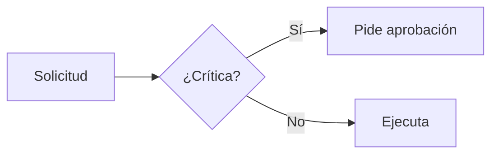

# Diplomado BIM + IA — Sitio de presentaciones

Sitio estático para las presentaciones del curso **BIM + IA** (Ascend · IDU).
Un **motor** compartido convierte archivos **Markdown** (uno por sesión) en decks
navegables, con el mismo diseño para todas las sesiones.

> Objetivo de diseño: que cualquier persona —técnica o no— pueda crear y editar
> una presentación **sin tocar HTML, CSS ni JavaScript**. Solo Markdown.

> 📘 **¿Vas a crear el contenido de una sesión?** Empezá por la guía para autores:
> **[GUIA-CONTENIDOS.md](GUIA-CONTENIDOS.md)** (con vía rápida para no técnicos y vía
> avanzada para desarrolladores). Este README es la referencia técnica del motor.

---

## 1. Cómo se ve la carpeta

```
docs/
├── index.html          Portada + índice de las 12 sesiones (no se toca)
├── deck.html           Reproductor de un deck        (no se toca)
├── assets/
│   ├── deck.css        Diseño (colores, tipografías)  ← editá aquí para re-tematizar
│   ├── deck.js         Motor de render y navegación   (no se toca)
│   ├── marked.min.js   Librería Markdown (vendorizada)
│   └── mermaid.min.js  Librería de diagramas (se carga solo si hace falta)
├── sessions/
│   ├── manifest.json   Lista de sesiones (título, docente, fecha, estado)
│   └── NN-nombre.md    Una sesión = un archivo Markdown  ← ACÁ SE TRABAJA
├── vercel.json         Configuración de despliegue
└── README.md           Este archivo
```

**Para crear o editar contenido solo tocás dos cosas:** los archivos `.md`
dentro de `sessions/` y, al terminar, el `manifest.json`.

---

## 2. Ver el sitio en tu computador

El navegador bloquea la carga de archivos `.md` si abrís el HTML con doble clic
(`file://`). Hay que servir la carpeta con un servidor local. Cualquiera sirve:

```bash
# Opción A — Node (no instala nada permanente)
cd docs
npx serve

# Opción B — Python
cd docs
python -m http.server 8000

# Opción C — VS Code
# Instalá la extensión "Live Server" y hacé clic derecho en index.html → "Open with Live Server"
```

Luego abrí la dirección que te indique (p. ej. `http://localhost:3000`).

---

## 3. Crear o editar una sesión

1. Abrí (o copiá) un archivo en `sessions/`, por ejemplo `02-comunicacion-agentes.md`.
2. Editá el **encabezado** y las **diapositivas**.
3. Guardá y refrescá el navegador. Listo.

### Encabezado (una sola vez, arriba del archivo)

```markdown
---
sesion: 2
titulo: Comunicación efectiva y **Agentes**
docente: Julián Puyo
fecha: 21/08/2026
eyebrow: Curso BIM + IA
subtitulo: Un texto de una o dos líneas para la portada.
---
```

- La **portada se genera sola** con estos datos.
- En `titulo` y `subtitulo`, `**palabra**` se pinta de naranja.

### Diapositivas

Cada diapositiva se separa con una línea con tres guiones `---`.

```markdown
---

## Título de la diapositiva

> Una frase de bajada (subtítulo) destacada.

- Punto uno
- Punto dos con **negrita**
```

- `##` → título de la diapositiva.
- `>` → bajada destacada (lede).
- `^^ Texto` (al inicio de una diapositiva) → etiqueta pequeña superior (eyebrow).
  Si ponés una barra, lo anterior se atenúa: `^^ Sesión 02 / Fundamento`.

---

## 4. Bloques opcionales (para el diseño "rico")

Con Markdown normal ya se ve bien. Estos bloques agregan las tarjetas de vidrio,
columnas y métricas del diseño. Todos abren con `:::nombre` y cierran con `:::`.

### Columnas

```markdown
:::split
... contenido izquierdo ...
:::
... esto NO es así — ver ejemplo real abajo ...
```

Ejemplo real (columnas con tarjetas):

```markdown
:::split
:::card [Etiqueta] Título de la tarjeta
Contenido en Markdown normal.
:::
:::card [Otra] Segunda tarjeta
Más contenido.
:::
:::
```

- `:::split` → 2 columnas · `:::split-3` → 3 columnas · `:::stack` → apilado con espacio.
- `:::card [Etiqueta] Título` → tarjeta de vidrio. La `[Etiqueta]` y el título son opcionales.
- Un `!` al inicio del título resalta el borde: `:::card [Riesgo] !Cuidado con esto`.

### Callouts (avisos)

```markdown
:::note
Información complementaria.
:::

:::warn
Advertencia o riesgo.
:::

:::ok
Idea clave o conclusión.
:::
```

### Métricas, chips y flujos

```markdown
:::metrics
0.815 | F1 del modelo
+17 pts | Sobre la referencia
:::

:::chips
Revit, Dynamo, n8n, MCP
:::

:::flow
Objetivo -> *Planifica -> Ejecuta -> Resultado
:::
```

- `:::metrics` → cada línea es `valor | etiqueta`.
- `:::chips` → etiquetas separadas por coma.
- `:::flow` → cajas unidas por flechas; un `*` antes de una caja la resalta.

### Tablas, código y diagramas

- **Tablas**: Markdown normal (`| col | col |`). Se estilizan solas.
- **Código**: bloques con tres backticks.
- **Diagramas**: bloque de código con lenguaje `mermaid` (se renderiza automáticamente).

````markdown

````

---

## 5. Activar una sesión (control de acceso)

El campo `"estado"` de cada sesión en `sessions/manifest.json` es **el único
interruptor** que decide qué pueden abrir los estudiantes:

| `estado` | En la portada | ¿La pueden abrir los estudiantes? |
|---|---|---|
| `"listo"` | Tarjeta clickeable · insignia **Disponible** | **Sí** |
| `"stub"` (o cualquier otro) | Tarjeta bloqueada · insignia **🔒 Próximamente** | **No** |

- En la portada, las sesiones que no están `"listo"` se muestran **atenuadas y no
  se puede hacer clic** en ellas.
- Si alguien escribe la URL a mano (`deck.html#s=01-...`), el reproductor
  **la bloquea** y muestra "Sesión en preparación", con un enlace de vuelta al índice.

**Para publicar una sesión:** cambiá `"estado": "stub"` por `"estado": "listo"`.
Para agregar una sesión nueva: añadí un objeto al arreglo `sesiones` y creá su
`.md` con el mismo `slug`.

### Previsualizar un borrador bloqueado (solo docentes)

Mientras trabajás una sesión que aún está bloqueada, agregá `&preview=1` al hash
para verla sin cambiar su estado:

```
deck.html#s=01-generalidades&preview=1
```

Sin `preview`, esa misma sesión les muestra "Sesión en preparación" a los estudiantes.

---

## 6. Cambiar los colores de todo el sitio

Editá las variables al inicio de `assets/deck.css` (bloque `:root`). Cambiando
`--accent-1`, `--accent-2` y `--accent-3` se re-tematiza **todo** el sitio de una vez.

---

## 7. Publicar

**GitHub Pages (recomendado):** en el repositorio, **Settings → Pages → Source:
*Deploy from a branch* → rama `main`, carpeta `/docs` → Save**. Cada push a `main`
que toque `docs/` se publica solo. (El archivo `.nojekyll` ya está incluido.)

**Vercel (alternativa):** *New Project* → importá el repositorio → **Root Directory
= `docs`** → *Deploy*. Útil si el repositorio es privado.

Cualquier hosting estático sirve: subí el contenido de `docs/` tal cual.

---

## 8. Atajos de navegación en un deck

| Acción | Tecla |
|---|---|
| Siguiente | → · Espacio · Av Pág |
| Anterior | ← · Re Pág |
| Primera / última | Inicio / Fin |
| Ir a una diapositiva | clic en los puntos inferiores |
| En móvil | deslizar izquierda / derecha |
