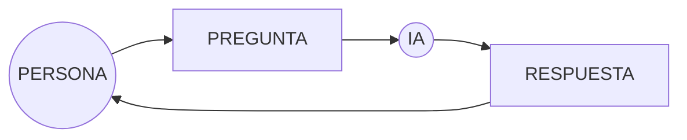
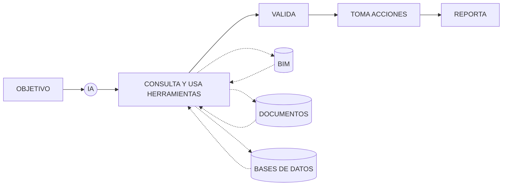
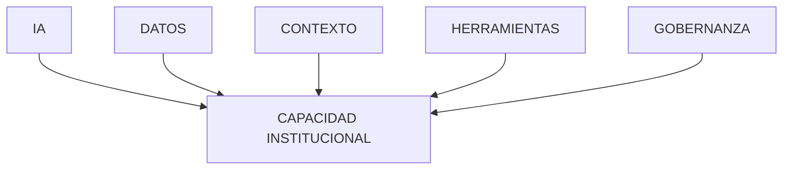
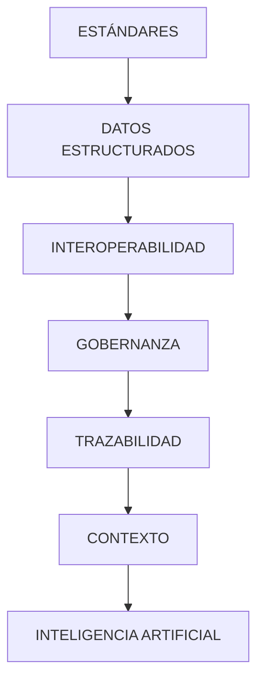
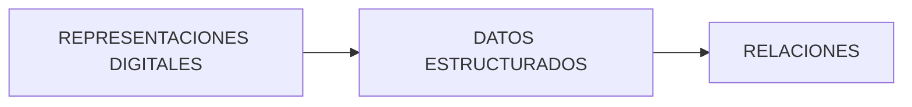
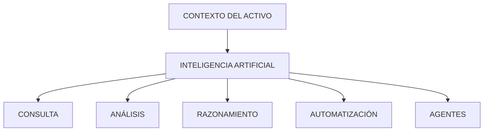
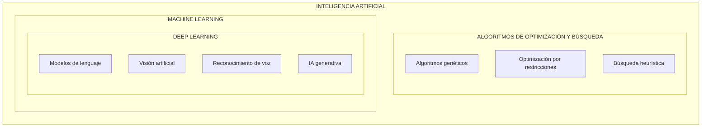

^^ Sesión 01 / Propósito
## BIM visto desde la Inteligencia Artificial

> Esta sesión no busca enseñar BIM desde cero. Parte de que los participantes ya conocen BIM y propone cambiar el nivel de discusión: **de BIM como metodología de modelado y coordinación a BIM como infraestructura de información para Inteligencia Artificial.**

:::split-3
:::card [01] Estructurar
Entender cómo BIM convierte activos físicos en entidades digitales identificables.
:::
:::card [02] Gobernar
Reconocer por qué estandarización, interoperabilidad y trazabilidad son requisitos previos para una IA institucional.
:::
:::card [03] Conectar
Entender cómo modelos, documentos, actividades, incidencias, ensayos y evidencias pueden convertirse en contexto para sistemas de IA.
:::
:::

---

^^ Sesión 01 / Pregunta de apertura
## ¿Puede responderlo una IA?

Una institución pública acumula más de diez años de proyectos.

<svg viewBox="0 0 900 140" xmlns="http://www.w3.org/2000/svg" style="width:100%; height:auto; display:block; margin:10px 0 18px">
  <circle cx="73" cy="10" r="7" fill="var(--accent-3)" opacity="0.8"/>
  <rect x="215" y="14.2" width="12" height="9.6" rx="2" fill="var(--accent-3)" opacity="0.6"/>
  <circle cx="357" cy="8" r="6" fill="var(--accent-2)" opacity="0.7"/>
  <rect x="430" y="10.2" width="12" height="9.6" rx="2" fill="var(--accent-1)" opacity="0.8"/>
  <circle cx="549" cy="13" r="7" fill="var(--accent-1)" opacity="0.7"/>
  <circle cx="744" cy="19" r="7" fill="var(--accent-3)" opacity="0.6"/>
  <rect x="800" y="6" width="10" height="8" rx="2" fill="var(--accent-2)" opacity="0.9"/>
  <rect x="74" y="43.8" width="8" height="6.4" rx="2" fill="var(--accent-2)" opacity="0.8"/>
  <circle cx="180" cy="39" r="5" fill="var(--accent-1)" opacity="0.8"/>
  <circle cx="300" cy="42" r="4" fill="var(--accent-1)" opacity="0.8"/>
  <circle cx="412" cy="45" r="4" fill="var(--accent-2)" opacity="0.8"/>
  <rect x="559" y="33" width="10" height="8" rx="2" fill="var(--accent-1)" opacity="0.8"/>
  <circle cx="685" cy="47" r="3" fill="var(--accent-1)" opacity="0.8"/>
  <circle cx="795" cy="43" r="3" fill="var(--accent-2)" opacity="0.6"/>
  <rect x="31" y="70.8" width="8" height="6.4" rx="2" fill="var(--accent-3)" opacity="0.9"/>
  <circle cx="187" cy="72" r="4" fill="var(--accent-2)" opacity="0.8"/>
  <circle cx="352" cy="68" r="4" fill="var(--accent-1)" opacity="0.7"/>
  <circle cx="463" cy="74" r="6" fill="var(--accent-2)" opacity="0.9"/>
  <circle cx="602" cy="64" r="6" fill="var(--accent-2)" opacity="0.8"/>
  <rect x="666" y="60.4" width="14" height="11.2" rx="2" fill="var(--accent-3)" opacity="0.9"/>
  <circle cx="860" cy="67" r="3" fill="var(--accent-1)" opacity="0.8"/>
  <rect x="46" y="86.8" width="8" height="6.4" rx="2" fill="var(--accent-3)" opacity="0.6"/>
  <circle cx="162" cy="90" r="5" fill="var(--accent-2)" opacity="0.8"/>
  <circle cx="334" cy="98" r="5" fill="var(--accent-2)" opacity="0.8"/>
  <rect x="476" y="86.2" width="12" height="9.6" rx="2" fill="var(--accent-3)" opacity="0.8"/>
  <circle cx="549" cy="92" r="6" fill="var(--accent-2)" opacity="0.9"/>
  <circle cx="670" cy="105" r="4" fill="var(--accent-1)" opacity="0.9"/>
  <rect x="817" y="96.2" width="12" height="9.6" rx="2" fill="var(--accent-1)" opacity="0.9"/>
  <rect x="74" y="116" width="10" height="8" rx="2" fill="var(--accent-3)" opacity="0.9"/>
  <circle cx="174" cy="122" r="4" fill="var(--accent-2)" opacity="0.7"/>
  <circle cx="337" cy="125" r="4" fill="var(--accent-1)" opacity="0.9"/>
  <circle cx="463" cy="133" r="7" fill="var(--accent-3)" opacity="0.9"/>
  <circle cx="608" cy="119" r="4" fill="var(--accent-3)" opacity="0.6"/>
  <rect x="741" y="119.2" width="12" height="9.6" rx="2" fill="var(--accent-3)" opacity="0.7"/>
  <circle cx="825" cy="123" r="4" fill="var(--accent-1)" opacity="0.8"/>
</svg>

:::split-3
:::card [Modelos] Información BIM
- RVT
- IFC
- modelos federados
- modelos de coordinación
:::
:::card [Documentos] Información documental
- PDF
- planos
- especificaciones
- informes
- contratos
- actas
:::
:::card [Evidencias] Información de obra
- fotografías
- ensayos
- incidencias
- avances
- interventoría
- comunicaciones
:::
:::

El director de infraestructura pregunta:

:::card [Pregunta] !¿Puede responder la IA?
> ¿Qué tipologías de falla hemos encontrado históricamente en puentes construidos por encima de los 2.000 m s. n. m. y qué soluciones han producido mejores resultados?
:::

---

^^ Sesión 01 / Diagnóstico
## La respuesta es: depende

No depende solamente de:

- GPT
- Claude
- Gemini
- un modelo de lenguaje más grande
- comprar más infraestructura tecnológica

Depende principalmente de **cómo está organizada la información**.

:::warn
Una IA no convierte automáticamente información desordenada en conocimiento institucional.

Puede buscar, resumir e inferir. Pero para responder preguntas confiables necesita **estructura, contexto, relaciones, calidad y trazabilidad**.
:::

---

^^ Sesión 01 / Idea central
## BIM prepara los datos para la IA

:::ok
**La IA no vuelve inteligente la información desordenada.**

BIM puede proporcionar la estructura, el contexto y la trazabilidad que permiten que los sistemas de Inteligencia Artificial entiendan el proyecto y sus activos.
:::

---

^^ Sesión 01 / Fundamento
## BIM no es el modelo

BIM suele asociarse inmediatamente con:

:::split-3
:::card [Software]
Revit

Civil 3D

Navisworks

InfraWorks
:::
:::card [Representación]
Modelo 3D

Modelo federado

Visualización
:::
:::card [Entregable]
RVT

IFC

NWC

DWG
:::
:::

Pero desde la perspectiva de una institución pública:

> **El modelo es solamente una representación de un sistema de información.**

---

^^ Sesión 01 / Información
## De BIM a un sistema de información

Un proyecto puede entenderse como una estructura de entidades relacionadas.

```text
PROYECTO
│
├── CONTRATOS
├── ACTORES
├── ZONAS
├── ACTIVOS
├── ELEMENTOS
├── ACTIVIDADES
├── DOCUMENTOS
├── INCIDENCIAS
├── INSPECCIONES
└── EVIDENCIAS
```

Cada entidad tiene propiedades.

Pero, sobre todo:

**cada entidad puede relacionarse con otras entidades.**

---

^^ Sesión 01 / Contexto
## BIM organiza el mundo físico

Para una persona puede ser suficiente decir:

> "El muro que revisamos ayer."

:::note
En un proyecto con cientos de muros, "el muro que revisamos ayer" no identifica nada por sí solo. Una persona lo resuelve por memoria compartida —sabe de qué obra habla, con quién, cuándo—. Una máquina no tiene ese atajo: necesita que la posición del muro dentro del proyecto esté explícita.
:::

<svg viewBox="0 0 500 250" xmlns="http://www.w3.org/2000/svg" style="width:100%; max-width:420px; height:auto; display:block; margin:14px auto">
  <rect x="10" y="10" width="480" height="230" rx="12" fill="none" stroke="var(--accent-3)" stroke-width="1.5" opacity="0.9"/>
  <text x="24" y="28" font-size="12" letter-spacing="1" fill="var(--accent-3)" font-family="Inter, sans-serif">PROYECTO</text>
  <rect x="32" y="38" width="436" height="188" rx="10" fill="none" stroke="var(--accent-3)" stroke-width="1.5" opacity="0.7"/>
  <text x="46" y="56" font-size="12" letter-spacing="1" fill="var(--accent-3)" font-family="Inter, sans-serif">CONTRATO</text>
  <rect x="54" y="66" width="392" height="146" rx="9" fill="none" stroke="var(--accent-2)" stroke-width="1.5" opacity="0.8"/>
  <text x="68" y="84" font-size="12" letter-spacing="1" fill="var(--accent-2)" font-family="Inter, sans-serif">TRAMO</text>
  <rect x="76" y="94" width="348" height="104" rx="8" fill="none" stroke="var(--accent-2)" stroke-width="1.5"/>
  <text x="90" y="112" font-size="12" letter-spacing="1" fill="var(--accent-2)" font-family="Inter, sans-serif">ZONA</text>
  <rect x="98" y="122" width="304" height="60" rx="7" fill="var(--accent-1)" opacity="0.16" stroke="var(--accent-1)" stroke-width="2"/>
  <text x="250" y="157" text-anchor="middle" font-size="15" font-weight="600" fill="var(--text-primary)" font-family="Inter, sans-serif">MURO MC-027</text>
</svg>

<p style="text-align:center; font-family:var(--font-mono); font-size:12px; letter-spacing:.04em; color:var(--text-dim); margin-top:-4px">GUID → Versión → Estado → Inspección → Resultado</p>

:::ok
**BIM convierte elementos físicos del proyecto en entidades digitales identificables.**
:::

---

^^ Sesión 01 / Datos
## ¿Qué sabe BIM de un objeto?

Un elemento BIM puede contener mucho más que geometría — y esas propiedades no son una lista suelta: son datos que se conectan entre sí, igual que el grafo de notas vinculadas de una app como Obsidian.

<svg viewBox="110 85 640 480" xmlns="http://www.w3.org/2000/svg" style="width:100%; max-width:700px; height:auto; display:block; margin:14px auto">
  <ellipse cx="287" cy="205" rx="123" ry="112" fill="none" stroke="var(--accent-3)" stroke-width="1.2" stroke-dasharray="4 4" opacity="0.5"/>
  <ellipse cx="515" cy="205" rx="114" ry="98" fill="none" stroke="var(--accent-1)" stroke-width="1.2" stroke-dasharray="4 4" opacity="0.5"/>
  <ellipse cx="285" cy="433" rx="128" ry="107" fill="none" stroke="var(--accent-2)" stroke-width="1.2" stroke-dasharray="4 4" opacity="0.5"/>
  <ellipse cx="514" cy="434" rx="127" ry="111" fill="none" stroke="var(--accent-3)" stroke-width="1.2" stroke-dasharray="4 4" opacity="0.5"/>
  <line x1="400" y1="320" x2="236" y2="291" stroke="var(--accent-3)" stroke-width="1" opacity="0.35"/>
  <line x1="400" y1="320" x2="231" y2="245" stroke="var(--accent-3)" stroke-width="1" opacity="0.35"/>
  <line x1="400" y1="320" x2="268" y2="217" stroke="var(--accent-3)" stroke-width="1" opacity="0.35"/>
  <line x1="400" y1="320" x2="286" y2="174" stroke="var(--accent-3)" stroke-width="1" opacity="0.35"/>
  <line x1="400" y1="320" x2="332" y2="167" stroke="var(--accent-3)" stroke-width="1" opacity="0.35"/>
  <line x1="400" y1="320" x2="368" y2="138" stroke="var(--accent-3)" stroke-width="1" opacity="0.35"/>
  <line x1="400" y1="320" x2="443" y2="159" stroke="var(--accent-1)" stroke-width="1" opacity="0.35"/>
  <line x1="400" y1="320" x2="493" y2="160" stroke="var(--accent-1)" stroke-width="1" opacity="0.35"/>
  <line x1="400" y1="320" x2="518" y2="202" stroke="var(--accent-1)" stroke-width="1" opacity="0.35"/>
  <line x1="400" y1="320" x2="560" y2="227" stroke="var(--accent-1)" stroke-width="1" opacity="0.35"/>
  <line x1="400" y1="320" x2="561" y2="277" stroke="var(--accent-1)" stroke-width="1" opacity="0.35"/>
  <line x1="400" y1="320" x2="371" y2="484" stroke="var(--accent-2)" stroke-width="1" opacity="0.35"/>
  <line x1="400" y1="320" x2="325" y2="489" stroke="var(--accent-2)" stroke-width="1" opacity="0.35"/>
  <line x1="400" y1="320" x2="297" y2="452" stroke="var(--accent-2)" stroke-width="1" opacity="0.35"/>
  <line x1="400" y1="320" x2="254" y2="434" stroke="var(--accent-2)" stroke-width="1" opacity="0.35"/>
  <line x1="400" y1="320" x2="247" y2="388" stroke="var(--accent-2)" stroke-width="1" opacity="0.35"/>
  <line x1="400" y1="320" x2="218" y2="352" stroke="var(--accent-2)" stroke-width="1" opacity="0.35"/>
  <line x1="400" y1="320" x2="564" y2="349" stroke="var(--accent-3)" stroke-width="1" opacity="0.35"/>
  <line x1="400" y1="320" x2="572" y2="388" stroke="var(--accent-3)" stroke-width="1" opacity="0.35"/>
  <line x1="400" y1="320" x2="540" y2="412" stroke="var(--accent-3)" stroke-width="1" opacity="0.35"/>
  <line x1="400" y1="320" x2="531" y2="451" stroke="var(--accent-3)" stroke-width="1" opacity="0.35"/>
  <line x1="400" y1="320" x2="492" y2="460" stroke="var(--accent-3)" stroke-width="1" opacity="0.35"/>
  <line x1="400" y1="320" x2="468" y2="492" stroke="var(--accent-3)" stroke-width="1" opacity="0.35"/>
  <line x1="400" y1="320" x2="429" y2="484" stroke="var(--accent-3)" stroke-width="1" opacity="0.35"/>
  <circle cx="236" cy="291" r="5" fill="var(--accent-3)"/>
  <circle cx="231" cy="245" r="5" fill="var(--accent-3)"/>
  <circle cx="268" cy="217" r="5" fill="var(--accent-3)"/>
  <circle cx="286" cy="174" r="5" fill="var(--accent-3)"/>
  <circle cx="332" cy="167" r="5" fill="var(--accent-3)"/>
  <circle cx="368" cy="138" r="5" fill="var(--accent-3)"/>
  <circle cx="443" cy="159" r="5" fill="var(--accent-1)"/>
  <circle cx="493" cy="160" r="5" fill="var(--accent-1)"/>
  <circle cx="518" cy="202" r="5" fill="var(--accent-1)"/>
  <circle cx="560" cy="227" r="5" fill="var(--accent-1)"/>
  <circle cx="561" cy="277" r="5" fill="var(--accent-1)"/>
  <circle cx="371" cy="484" r="5" fill="var(--accent-2)"/>
  <circle cx="325" cy="489" r="5" fill="var(--accent-2)"/>
  <circle cx="297" cy="452" r="5" fill="var(--accent-2)"/>
  <circle cx="254" cy="434" r="5" fill="var(--accent-2)"/>
  <circle cx="247" cy="388" r="5" fill="var(--accent-2)"/>
  <circle cx="218" cy="352" r="5" fill="var(--accent-2)"/>
  <circle cx="564" cy="349" r="5" fill="var(--accent-3)"/>
  <circle cx="572" cy="388" r="5" fill="var(--accent-3)"/>
  <circle cx="540" cy="412" r="5" fill="var(--accent-3)"/>
  <circle cx="531" cy="451" r="5" fill="var(--accent-3)"/>
  <circle cx="492" cy="460" r="5" fill="var(--accent-3)"/>
  <circle cx="468" cy="492" r="5" fill="var(--accent-3)"/>
  <circle cx="429" cy="484" r="5" fill="var(--accent-3)"/>
  <text x="228" y="295" text-anchor="end" font-size="10.5" fill="var(--text-dim)" font-family="Inter, sans-serif">identificador</text>
  <text x="223" y="249" text-anchor="end" font-size="10.5" fill="var(--text-dim)" font-family="Inter, sans-serif">GUID</text>
  <text x="260" y="209" text-anchor="end" font-size="10.5" fill="var(--text-dim)" font-family="Inter, sans-serif">tipo</text>
  <text x="278" y="166" text-anchor="end" font-size="10.5" fill="var(--text-dim)" font-family="Inter, sans-serif">clasificación</text>
  <text x="324" y="159" text-anchor="end" font-size="10.5" fill="var(--text-dim)" font-family="Inter, sans-serif">sistema</text>
  <text x="360" y="130" text-anchor="end" font-size="10.5" fill="var(--text-dim)" font-family="Inter, sans-serif">código</text>
  <text x="451" y="151" text-anchor="start" font-size="10.5" fill="var(--text-dim)" font-family="Inter, sans-serif">dimensiones</text>
  <text x="501" y="152" text-anchor="start" font-size="10.5" fill="var(--text-dim)" font-family="Inter, sans-serif">material</text>
  <text x="526" y="194" text-anchor="start" font-size="10.5" fill="var(--text-dim)" font-family="Inter, sans-serif">especificaciones</text>
  <text x="568" y="219" text-anchor="start" font-size="10.5" fill="var(--text-dim)" font-family="Inter, sans-serif">propiedades técnicas</text>
  <text x="569" y="281" text-anchor="start" font-size="10.5" fill="var(--text-dim)" font-family="Inter, sans-serif">cantidades</text>
  <text x="363" y="497" text-anchor="end" font-size="10.5" fill="var(--text-dim)" font-family="Inter, sans-serif">proyecto</text>
  <text x="317" y="502" text-anchor="end" font-size="10.5" fill="var(--text-dim)" font-family="Inter, sans-serif">estructura</text>
  <text x="289" y="465" text-anchor="end" font-size="10.5" fill="var(--text-dim)" font-family="Inter, sans-serif">zona</text>
  <text x="246" y="447" text-anchor="end" font-size="10.5" fill="var(--text-dim)" font-family="Inter, sans-serif">nivel</text>
  <text x="239" y="392" text-anchor="end" font-size="10.5" fill="var(--text-dim)" font-family="Inter, sans-serif">tramo</text>
  <text x="210" y="356" text-anchor="end" font-size="10.5" fill="var(--text-dim)" font-family="Inter, sans-serif">coordenadas</text>
  <text x="572" y="353" text-anchor="start" font-size="10.5" fill="var(--text-dim)" font-family="Inter, sans-serif">estado</text>
  <text x="580" y="392" text-anchor="start" font-size="10.5" fill="var(--text-dim)" font-family="Inter, sans-serif">responsable</text>
  <text x="548" y="425" text-anchor="start" font-size="10.5" fill="var(--text-dim)" font-family="Inter, sans-serif">versión</text>
  <text x="539" y="464" text-anchor="start" font-size="10.5" fill="var(--text-dim)" font-family="Inter, sans-serif">aprobación</text>
  <text x="500" y="473" text-anchor="start" font-size="10.5" fill="var(--text-dim)" font-family="Inter, sans-serif">actividad</text>
  <text x="476" y="505" text-anchor="start" font-size="10.5" fill="var(--text-dim)" font-family="Inter, sans-serif">incidencia</text>
  <text x="437" y="497" text-anchor="start" font-size="10.5" fill="var(--text-dim)" font-family="Inter, sans-serif">inspección</text>
  <text x="198" y="125" text-anchor="end" font-size="11" letter-spacing="1" fill="var(--accent-3)" font-family="Inter, sans-serif">IDENTIDAD</text>
  <text x="597" y="134" text-anchor="start" font-size="11" letter-spacing="1" fill="var(--accent-1)" font-family="Inter, sans-serif">CARACTERÍSTICAS</text>
  <text x="194" y="510" text-anchor="end" font-size="11" letter-spacing="1" fill="var(--accent-2)" font-family="Inter, sans-serif">CONTEXTO</text>
  <text x="605" y="513" text-anchor="start" font-size="11" letter-spacing="1" fill="var(--accent-3)" font-family="Inter, sans-serif">GESTIÓN</text>
  <circle cx="400" cy="320" r="18" fill="var(--accent-1)"/>
  <text x="400" y="350" text-anchor="middle" font-size="13" font-weight="600" fill="var(--text-primary)" font-family="Inter, sans-serif">Elemento BIM</text>
</svg>

---

^^ Sesión 01 / Comparación
## Dos proyectos aparentemente digitales

:::split
:::card [Proyecto A] Digitalizado
<svg viewBox="0 0 320 130" xmlns="http://www.w3.org/2000/svg" style="width:100%; height:auto; display:block; margin-bottom:10px">
  <circle cx="44" cy="24" r="7" fill="var(--accent-1)" opacity="0.74"/>
  <circle cx="85" cy="30" r="6" fill="var(--accent-2)" opacity="0.79"/>
  <rect x="158" y="16" width="12" height="10" rx="2" fill="var(--accent-1)" opacity="0.79"/>
  <circle cx="220" cy="26" r="8" fill="var(--accent-2)" opacity="0.67"/>
  <circle cx="304" cy="12" r="5" fill="var(--accent-3)" opacity="0.68"/>
  <rect x="32" y="59.5" width="14" height="11" rx="2" fill="var(--accent-2)" opacity="0.63"/>
  <rect x="89" y="66" width="10" height="8" rx="2" fill="var(--accent-1)" opacity="0.63"/>
  <circle cx="146" cy="63" r="7" fill="var(--accent-2)" opacity="0.93"/>
  <rect x="213" y="50.5" width="16" height="13" rx="2" fill="var(--accent-1)" opacity="0.64"/>
  <rect x="291" y="54" width="10" height="8" rx="2" fill="var(--accent-2)" opacity="0.91"/>
  <circle cx="28" cy="103" r="7" fill="var(--accent-1)" opacity="0.62"/>
  <rect x="78" y="97.5" width="14" height="11" rx="2" fill="var(--accent-3)" opacity="0.92"/>
  <circle cx="170" cy="100" r="8" fill="var(--accent-1)" opacity="0.81"/>
  <rect x="209" y="111" width="10" height="8" rx="2" fill="var(--accent-2)" opacity="0.63"/>
  <rect x="297" y="101.5" width="14" height="11" rx="2" fill="var(--accent-2)" opacity="0.65"/>
</svg>

**12.000 PDF · 3.000 planos · 80.000 fotografías · 250 Excel · correos · informes · modelos BIM**

La información existe. Pero no necesariamente está conectada.
:::

:::card [Proyecto B] Estructurado
<svg viewBox="0 0 320 260" xmlns="http://www.w3.org/2000/svg" style="width:100%; height:auto; display:block; margin-bottom:10px">
  <line x1="160" y1="20" x2="160" y2="55" stroke="var(--glass-line)" stroke-width="1.5"/>
  <line x1="160" y1="55" x2="160" y2="90" stroke="var(--glass-line)" stroke-width="1.5"/>
  <line x1="160" y1="90" x2="160" y2="125" stroke="var(--glass-line)" stroke-width="1.5"/>
  <line x1="160" y1="125" x2="70" y2="165" stroke="var(--glass-line)" stroke-width="1.5"/>
  <line x1="160" y1="125" x2="160" y2="165" stroke="var(--glass-line)" stroke-width="1.5"/>
  <line x1="160" y1="125" x2="250" y2="165" stroke="var(--glass-line)" stroke-width="1.5"/>
  <line x1="70" y1="165" x2="70" y2="205" stroke="var(--glass-line)" stroke-width="1.5"/>
  <line x1="250" y1="165" x2="250" y2="205" stroke="var(--glass-line)" stroke-width="1.5"/>
  <line x1="70" y1="205" x2="70" y2="240" stroke="var(--glass-line)" stroke-width="1.5"/>
  <circle cx="160" cy="20" r="6" fill="var(--accent-3)"/>
  <circle cx="160" cy="55" r="6" fill="var(--accent-3)"/>
  <circle cx="160" cy="90" r="6" fill="var(--accent-3)"/>
  <circle cx="160" cy="125" r="7" fill="var(--accent-1)"/>
  <circle cx="70" cy="165" r="5" fill="var(--accent-2)"/>
  <circle cx="160" cy="165" r="5" fill="var(--accent-2)"/>
  <circle cx="250" cy="165" r="5" fill="var(--accent-2)"/>
  <circle cx="70" cy="205" r="5" fill="var(--accent-2)"/>
  <circle cx="250" cy="205" r="5" fill="var(--accent-2)"/>
  <circle cx="70" cy="240" r="5" fill="var(--accent-1)"/>
  <text x="172" y="24" font-size="10" fill="var(--text-dim)" font-family="Inter, sans-serif">PROYECTO</text>
  <text x="172" y="59" font-size="10" fill="var(--text-dim)" font-family="Inter, sans-serif">CONTRATO</text>
  <text x="172" y="94" font-size="10" fill="var(--text-dim)" font-family="Inter, sans-serif">TRAMO</text>
  <text x="172" y="129" font-size="10" fill="var(--text-primary)" font-family="Inter, sans-serif">ELEMENTO</text>
  <text x="70" y="152" text-anchor="middle" font-size="9" fill="var(--text-dim)" font-family="Inter, sans-serif">ACTIVIDAD</text>
  <text x="160" y="152" text-anchor="middle" font-size="9" fill="var(--text-dim)" font-family="Inter, sans-serif">ENSAYO</text>
  <text x="250" y="152" text-anchor="middle" font-size="9" fill="var(--text-dim)" font-family="Inter, sans-serif">INCIDENCIA</text>
  <text x="70" y="220" text-anchor="middle" font-size="9" fill="var(--text-dim)" font-family="Inter, sans-serif">FOTOGRAFÍA</text>
  <text x="250" y="220" text-anchor="middle" font-size="9" fill="var(--text-dim)" font-family="Inter, sans-serif">DOCUMENTO</text>
  <text x="70" y="255" text-anchor="middle" font-size="9" fill="var(--text-dim)" font-family="Inter, sans-serif">RESPONSABLE</text>
</svg>

Existen relaciones explícitas entre la información.
:::
:::

---

^^ Sesión 01 / IA
## ¿Qué cambia para una IA?

En **Proyecto A** podemos preguntar:

> Busca documentos donde aparezca "muro".

En **Proyecto B** podemos preguntar:

> ¿Cuáles muros ejecutados durante junio presentan ensayos pendientes y además tienen incidencias abiertas de calidad?

:::ok
La segunda pregunta ya no es solamente una búsqueda de texto.

Es una **consulta sobre relaciones dentro de un sistema de información**.
:::

---

^^ Sesión 01 / Sector público
## BIM en una institución pública

En una empresa, un proyecto puede terminar.

Para una institución pública, la información puede necesitar mantenerse durante décadas.

<svg viewBox="0 0 1000 140" xmlns="http://www.w3.org/2000/svg" style="width:100%; height:auto; display:block; margin:14px 0">
  <rect x="17" y="35" width="84" height="50" rx="8" fill="var(--accent-3)" fill-opacity="0.05" stroke="var(--accent-3)" stroke-width="1.5"/>
  <rect x="115" y="35" width="84" height="50" rx="8" fill="var(--accent-3)" fill-opacity="0.05" stroke="var(--accent-3)" stroke-width="1.5"/>
  <rect x="213" y="35" width="84" height="50" rx="8" fill="var(--accent-3)" fill-opacity="0.05" stroke="var(--accent-3)" stroke-width="1.5"/>
  <rect x="311" y="35" width="84" height="50" rx="8" fill="var(--accent-3)" fill-opacity="0.05" stroke="var(--accent-3)" stroke-width="1.5"/>
  <rect x="409" y="35" width="84" height="50" rx="8" fill="var(--accent-3)" fill-opacity="0.05" stroke="var(--accent-3)" stroke-width="1.5"/>
  <rect x="507" y="35" width="84" height="50" rx="8" fill="var(--accent-3)" fill-opacity="0.05" stroke="var(--accent-3)" stroke-width="1.5"/>
  <rect x="605" y="35" width="84" height="50" rx="8" fill="var(--accent-3)" fill-opacity="0.05" stroke="var(--accent-3)" stroke-width="1.5"/>
  <rect x="703" y="35" width="84" height="50" rx="8" fill="var(--accent-1)" fill-opacity="0.10" stroke="var(--accent-1)" stroke-width="1.5" stroke-dasharray="4 3"/>
  <rect x="801" y="35" width="84" height="50" rx="8" fill="var(--accent-1)" fill-opacity="0.10" stroke="var(--accent-1)" stroke-width="1.5" stroke-dasharray="4 3"/>
  <rect x="899" y="35" width="84" height="50" rx="8" fill="var(--accent-1)" fill-opacity="0.10" stroke="var(--accent-1)" stroke-width="1.5" stroke-dasharray="4 3"/>
  <line x1="101" y1="60" x2="115" y2="60" stroke="var(--glass-line)" stroke-width="1.5"/>
  <line x1="199" y1="60" x2="213" y2="60" stroke="var(--glass-line)" stroke-width="1.5"/>
  <line x1="297" y1="60" x2="311" y2="60" stroke="var(--glass-line)" stroke-width="1.5"/>
  <line x1="395" y1="60" x2="409" y2="60" stroke="var(--glass-line)" stroke-width="1.5"/>
  <line x1="493" y1="60" x2="507" y2="60" stroke="var(--glass-line)" stroke-width="1.5"/>
  <line x1="591" y1="60" x2="605" y2="60" stroke="var(--glass-line)" stroke-width="1.5"/>
  <line x1="689" y1="60" x2="703" y2="60" stroke="var(--glass-line)" stroke-width="1.5"/>
  <line x1="787" y1="60" x2="801" y2="60" stroke="var(--glass-line)" stroke-width="1.5"/>
  <line x1="885" y1="60" x2="899" y2="60" stroke="var(--glass-line)" stroke-width="1.5"/>
  <text x="59" y="64" text-anchor="middle" font-size="8" fill="var(--text-primary)" font-family="Inter, sans-serif">PLANEACIÓN</text>
  <text x="157" y="64" text-anchor="middle" font-size="8" fill="var(--text-primary)" font-family="Inter, sans-serif">ESTUDIOS</text>
  <text x="255" y="64" text-anchor="middle" font-size="8" fill="var(--text-primary)" font-family="Inter, sans-serif">DISEÑO</text>
  <text x="353" y="64" text-anchor="middle" font-size="8" fill="var(--text-primary)" font-family="Inter, sans-serif">CONTRATACIÓN</text>
  <text x="451" y="64" text-anchor="middle" font-size="8" fill="var(--text-primary)" font-family="Inter, sans-serif">CONSTRUCCIÓN</text>
  <text x="549" y="64" text-anchor="middle" font-size="8" fill="var(--text-primary)" font-family="Inter, sans-serif">INTERVENTORÍA</text>
  <text x="647" y="64" text-anchor="middle" font-size="8" fill="var(--text-primary)" font-family="Inter, sans-serif">RECIBO</text>
  <text x="745" y="64" text-anchor="middle" font-size="8" fill="var(--text-primary)" font-family="Inter, sans-serif">OPERACIÓN</text>
  <text x="843" y="64" text-anchor="middle" font-size="8" fill="var(--text-primary)" font-family="Inter, sans-serif">MANTENIMIENTO</text>
  <text x="941" y="64" text-anchor="middle" font-size="8" fill="var(--text-primary)" font-family="Inter, sans-serif">REHABILITACIÓN</text>
  <line x1="703" y1="100" x2="983" y2="100" stroke="var(--accent-1)" stroke-width="1.5"/>
  <line x1="703" y1="96" x2="703" y2="100" stroke="var(--accent-1)" stroke-width="1.5"/>
  <line x1="983" y1="96" x2="983" y2="100" stroke="var(--accent-1)" stroke-width="1.5"/>
  <text x="843" y="118" text-anchor="middle" font-size="10.5" fill="var(--accent-1)" font-family="Inter, sans-serif">Mayor riesgo de continuidad de datos</text>
</svg>

---

^^ Sesión 01 / Continuidad
## Durante ese ciclo cambian muchas cosas

:::split-3
:::card [Personas]
- funcionarios
- consultores
- contratistas
- interventores
- operadores
:::
:::card [Tecnología]
- software
- formatos
- servidores
- plataformas
- proveedores
:::
:::card [Administración]
- gobiernos
- políticas
- contratos
- estructuras internas
- responsables
:::
:::

Pero el activo permanece.

Y también debería permanecer su información.

---

^^ Sesión 01 / Gobernanza
## Del archivo al patrimonio de información

Una institución pública no debería depender de:

> "el archivo que entiende el modelador que trabajó en el proyecto".

Necesita construir:

:::ok
## Patrimonio de información institucional

Información:

:::chips
Identificable, Estructurada, Interoperable, Documentada, Trazable, Consultable, Preservable
:::
:::

---

^^ Sesión 01 / Interoperabilidad
## La información no debería depender de una aplicación

Si la información institucional depende completamente de una aplicación, la institución genera dependencia tecnológica. Una estrategia de interoperabilidad busca lo contrario:

<svg viewBox="0 0 900 210" xmlns="http://www.w3.org/2000/svg" style="width:100%; height:auto; display:block; margin:14px 0">
  <text x="225" y="12" text-anchor="middle" font-size="11" letter-spacing="1" fill="var(--accent-1)" font-family="Inter, sans-serif">DEPENDENCIA</text>
  <line x1="430" y1="18" x2="430" y2="200" stroke="var(--glass-line)" stroke-width="1"/>
  <rect x="155" y="23" width="140" height="34" rx="8" fill="var(--accent-1)" fill-opacity="0.08" stroke="var(--accent-1)" stroke-width="1.5"/>
  <text x="225" y="44" text-anchor="middle" font-size="11" fill="var(--text-primary)" font-family="Inter, sans-serif">INFORMACIÓN</text>
  <line x1="225" y1="57" x2="225" y2="93" stroke="var(--accent-1)" stroke-width="1.5"/>
  <rect x="155" y="93" width="140" height="34" rx="8" fill="var(--accent-1)" fill-opacity="0.08" stroke="var(--accent-1)" stroke-width="1.5"/>
  <text x="225" y="114" text-anchor="middle" font-size="11" fill="var(--text-primary)" font-family="Inter, sans-serif">SOFTWARE</text>
  <line x1="225" y1="127" x2="225" y2="163" stroke="var(--accent-1)" stroke-width="1.5"/>
  <rect x="155" y="163" width="140" height="34" rx="8" fill="var(--accent-1)" fill-opacity="0.14" stroke="var(--accent-1)" stroke-width="1.5"/>
  <text x="225" y="184" text-anchor="middle" font-size="11" fill="var(--text-primary)" font-family="Inter, sans-serif">PROVEEDOR</text>
  <text x="675" y="12" text-anchor="middle" font-size="11" letter-spacing="1" fill="var(--accent-3)" font-family="Inter, sans-serif">INTEROPERABILIDAD</text>
  <rect x="605" y="23" width="140" height="34" rx="8" fill="var(--accent-3)" fill-opacity="0.08" stroke="var(--accent-3)" stroke-width="1.5"/>
  <text x="675" y="44" text-anchor="middle" font-size="11" fill="var(--text-primary)" font-family="Inter, sans-serif">INFORMACIÓN</text>
  <line x1="675" y1="57" x2="520" y2="134" stroke="var(--accent-3)" stroke-width="1.5"/>
  <line x1="675" y1="57" x2="620" y2="134" stroke="var(--accent-3)" stroke-width="1.5"/>
  <line x1="675" y1="57" x2="720" y2="134" stroke="var(--accent-3)" stroke-width="1.5"/>
  <line x1="675" y1="57" x2="825" y2="134" stroke="var(--accent-3)" stroke-width="1.5"/>
  <rect x="475" y="134" width="90" height="32" rx="8" fill="var(--accent-3)" fill-opacity="0.08" stroke="var(--accent-3)" stroke-width="1.5"/>
  <text x="520" y="154" text-anchor="middle" font-size="10" fill="var(--text-primary)" font-family="Inter, sans-serif">Sistema A</text>
  <rect x="575" y="134" width="90" height="32" rx="8" fill="var(--accent-3)" fill-opacity="0.08" stroke="var(--accent-3)" stroke-width="1.5"/>
  <text x="620" y="154" text-anchor="middle" font-size="10" fill="var(--text-primary)" font-family="Inter, sans-serif">Sistema B</text>
  <rect x="675" y="134" width="90" height="32" rx="8" fill="var(--accent-3)" fill-opacity="0.08" stroke="var(--accent-3)" stroke-width="1.5"/>
  <text x="720" y="154" text-anchor="middle" font-size="10" fill="var(--text-primary)" font-family="Inter, sans-serif">Sistema C</text>
  <rect x="775" y="134" width="100" height="32" rx="8" fill="var(--accent-3)" fill-opacity="0.08" stroke="var(--accent-3)" stroke-width="1.5"/>
  <text x="825" y="154" text-anchor="middle" font-size="9.5" fill="var(--text-primary)" font-family="Inter, sans-serif">Sistema futuro</text>
</svg>

---

^^ Sesión 01 / OpenBIM
## Separar la información de la herramienta

Los estándares abiertos permiten separar:

**la información**

de

**la aplicación utilizada para crearla o consumirla.**

<svg viewBox="0 0 640 140" xmlns="http://www.w3.org/2000/svg" style="width:100%; max-width:560px; height:auto; display:block; margin:14px auto">
  <rect x="35" y="45" width="150" height="50" rx="10" fill="var(--accent-3)" fill-opacity="0.08" stroke="var(--accent-3)" stroke-width="1.5"/>
  <text x="110" y="75" text-anchor="middle" font-size="12" fill="var(--text-primary)" font-family="Inter, sans-serif">INFORMACIÓN</text>
  <rect x="455" y="45" width="150" height="50" rx="10" fill="var(--glass-line)" fill-opacity="0.12" stroke="var(--glass-line)" stroke-width="1.5"/>
  <text x="530" y="75" text-anchor="middle" font-size="12" fill="var(--text-dim)" font-family="Inter, sans-serif">APLICACIÓN</text>
  <rect x="230" y="50" width="180" height="40" rx="20" fill="var(--accent-1)" fill-opacity="0.1" stroke="var(--accent-1)" stroke-width="1.5"/>
  <text x="320" y="66" text-anchor="middle" font-size="10.5" font-weight="600" fill="var(--accent-1)" font-family="Inter, sans-serif">ESTÁNDAR ABIERTO</text>
  <text x="320" y="80" text-anchor="middle" font-size="9.5" fill="var(--text-dim)" font-family="Inter, sans-serif">IFC · BCF · IDS</text>
  <line x1="185" y1="70" x2="230" y2="70" stroke="var(--accent-3)" stroke-width="1.5" stroke-dasharray="4 3"/>
  <line x1="410" y1="70" x2="455" y2="70" stroke="var(--glass-line)" stroke-width="1.5" stroke-dasharray="4 3"/>
</svg>

Algunos componentes del ecosistema BIM:

:::chips
IFC, BCF, IDS, Clasificaciones, APIs, Estructuras de información abiertas
:::

:::note
Para una institución pública, la interoperabilidad no es solamente un problema tecnológico.

También es un problema de **continuidad, independencia y gobernanza del dato**.
:::

---

^^ Sesión 01 / Aplicación
## ¿Qué podría hacer una IA?

Con información estructurada puede comenzar a responder preguntas como:

<svg viewBox="0 0 700 180" xmlns="http://www.w3.org/2000/svg" style="width:100%; max-width:620px; height:auto; display:block; margin:14px auto">
  <text x="350" y="15" text-anchor="middle" font-size="10" letter-spacing="0.5" fill="var(--text-dim)" font-family="Inter, sans-serif">descriptivo → diagnóstico → predictivo</text>
  <line x1="45" y1="150" x2="655" y2="150" stroke="var(--glass-line)" stroke-width="1"/>
  <rect x="60" y="110" width="130" height="40" rx="6" fill="var(--accent-3)" fill-opacity="0.12" stroke="var(--accent-3)" stroke-width="1.5"/>
  <text x="125" y="165" text-anchor="middle" font-size="11" fill="var(--text-primary)" font-family="Inter, sans-serif">Consulta</text>
  <rect x="210" y="85" width="130" height="65" rx="6" fill="var(--accent-3)" fill-opacity="0.12" stroke="var(--accent-3)" stroke-width="1.5"/>
  <text x="275" y="165" text-anchor="middle" font-size="11" fill="var(--text-primary)" font-family="Inter, sans-serif">Control</text>
  <rect x="360" y="60" width="130" height="90" rx="6" fill="var(--accent-2)" fill-opacity="0.14" stroke="var(--accent-2)" stroke-width="1.5"/>
  <text x="425" y="165" text-anchor="middle" font-size="11" fill="var(--text-primary)" font-family="Inter, sans-serif">Análisis</text>
  <rect x="510" y="35" width="130" height="115" rx="6" fill="var(--accent-1)" fill-opacity="0.16" stroke="var(--accent-1)" stroke-width="1.5"/>
  <text x="575" y="165" text-anchor="middle" font-size="11" fill="var(--text-primary)" font-family="Inter, sans-serif">Predicción</text>
</svg>

:::split
:::card [Consulta]
¿Qué elementos tienen incidencias abiertas?

¿Qué documentos soportan esta decisión?

¿Qué cambió entre las versiones?
:::
:::card [Control]
¿Qué ensayos están pendientes?

¿Qué elementos no cumplen requisitos?

¿Qué actividades presentan retrasos?
:::
:::

:::split
:::card [Análisis]
¿Qué problemas son recurrentes?

¿Dónde se concentran las fallas?

¿Qué variables explican determinados resultados?
:::
:::card [Predicción]
¿Qué elementos tienen mayor riesgo?

¿Qué actividades podrían retrasarse?

¿Qué activos requerirán intervención?
:::
:::

---

^^ Sesión 01 / Calidad
## El problema de los nombres

Un mismo activo puede aparecer como:

```text
Muro-01
MURO 1
M-001
M01
Muro Contención Norte
Elemento 4589
```

Para una persona puede resultar evidente que hablan del mismo elemento.

Para una máquina no necesariamente.

---

^^ Sesión 01 / Calidad
## Inferir vs. conocer

:::split
:::card [Sin estructura] La IA debe inferir
```text
"Muro 01"
    ≈
"M-001"
    ≈
"Muro Norte"
```
:::

:::card [Con estructura] Los sistemas conocen la relación
```text
GUID:
8ec72b31-...
```

Todos los registros apuntan al mismo elemento.
:::
:::

:::warn
**Inferir una relación no es lo mismo que conocer una relación explícitamente registrada.**

En procesos institucionales, regulatorios, contractuales o de interventoría esta diferencia es crítica.
:::

---

^^ Sesión 01 / Riesgo
## Garbage In → Garbage Out

La Inteligencia Artificial no elimina los problemas tradicionales de calidad de información.

Puede incluso amplificarlos.

<svg viewBox="0 0 700 300" xmlns="http://www.w3.org/2000/svg" style="width:100%; max-width:520px; height:auto; display:block; margin:14px auto">
  <defs>
    <marker id="gg-arrow" markerWidth="8" markerHeight="8" refX="5" refY="3" orient="auto"><path d="M0,0 L6,3 L0,6 Z" fill="var(--accent-1)"/></marker>
  </defs>
  <rect x="240" y="10" width="220" height="36" rx="6" fill="var(--accent-1)" fill-opacity="0.06" stroke="var(--accent-1)" stroke-width="1.2"/>
  <text x="350" y="33" text-anchor="middle" font-size="10" fill="var(--text-primary)" font-family="Inter, sans-serif">DATOS INCONSISTENTES</text>
  <line x1="350" y1="46" x2="350" y2="58" stroke="var(--accent-1)" stroke-width="1.4" marker-end="url(#gg-arrow)"/>
  <rect x="220" y="60" width="260" height="40" rx="6" fill="var(--accent-1)" fill-opacity="0.10" stroke="var(--accent-1)" stroke-width="1.4"/>
  <text x="350" y="85" text-anchor="middle" font-size="10.5" fill="var(--text-primary)" font-family="Inter, sans-serif">CONTEXTO INCORRECTO</text>
  <line x1="350" y1="100" x2="350" y2="112" stroke="var(--accent-1)" stroke-width="1.6" marker-end="url(#gg-arrow)"/>
  <rect x="200" y="114" width="300" height="44" rx="6" fill="var(--accent-1)" fill-opacity="0.14" stroke="var(--accent-1)" stroke-width="1.6"/>
  <text x="350" y="141" text-anchor="middle" font-size="11" fill="var(--text-primary)" font-family="Inter, sans-serif">INTERPRETACIÓN INCORRECTA</text>
  <line x1="350" y1="158" x2="350" y2="170" stroke="var(--accent-1)" stroke-width="1.9" marker-end="url(#gg-arrow)"/>
  <rect x="180" y="172" width="340" height="48" rx="6" fill="var(--accent-1)" fill-opacity="0.19" stroke="var(--accent-1)" stroke-width="1.9"/>
  <text x="350" y="200" text-anchor="middle" font-size="11.5" fill="var(--text-primary)" font-family="Inter, sans-serif">RESPUESTA CONVINCENTE</text>
  <line x1="350" y1="220" x2="350" y2="232" stroke="var(--accent-1)" stroke-width="2.2" marker-end="url(#gg-arrow)"/>
  <rect x="160" y="234" width="380" height="52" rx="6" fill="var(--accent-1)" fill-opacity="0.25" stroke="var(--accent-1)" stroke-width="2.2"/>
  <text x="350" y="264" text-anchor="middle" font-size="12.5" font-weight="600" fill="var(--text-primary)" font-family="Inter, sans-serif">DECISIÓN INCORRECTA</text>
</svg>

---

^^ Sesión 01 / Gobernanza
## BIM necesita reglas

Para utilizar IA de manera confiable debemos definir:

:::split-3
:::card [Estructura]
¿Qué información existe?

¿Cómo se organiza?

¿Qué entidades manejamos?
:::
:::card [Reglas]
¿Cómo se nombra?

¿Cómo se clasifica?

¿Qué propiedades son obligatorias?
:::
:::card [Control]
¿Quién puede modificar?

¿Quién aprueba?

¿Qué versión es vigente?
:::
:::

---

^^ Sesión 01 / Marco
## Las seis capas BIM que preparan la IA

<svg viewBox="0 0 600 410" xmlns="http://www.w3.org/2000/svg" style="width:100%; max-width:520px; height:auto; display:block; margin:14px auto">
  <defs>
    <marker id="layers-arrow" markerWidth="9" markerHeight="9" refX="4" refY="6" orient="auto"><path d="M0,6 L4,0 L8,6 Z" fill="var(--accent-1)"/></marker>
  </defs>
  <line x1="300" y1="92" x2="300" y2="66" stroke="var(--accent-1)" stroke-width="1.5" marker-end="url(#layers-arrow)"/>
  <rect x="200" y="20" width="200" height="44" rx="8" fill="var(--accent-1)" fill-opacity="0.18" stroke="var(--accent-1)" stroke-width="2"/>
  <text x="300" y="46" text-anchor="middle" font-size="13" font-weight="600" fill="var(--text-primary)" font-family="Inter, sans-serif">INTELIGENCIA ARTIFICIAL</text>
  <rect x="160" y="92" width="280" height="48" rx="6" fill="var(--accent-3)" fill-opacity="0.20" stroke="var(--accent-3)" stroke-width="1.5"/>
  <text x="300" y="112" text-anchor="middle" font-size="12" font-weight="600" fill="var(--text-primary)" font-family="Inter, sans-serif">6. CONOCIMIENTO</text>
  <text x="300" y="127" text-anchor="middle" font-size="9" fill="var(--text-dim)" font-family="Inter, sans-serif">relaciones / contexto</text>
  <rect x="140" y="144" width="320" height="48" rx="6" fill="var(--accent-3)" fill-opacity="0.17" stroke="var(--accent-3)" stroke-width="1.5"/>
  <text x="300" y="164" text-anchor="middle" font-size="12" font-weight="600" fill="var(--text-primary)" font-family="Inter, sans-serif">5. TRAZABILIDAD</text>
  <text x="300" y="179" text-anchor="middle" font-size="9" fill="var(--text-dim)" font-family="Inter, sans-serif">estados / versiones</text>
  <rect x="120" y="196" width="360" height="48" rx="6" fill="var(--accent-3)" fill-opacity="0.14" stroke="var(--accent-3)" stroke-width="1.5"/>
  <text x="300" y="216" text-anchor="middle" font-size="12" font-weight="600" fill="var(--text-primary)" font-family="Inter, sans-serif">4. INTEROPERABILIDAD</text>
  <text x="300" y="231" text-anchor="middle" font-size="9" fill="var(--text-dim)" font-family="Inter, sans-serif">IFC / APIs / OpenBIM</text>
  <rect x="100" y="248" width="400" height="48" rx="6" fill="var(--accent-3)" fill-opacity="0.11" stroke="var(--accent-3)" stroke-width="1.5"/>
  <text x="300" y="268" text-anchor="middle" font-size="12" font-weight="600" fill="var(--text-primary)" font-family="Inter, sans-serif">3. ESTANDARIZACIÓN</text>
  <text x="300" y="283" text-anchor="middle" font-size="9" fill="var(--text-dim)" font-family="Inter, sans-serif">nombres / clasificación</text>
  <rect x="80" y="300" width="440" height="48" rx="6" fill="var(--accent-3)" fill-opacity="0.08" stroke="var(--accent-3)" stroke-width="1.5"/>
  <text x="300" y="320" text-anchor="middle" font-size="12" font-weight="600" fill="var(--text-primary)" font-family="Inter, sans-serif">2. ESTRUCTURACIÓN</text>
  <text x="300" y="335" text-anchor="middle" font-size="9" fill="var(--text-dim)" font-family="Inter, sans-serif">entidades / propiedades</text>
  <rect x="60" y="352" width="480" height="48" rx="6" fill="var(--accent-3)" fill-opacity="0.05" stroke="var(--accent-3)" stroke-width="1.5"/>
  <text x="300" y="372" text-anchor="middle" font-size="12" font-weight="600" fill="var(--text-primary)" font-family="Inter, sans-serif">1. DIGITALIZACIÓN</text>
  <text x="300" y="387" text-anchor="middle" font-size="9" fill="var(--text-dim)" font-family="Inter, sans-serif">archivos / modelos</text>
</svg>

:::ok
Poner IA encima de la capa 1 puede producir demostraciones interesantes.

Poner IA encima de las seis capas permite construir **capacidad institucional**.
:::

---

^^ Sesión 01 / Capa 1
## Digitalización

Pasamos del mundo físico a información digital.

:::chips
Modelos, Documentos, Fotografías, Escaneos, Registros, Formularios
:::

:::warn
**Digitalizar no significa estructurar.**

Tener millones de archivos digitales no significa tener una base de conocimiento.
:::

---

^^ Sesión 01 / Capa 2
## Estructuración

Definimos entidades.

:::chips
Proyecto, Contrato, Activo, Zona, Elemento, Actividad, Documento, Persona, Inspección, Incidencia
:::

Ahora podemos comenzar a organizar la información.

---

^^ Sesión 01 / Capa 3
## Estandarización

Dos proyectos deberían hablar un lenguaje suficientemente compatible.

Esto requiere:

- nomenclaturas
- clasificaciones
- parámetros
- unidades
- estados
- tipos documentales
- convenciones
- requisitos de información

:::ok
La estandarización permite que una máquina aplique la misma lógica sobre múltiples proyectos.
:::

---

^^ Sesión 01 / Capa 4
## Interoperabilidad

La información debe poder circular.

<svg viewBox="0 0 750 100" xmlns="http://www.w3.org/2000/svg" style="width:100%; height:auto; display:block; margin:14px 0">
  <defs>
    <marker id="io-end" markerWidth="7" markerHeight="7" refX="5" refY="2.5" orient="auto"><path d="M0,0 L5,2.5 L0,5 Z" fill="var(--accent-3)"/></marker>
    <marker id="io-start" markerWidth="7" markerHeight="7" refX="0" refY="2.5" orient="auto-start-reverse"><path d="M0,0 L5,2.5 L0,5 Z" fill="var(--accent-3)"/></marker>
  </defs>
  <line x1="80" y1="50" x2="94" y2="50" stroke="var(--accent-3)" stroke-width="1.5" marker-start="url(#io-start)" marker-end="url(#io-end)"/>
  <line x1="164" y1="50" x2="178" y2="50" stroke="var(--accent-3)" stroke-width="1.5" marker-start="url(#io-start)" marker-end="url(#io-end)"/>
  <line x1="248" y1="50" x2="262" y2="50" stroke="var(--accent-3)" stroke-width="1.5" marker-start="url(#io-start)" marker-end="url(#io-end)"/>
  <line x1="332" y1="50" x2="346" y2="50" stroke="var(--accent-3)" stroke-width="1.5" marker-start="url(#io-start)" marker-end="url(#io-end)"/>
  <line x1="456" y1="50" x2="470" y2="50" stroke="var(--accent-3)" stroke-width="1.5" marker-start="url(#io-start)" marker-end="url(#io-end)"/>
  <line x1="660" y1="50" x2="674" y2="50" stroke="var(--accent-3)" stroke-width="1.5" marker-start="url(#io-start)" marker-end="url(#io-end)"/>
  <rect x="10" y="30" width="70" height="40" rx="8" fill="var(--accent-3)" fill-opacity="0.08" stroke="var(--accent-3)" stroke-width="1.5"/>
  <text x="45" y="54" text-anchor="middle" font-size="11" fill="var(--text-primary)" font-family="Inter, sans-serif">BIM</text>
  <rect x="94" y="30" width="70" height="40" rx="8" fill="var(--accent-3)" fill-opacity="0.08" stroke="var(--accent-3)" stroke-width="1.5"/>
  <text x="129" y="54" text-anchor="middle" font-size="11" fill="var(--text-primary)" font-family="Inter, sans-serif">CDE</text>
  <rect x="178" y="30" width="70" height="40" rx="8" fill="var(--accent-3)" fill-opacity="0.08" stroke="var(--accent-3)" stroke-width="1.5"/>
  <text x="213" y="54" text-anchor="middle" font-size="11" fill="var(--text-primary)" font-family="Inter, sans-serif">ERP</text>
  <rect x="262" y="30" width="70" height="40" rx="8" fill="var(--accent-3)" fill-opacity="0.08" stroke="var(--accent-3)" stroke-width="1.5"/>
  <text x="297" y="54" text-anchor="middle" font-size="11" fill="var(--text-primary)" font-family="Inter, sans-serif">GIS</text>
  <rect x="346" y="30" width="110" height="40" rx="8" fill="var(--accent-3)" fill-opacity="0.08" stroke="var(--accent-3)" stroke-width="1.5"/>
  <text x="401" y="54" text-anchor="middle" font-size="10.5" fill="var(--text-primary)" font-family="Inter, sans-serif">PLANEACIÓN</text>
  <rect x="470" y="30" width="190" height="40" rx="8" fill="var(--accent-3)" fill-opacity="0.08" stroke="var(--accent-3)" stroke-width="1.5"/>
  <text x="565" y="54" text-anchor="middle" font-size="10.5" fill="var(--text-primary)" font-family="Inter, sans-serif">SISTEMAS DOCUMENTALES</text>
  <rect x="674" y="30" width="66" height="40" rx="8" fill="var(--accent-1)" fill-opacity="0.16" stroke="var(--accent-1)" stroke-width="1.5"/>
  <text x="707" y="54" text-anchor="middle" font-size="11" font-weight="600" fill="var(--text-primary)" font-family="Inter, sans-serif">IA</text>
</svg>

Una arquitectura institucional de IA necesitará consultar múltiples sistemas.

---

^^ Sesión 01 / Capa 5
## Trazabilidad

Una IA institucional necesita entender:

- quién creó
- quién modificó
- cuándo
- qué cambió
- qué versión está vigente
- quién aprobó
- qué evidencia respalda una afirmación

:::card [Interventoría] !Una respuesta sin trazabilidad puede ser inútil
En una entidad pública no basta con responder:

> "La obra presenta un retraso del 12 %."

También debemos poder responder:

> **¿De dónde salió ese dato?**
:::

---

^^ Sesión 01 / Capa 6
## BIM como grafo

Finalmente podemos relacionar conceptos. No necesitamos entrar todavía en tecnología de bases de grafos — el concepto importante es este:

<svg viewBox="0 0 660 260" xmlns="http://www.w3.org/2000/svg" style="width:100%; max-width:600px; height:auto; display:block; margin:14px auto">
  <line x1="330" y1="36" x2="150" y2="75" stroke="var(--glass-line)" stroke-width="1.2"/>
  <line x1="330" y1="36" x2="330" y2="75" stroke="var(--glass-line)" stroke-width="1.2"/>
  <line x1="330" y1="36" x2="510" y2="75" stroke="var(--glass-line)" stroke-width="1.2"/>
  <line x1="330" y1="105" x2="330" y2="144" stroke="var(--glass-line)" stroke-width="1.2"/>
  <line x1="330" y1="176" x2="180" y2="216" stroke="var(--glass-line)" stroke-width="1.2"/>
  <line x1="330" y1="176" x2="280" y2="216" stroke="var(--glass-line)" stroke-width="1.2"/>
  <line x1="330" y1="176" x2="380" y2="216" stroke="var(--glass-line)" stroke-width="1.2"/>
  <line x1="330" y1="176" x2="480" y2="216" stroke="var(--glass-line)" stroke-width="1.2"/>
  <text x="235" y="52" text-anchor="middle" font-size="8.5" fill="var(--accent-2)" font-family="Inter, sans-serif">tiene</text>
  <text x="330" y="52" text-anchor="middle" font-size="8.5" fill="var(--accent-2)" font-family="Inter, sans-serif">contiene</text>
  <text x="425" y="52" text-anchor="middle" font-size="8.5" fill="var(--accent-2)" font-family="Inter, sans-serif">tiene</text>
  <text x="342" y="124" text-anchor="start" font-size="8.5" fill="var(--accent-2)" font-family="Inter, sans-serif">contiene</text>
  <text x="242" y="191" text-anchor="middle" font-size="8.5" fill="var(--accent-2)" font-family="Inter, sans-serif">tiene</text>
  <text x="302" y="203" text-anchor="middle" font-size="8.5" fill="var(--accent-2)" font-family="Inter, sans-serif">tiene</text>
  <text x="358" y="191" text-anchor="middle" font-size="8.5" fill="var(--accent-2)" font-family="Inter, sans-serif">genera</text>
  <text x="418" y="203" text-anchor="middle" font-size="8.5" fill="var(--accent-2)" font-family="Inter, sans-serif">tiene</text>
  <rect x="275" y="4" width="110" height="32" rx="7" fill="var(--accent-1)" fill-opacity="0.16" stroke="var(--accent-1)" stroke-width="1.6"/>
  <text x="330" y="24" text-anchor="middle" font-size="11" font-weight="600" fill="var(--text-primary)" font-family="Inter, sans-serif">PROYECTO</text>
  <rect x="100" y="75" width="100" height="30" rx="6" fill="var(--accent-3)" fill-opacity="0.08" stroke="var(--accent-3)" stroke-width="1.4"/>
  <text x="150" y="94" text-anchor="middle" font-size="10" fill="var(--text-primary)" font-family="Inter, sans-serif">CONTRATO</text>
  <rect x="280" y="75" width="100" height="30" rx="6" fill="var(--accent-3)" fill-opacity="0.08" stroke="var(--accent-3)" stroke-width="1.4"/>
  <text x="330" y="94" text-anchor="middle" font-size="10" fill="var(--text-primary)" font-family="Inter, sans-serif">TRAMO</text>
  <rect x="460" y="75" width="100" height="30" rx="6" fill="var(--accent-3)" fill-opacity="0.08" stroke="var(--accent-3)" stroke-width="1.4"/>
  <text x="510" y="94" text-anchor="middle" font-size="10" fill="var(--text-primary)" font-family="Inter, sans-serif">ACTORES</text>
  <rect x="275" y="144" width="110" height="32" rx="7" fill="var(--accent-2)" fill-opacity="0.14" stroke="var(--accent-2)" stroke-width="1.5"/>
  <text x="330" y="164" text-anchor="middle" font-size="11" font-weight="600" fill="var(--text-primary)" font-family="Inter, sans-serif">ELEMENTO</text>
  <rect x="135" y="216" width="90" height="28" rx="6" fill="var(--accent-3)" fill-opacity="0.08" stroke="var(--accent-3)" stroke-width="1.2"/>
  <text x="180" y="234" text-anchor="middle" font-size="9.5" fill="var(--text-primary)" font-family="Inter, sans-serif">ENSAYO</text>
  <rect x="235" y="216" width="90" height="28" rx="6" fill="var(--accent-3)" fill-opacity="0.08" stroke="var(--accent-3)" stroke-width="1.2"/>
  <text x="280" y="234" text-anchor="middle" font-size="9.5" fill="var(--text-primary)" font-family="Inter, sans-serif">ACTIVIDAD</text>
  <rect x="335" y="216" width="90" height="28" rx="6" fill="var(--accent-3)" fill-opacity="0.08" stroke="var(--accent-3)" stroke-width="1.2"/>
  <text x="380" y="234" text-anchor="middle" font-size="9.5" fill="var(--text-primary)" font-family="Inter, sans-serif">INCIDENCIA</text>
  <rect x="435" y="216" width="90" height="28" rx="6" fill="var(--accent-3)" fill-opacity="0.08" stroke="var(--accent-3)" stroke-width="1.2"/>
  <text x="480" y="234" text-anchor="middle" font-size="9.5" fill="var(--text-primary)" font-family="Inter, sans-serif">EVIDENCIA</text>
</svg>

:::ok
El valor del ecosistema BIM para IA no está solamente en almacenar atributos.

Está en **conservar las relaciones entre la información**.
:::

---

^^ Sesión 01 / Taller
## Actividad práctica (10 min)

Si hoy conectáramos una IA a todos los sistemas de la institución:

:::card [Individual] Responda por escrito
### ¿Qué podría responder con certeza?

### ¿Qué tendría que inferir?

### ¿Qué información no podría relacionar?
:::

:::note
**Material del taller** — se llena en pantalla y se descarga en PDF o `.md`:
<a href="doc.html#d=talleres/taller-01" target="_blank" rel="noopener">Hoja de trabajo</a>

Responda individualmente. Después se elegirán al azar algunas personas para
compartir sus respuestas en voz alta.
:::

---

^^ Sesión 01 / Transición
## De copilotos a agentes

Hoy muchas aplicaciones de IA funcionan como parlantes.


Pero los sistemas hoy ya pueden funcionar como agentes.


---

^^ Sesión 01 / Complementariedad
## ¿Qué aporta cada lado?

:::split
:::card [Inteligencia Artificial] Capacidades
- lenguaje natural
- razonamiento
- clasificación
- extracción
- generación
- predicción
- visión computacional
- agentes
:::

:::card [BIM] Contexto
- identidad
- estructura
- geometría
- relaciones
- contexto
- estándares
- trazabilidad
:::
:::

:::ok
**IA aporta inteligencia.**

**BIM aporta contexto sobre el entorno construido.**
:::

---

^^ Sesión 01 / Marco del diplomado
## Una ecuación para el curso



---

^^ Sesión 01 / Riesgos
## Lo que NO debemos hacer

:::warn
**Error 1:** conectar un chatbot a una carpeta llena de documentos y llamarlo transformación digital.
:::

:::warn
**Error 2:** pensar que tener modelos BIM significa automáticamente tener datos preparados para IA.
:::

:::warn
**Error 3:** permitir que cada proyecto produzca información completamente diferente.
:::

:::warn
**Error 4:** construir sistemas de IA sin trazabilidad de las fuentes.
:::

:::warn
**Error 5:** depender exclusivamente de formatos propietarios para conservar conocimiento institucional.
:::

---

^^ Sesión 01 / Estrategia
## Lo que sí debemos construir



---

^^ Sesión 01 / Cierre
## Tres ideas para llevar

:::split-3
:::card [01] BIM convierte construcción en datos
Los activos físicos se convierten en entidades digitales identificables y relacionables.
:::
:::card [02] La gobernanza convierte datos en información confiable
Define estructura, calidad, responsabilidad, interoperabilidad y trazabilidad.
:::
:::card [03] La IA convierte información en capacidad
Permite consultar, analizar, detectar, predecir y actuar.
:::
:::

---

^^ Sesión 01 / Cierre
## El modelo de IA no es el punto de partida

:::card [Idea fuerza] !La calidad de la inteligencia depende de la calidad del contexto
Una institución puede comprar acceso mañana al modelo de Inteligencia Artificial más avanzado del mundo.

Pero ese modelo seguirá necesitando saber:

**qué información existe, qué significa, cómo se relaciona, cuál es válida y dónde encontrar la evidencia.**

Ese es uno de los principales aportes que BIM puede hacer a una estrategia institucional de Inteligencia Artificial.
:::

---

^^ Sesión 01 / Puente
## De BIM hacia Inteligencia Artificial

En BIM hemos dedicado años a construir:



:::card [Ahora aparece una nueva capa:] 
la Inteligencia Artificial utiliza ese contexto para consultar, analizar, razonar, automatizar y actuar mediante agentes.
:::



:::ok
## Próxima pregunta

Si BIM puede convertirse en el contexto institucional de nuestros activos:

**¿qué es realmente la Inteligencia Artificial y qué nuevas capacidades introduce sobre ese contexto?**
:::

---

^^ Sesión 01 / Parte B
## Sesión 01B — Fundamentos de Inteligencia Artificial aplicados al sector AECO


---

^^ Sesión 01 / Propósito
## Implementar IA NO es el objetivo

> **BIM estructura la realidad construida; la IA permite interpretar esa estructura, relacionarla con información no estructurada y asistir decisiones. Pero la IA no reemplaza la fuente de verdad, las reglas del proyecto ni la responsabilidad profesional.**

Además, debe quedar clara una distinción fundamental:

> **Modelo de IA ≠ aplicación de IA ≠ sistema de IA.**

Un modelo puede razonar sobre información; un sistema completo necesita además contexto, fuentes de datos, herramientas, permisos, reglas y validaciones.

---

^^ Sesión 01 / Fundamentos de IA
## 1. De BIM a Inteligencia Artificial

En BIM tenemos:

:::split-6
:::card
**Objetos**
:::
:::card
**Propiedades**
:::
:::card
**Relaciones**
:::
:::card
**Clasificación**
:::
:::card
**Documentos**
:::
:::card
**Versiones**
:::
:::

:::split-6
:::card
**Incidencias**
:::
:::card
**Actividades**
:::
:::card
**Costos**
:::
:::card
**Programación**
:::
:::card
**Ubicación**
:::
:::card
**Evidencia de obra**
:::
:::

La pregunta ahora es:

> **¿Qué puede hacer una máquina con toda esa información?**

Antes del auge de la IA generativa, principalmente programábamos reglas:

```text
SI parámetro X está vacío → generar incidencia
```

Con IA podemos trabajar con situaciones mucho menos estructuradas:

```text
Analiza este modelo, estas especificaciones, estas actas y estas fotografías e identifica posibles inconsistencias.
```

Este cambio es fundamental.

**Software tradicional:** le decimos exactamente cómo resolver el problema.

**Machine Learning:** aprende patrones a partir de datos.

**IA generativa:** utiliza patrones aprendidos para producir o transformar nueva información.

---

^^ Sesión 01 / Fundamentos de IA
## 2. ¿Qué es Inteligencia Artificial?

La inteligencia artificial es el concepto amplio: sistemas capaces de realizar tareas que normalmente requieren capacidades cognitivas humanas.

Machine Learning y Deep Learning no son ramas paralelas de la IA: son subconjuntos, uno dentro del otro.



:::split-3
:::card [IA] Concepto amplio
Disciplina que desarrolla sistemas capaces de replicar o imitar tareas que normalmente requieren inteligencia humana. Incluye desde algoritmos de optimización y búsqueda hasta modelos que aprenden por sí mismos.
:::
:::card [ML] Subconjunto de la IA
Los sistemas aprenden patrones a partir de datos —en vez de seguir reglas escritas a mano— y usan esos patrones para hacer predicciones.
:::
:::card [DL] Subconjunto del ML
Evolución del Machine Learning: los algoritmos se estructuran en redes neuronales profundas capaces de aprender representaciones complejas directamente de los datos.
:::
:::

---

^^ Sesión 01 / Fundamentos de IA
## La IA como búsqueda de la mejor solución


:::note
Cada trayectoria es una representación vectorial —un **tensor**— explorando el espacio de posibles soluciones. El modelo ajusta esos vectores paso a paso hasta converger en el punto que mejor resuelve el problema, igual que estas rutas convergiendo hacia el destino.
:::

---

^^ Sesión 01 / Fundamentos de IA
## Tipos de Machine Learning en BIM

Machine Learning no es una sola técnica: es una familia de enfoques. Cada uno responde una pregunta distinta sobre los datos del proyecto.

:::split-3
:::card [Regresión] Predice un número
Estima un valor continuo a partir de variables conocidas.

**En BIM:** proyectar el costo final o la duración de una actividad usando datos históricos de contratos similares.

:::diagram

<svg viewBox="0 0 220 120" xmlns="http://www.w3.org/2000/svg">
  <line x1="20" y1="100" x2="200" y2="100" stroke="var(--glass-line)" stroke-width="1.5"/>
  <line x1="20" y1="10" x2="20" y2="100" stroke="var(--glass-line)" stroke-width="1.5"/>
  <circle cx="40" cy="85" r="4" fill="var(--accent-3)"/>
  <circle cx="65" cy="70" r="4" fill="var(--accent-3)"/>
  <circle cx="80" cy="78" r="4" fill="var(--accent-3)"/>
  <circle cx="105" cy="55" r="4" fill="var(--accent-3)"/>
  <circle cx="125" cy="60" r="4" fill="var(--accent-3)"/>
  <circle cx="150" cy="40" r="4" fill="var(--accent-3)"/>
  <circle cx="170" cy="30" r="4" fill="var(--accent-3)"/>
  <circle cx="185" cy="20" r="4" fill="var(--accent-3)"/>
  <line x1="30" y1="95" x2="195" y2="15" stroke="var(--accent-1)" stroke-width="2.5" stroke-linecap="round"/>
</svg>

:::
:::
:::card [Clasificación] Asigna una categoría
Algoritmos como **Random Forest** o árboles de decisión combinan reglas simples para clasificar casos nuevos.

**En BIM:** clasificar si un elemento o actividad tiene alto o bajo riesgo de generar una incidencia de calidad.

:::diagram

<svg viewBox="0 0 220 120" xmlns="http://www.w3.org/2000/svg">
  <line x1="110" y1="20" x2="60" y2="60" stroke="var(--glass-line)" stroke-width="2"/>
  <line x1="110" y1="20" x2="160" y2="60" stroke="var(--glass-line)" stroke-width="2"/>
  <line x1="60" y1="60" x2="35" y2="100" stroke="var(--glass-line)" stroke-width="2"/>
  <line x1="60" y1="60" x2="85" y2="100" stroke="var(--glass-line)" stroke-width="2"/>
  <line x1="160" y1="60" x2="135" y2="100" stroke="var(--glass-line)" stroke-width="2"/>
  <line x1="160" y1="60" x2="185" y2="100" stroke="var(--glass-line)" stroke-width="2"/>
  <circle cx="110" cy="20" r="9" fill="var(--accent-1)"/>
  <circle cx="60" cy="60" r="7" fill="var(--accent-3)"/>
  <circle cx="160" cy="60" r="7" fill="var(--accent-3)"/>
  <circle cx="35" cy="100" r="6" fill="var(--accent-2)"/>
  <circle cx="85" cy="100" r="6" fill="var(--accent-2)"/>
  <circle cx="135" cy="100" r="6" fill="var(--accent-2)"/>
  <circle cx="185" cy="100" r="6" fill="var(--accent-2)"/>
</svg>

:::
:::
:::card [Clustering] Agrupa sin etiquetas
Encuentra grupos de datos parecidos sin que nadie le diga de antemano cuáles son las categorías.

**En BIM:** agrupar contratos o elementos con patrones similares de sobrecosto, sin definirlos manualmente.

:::diagram

<svg viewBox="0 0 220 120" xmlns="http://www.w3.org/2000/svg">
  <ellipse cx="50" cy="40" rx="34" ry="26" fill="none" stroke="var(--accent-1)" stroke-width="1.5" stroke-dasharray="4 4"/>
  <ellipse cx="150" cy="35" rx="36" ry="24" fill="none" stroke="var(--accent-3)" stroke-width="1.5" stroke-dasharray="4 4"/>
  <ellipse cx="100" cy="95" rx="40" ry="20" fill="none" stroke="var(--accent-2)" stroke-width="1.5" stroke-dasharray="4 4"/>
  <circle cx="38" cy="34" r="4" fill="var(--accent-1)"/>
  <circle cx="55" cy="48" r="4" fill="var(--accent-1)"/>
  <circle cx="62" cy="30" r="4" fill="var(--accent-1)"/>
  <circle cx="40" cy="52" r="4" fill="var(--accent-1)"/>
  <circle cx="140" cy="28" r="4" fill="var(--accent-3)"/>
  <circle cx="160" cy="40" r="4" fill="var(--accent-3)"/>
  <circle cx="150" cy="48" r="4" fill="var(--accent-3)"/>
  <circle cx="168" cy="26" r="4" fill="var(--accent-3)"/>
  <circle cx="80" cy="90" r="4" fill="var(--accent-2)"/>
  <circle cx="100" cy="100" r="4" fill="var(--accent-2)"/>
  <circle cx="120" cy="88" r="4" fill="var(--accent-2)"/>
  <circle cx="108" cy="102" r="4" fill="var(--accent-2)"/>
</svg>

:::
:::
:::

:::split-3
:::card [Anomalías] Detecta lo atípico
Identifica valores que se apartan del comportamiento esperado.

**En BIM:** detectar mediciones de un escaneo láser o sensor IoT que se desvían del modelo o de la tolerancia definida.

:::diagram

<svg viewBox="0 0 220 120" xmlns="http://www.w3.org/2000/svg">
  <circle cx="30" cy="30" r="4" fill="var(--accent-3)"/>
  <circle cx="60" cy="28" r="4" fill="var(--accent-3)"/>
  <circle cx="90" cy="32" r="4" fill="var(--accent-3)"/>
  <circle cx="120" cy="27" r="4" fill="var(--accent-3)"/>
  <circle cx="150" cy="31" r="4" fill="var(--accent-3)"/>
  <circle cx="35" cy="60" r="4" fill="var(--accent-3)"/>
  <circle cx="65" cy="58" r="4" fill="var(--accent-3)"/>
  <circle cx="95" cy="62" r="4" fill="var(--accent-3)"/>
  <circle cx="125" cy="57" r="4" fill="var(--accent-3)"/>
  <circle cx="40" cy="90" r="4" fill="var(--accent-3)"/>
  <circle cx="70" cy="88" r="4" fill="var(--accent-3)"/>
  <circle cx="100" cy="92" r="4" fill="var(--accent-3)"/>
  <circle cx="130" cy="87" r="4" fill="var(--accent-3)"/>
  <circle cx="185" cy="95" r="10" fill="none" stroke="var(--accent-1)" stroke-width="2"/>
  <circle cx="185" cy="95" r="5" fill="var(--accent-1)"/>
</svg>

:::
:::
:::card [Series de tiempo] Proyecta en el tiempo
Aprende el patrón histórico de una variable para estimar su evolución futura.

**En BIM:** proyectar el avance físico de la obra a partir de las curvas de avance registradas.

:::diagram

<svg viewBox="0 0 220 120" xmlns="http://www.w3.org/2000/svg">
  <line x1="20" y1="100" x2="200" y2="100" stroke="var(--glass-line)" stroke-width="1.5"/>
  <line x1="20" y1="10" x2="20" y2="100" stroke="var(--glass-line)" stroke-width="1.5"/>
  <polyline points="25,85 50,90 75,65 100,72 125,45 150,50 175,25 195,15" fill="none" stroke="var(--accent-1)" stroke-width="2.5" stroke-linecap="round" stroke-linejoin="round"/>
  <circle cx="195" cy="15" r="4" fill="var(--accent-1)"/>
</svg>

:::
:::
:::card [Refuerzo] Aprende por prueba y error
El sistema prueba acciones, recibe una recompensa y ajusta su estrategia para maximizar el resultado.

**En BIM:** optimizar la secuenciación 4D de actividades para minimizar tiempos muertos e interferencias.

:::diagram

<svg viewBox="0 0 220 120" xmlns="http://www.w3.org/2000/svg">
  <rect x="15" y="40" width="70" height="40" rx="10" fill="none" stroke="var(--accent-3)" stroke-width="2"/>
  <text x="50" y="65" text-anchor="middle" font-size="12" fill="var(--text-primary)" font-family="Inter, sans-serif">Agente</text>
  <rect x="135" y="40" width="70" height="40" rx="10" fill="none" stroke="var(--accent-1)" stroke-width="2"/>
  <text x="170" y="65" text-anchor="middle" font-size="12" fill="var(--text-primary)" font-family="Inter, sans-serif">Entorno</text>
  <path d="M85,50 H135" stroke="var(--accent-2)" stroke-width="2" marker-end="url(#arrow1)"/>
  <path d="M135,70 H85" stroke="var(--accent-2)" stroke-width="2" marker-end="url(#arrow2)"/>
  <text x="110" y="42" text-anchor="middle" font-size="9" fill="var(--text-dim)" font-family="Inter, sans-serif">acción</text>
  <text x="110" y="88" text-anchor="middle" font-size="9" fill="var(--text-dim)" font-family="Inter, sans-serif">recompensa</text>
  <defs>
    <marker id="arrow1" markerWidth="8" markerHeight="8" refX="6" refY="3" orient="auto"><path d="M0,0 L6,3 L0,6 Z" fill="var(--accent-2)"/></marker>
    <marker id="arrow2" markerWidth="8" markerHeight="8" refX="6" refY="3" orient="auto"><path d="M0,0 L6,3 L0,6 Z" fill="var(--accent-2)"/></marker>
  </defs>
</svg>

:::
:::
:::

---

^^ Sesión 01 / Fundamentos de IA
## Deep Learning e IA generativa

:::split
:::card [DL] Deep Learning
Utiliza redes neuronales profundas capaces de aprender relaciones mucho más complejas.

Permite muchas de las tecnologías actuales de:

:::chips
Visión artificial, Reconocimiento de voz, Modelos de lenguaje, IA generativa
:::

*Para entender una neurona y su relación con la regresión lineal: <a href="https://www.youtube.com/watch?v=MRIv2IwFTPg" target="_blank" rel="noopener">cómo funcionan las redes neuronales</a> (video).*

:::diagram

<svg viewBox="0 0 220 120" xmlns="http://www.w3.org/2000/svg">
  <line x1="35" y1="25" x2="110" y2="20" stroke="var(--glass-line)" stroke-width="1.5"/>
  <line x1="35" y1="25" x2="110" y2="45" stroke="var(--glass-line)" stroke-width="1.5"/>
  <line x1="35" y1="25" x2="110" y2="70" stroke="var(--glass-line)" stroke-width="1.5"/>
  <line x1="35" y1="60" x2="110" y2="20" stroke="var(--glass-line)" stroke-width="1.5"/>
  <line x1="35" y1="60" x2="110" y2="45" stroke="var(--glass-line)" stroke-width="1.5"/>
  <line x1="35" y1="60" x2="110" y2="70" stroke="var(--glass-line)" stroke-width="1.5"/>
  <line x1="35" y1="60" x2="110" y2="95" stroke="var(--glass-line)" stroke-width="1.5"/>
  <line x1="35" y1="95" x2="110" y2="45" stroke="var(--glass-line)" stroke-width="1.5"/>
  <line x1="35" y1="95" x2="110" y2="70" stroke="var(--glass-line)" stroke-width="1.5"/>
  <line x1="35" y1="95" x2="110" y2="95" stroke="var(--glass-line)" stroke-width="1.5"/>
  <line x1="110" y1="20" x2="185" y2="45" stroke="var(--glass-line)" stroke-width="1.5"/>
  <line x1="110" y1="45" x2="185" y2="45" stroke="var(--glass-line)" stroke-width="1.5"/>
  <line x1="110" y1="70" x2="185" y2="45" stroke="var(--glass-line)" stroke-width="1.5"/>
  <line x1="110" y1="20" x2="185" y2="75" stroke="var(--glass-line)" stroke-width="1.5"/>
  <line x1="110" y1="70" x2="185" y2="75" stroke="var(--glass-line)" stroke-width="1.5"/>
  <line x1="110" y1="95" x2="185" y2="75" stroke="var(--glass-line)" stroke-width="1.5"/>
  <circle cx="35" cy="25" r="6" fill="var(--accent-3)"/>
  <circle cx="35" cy="60" r="6" fill="var(--accent-3)"/>
  <circle cx="35" cy="95" r="6" fill="var(--accent-3)"/>
  <circle cx="110" cy="20" r="5" fill="var(--accent-2)"/>
  <circle cx="110" cy="45" r="5" fill="var(--accent-2)"/>
  <circle cx="110" cy="70" r="5" fill="var(--accent-2)"/>
  <circle cx="110" cy="95" r="5" fill="var(--accent-2)"/>
  <circle cx="185" cy="45" r="6" fill="var(--accent-1)"/>
  <circle cx="185" cy="75" r="6" fill="var(--accent-1)"/>
</svg>

:::
:::

:::card [GenAI] IA generativa
No solamente clasifica o predice.

Puede generar:

:::chips
Texto, Código, Imágenes, Audio, Video, Estructuras de datos
:::

La IA generativa también es Machine Learning —pero ya entrenado—. Por eso un profesional BIM puede usarla directamente, sin tener que entrenar su propio modelo: ese trabajo ya lo hizo el proveedor del modelo general.

:::diagram

<svg viewBox="0 0 220 120" xmlns="http://www.w3.org/2000/svg">
  <rect x="5" y="10" width="95" height="100" rx="10" fill="none" stroke="var(--glass-line)" stroke-width="1" stroke-dasharray="3 3"/>
  <text x="52" y="24" text-anchor="middle" font-size="9" letter-spacing="1" fill="var(--text-dim)" font-family="Inter, sans-serif">DISCRIMINATIVO</text>
  <rect x="18" y="45" width="20" height="16" rx="3" fill="var(--accent-3)"/>
  <path d="M40,53 H60" stroke="var(--glass-line)" stroke-width="1.5" marker-end="url(#a1)"/>
  <rect x="62" y="43" width="26" height="20" rx="4" fill="none" stroke="var(--accent-2)" stroke-width="2"/>
  <path d="M75,63 V80" stroke="var(--glass-line)" stroke-width="1.5" marker-end="url(#a2)"/>
  <circle cx="75" cy="90" r="6" fill="var(--accent-1)"/>
  <rect x="120" y="10" width="95" height="100" rx="10" fill="none" stroke="var(--glass-line)" stroke-width="1" stroke-dasharray="3 3"/>
  <text x="167" y="24" text-anchor="middle" font-size="9" letter-spacing="1" fill="var(--text-dim)" font-family="Inter, sans-serif">GENERATIVO</text>
  <rect x="133" y="45" width="20" height="16" rx="3" fill="var(--accent-3)"/>
  <path d="M155,53 H175" stroke="var(--glass-line)" stroke-width="1.5" marker-end="url(#a3)"/>
  <rect x="177" y="43" width="26" height="20" rx="4" fill="none" stroke="var(--accent-2)" stroke-width="2"/>
  <path d="M190,63 V76" stroke="var(--glass-line)" stroke-width="1.5" marker-end="url(#a4)"/>
  <line x1="178" y1="82" x2="202" y2="82" stroke="var(--accent-1)" stroke-width="2" stroke-linecap="round"/>
  <line x1="178" y1="90" x2="196" y2="90" stroke="var(--accent-1)" stroke-width="2" stroke-linecap="round"/>
  <line x1="178" y1="98" x2="200" y2="98" stroke="var(--accent-1)" stroke-width="2" stroke-linecap="round"/>
  <defs>
    <marker id="a1" markerWidth="7" markerHeight="7" refX="5" refY="2.5" orient="auto"><path d="M0,0 L5,2.5 L0,5 Z" fill="var(--glass-line)"/></marker>
    <marker id="a2" markerWidth="7" markerHeight="7" refX="5" refY="2.5" orient="auto"><path d="M0,0 L5,2.5 L0,5 Z" fill="var(--glass-line)"/></marker>
    <marker id="a3" markerWidth="7" markerHeight="7" refX="5" refY="2.5" orient="auto"><path d="M0,0 L5,2.5 L0,5 Z" fill="var(--glass-line)"/></marker>
    <marker id="a4" markerWidth="7" markerHeight="7" refX="5" refY="2.5" orient="auto"><path d="M0,0 L5,2.5 L0,5 Z" fill="var(--glass-line)"/></marker>
  </defs>
</svg>

:::
:::
:::

---

^^ Sesión 01 / Fundamentos de IA
## 3. Modelos de lenguaje

Los LLM —Large Language Models— trabajan principalmente con lenguaje y representaciones de información.

Pueden:

- interpretar documentos;
- resumir;
- comparar;
- clasificar;
- extraer información;
- escribir;
- generar código;
- transformar información no estructurada en información estructurada.

Ejemplo:

```text
Entrada:
Acta de comité de obra de 14 páginas.

Salida:
[
  {
    "actividad": "Actualizar diseño de drenaje",
    "responsable": "Contratista",
    "fecha_limite": "2026-08-20"
  }
]
```

Para AECO esto es especialmente poderoso porque una gran cantidad de conocimiento del proyecto sigue viviendo en lenguaje natural.

---

^^ Sesión 01 / Fundamentos de IA
## 4. Modelos multimodales

Un modelo multimodal puede trabajar simultáneamente con diferentes tipos de información.

<svg viewBox="0 0 660 230" xmlns="http://www.w3.org/2000/svg" style="width:100%; max-width:600px; height:auto; display:block; margin:14px auto">
  <line x1="70" y1="54" x2="330" y2="160" stroke="var(--glass-line)" stroke-width="1.2"/>
  <line x1="174" y1="54" x2="330" y2="160" stroke="var(--glass-line)" stroke-width="1.2"/>
  <line x1="278" y1="54" x2="330" y2="160" stroke="var(--glass-line)" stroke-width="1.2"/>
  <line x1="382" y1="54" x2="330" y2="160" stroke="var(--glass-line)" stroke-width="1.2"/>
  <line x1="486" y1="54" x2="330" y2="160" stroke="var(--glass-line)" stroke-width="1.2"/>
  <line x1="590" y1="54" x2="330" y2="160" stroke="var(--glass-line)" stroke-width="1.2"/>
  <rect x="25" y="20" width="90" height="34" rx="6" fill="var(--accent-3)" fill-opacity="0.1" stroke="var(--accent-3)" stroke-width="1.4"/>
  <text x="70" y="41" text-anchor="middle" font-size="10.5" fill="var(--text-primary)" font-family="Inter, sans-serif">Texto</text>
  <rect x="129" y="20" width="90" height="34" rx="6" fill="var(--accent-3)" fill-opacity="0.1" stroke="var(--accent-3)" stroke-width="1.4"/>
  <text x="174" y="41" text-anchor="middle" font-size="10.5" fill="var(--text-primary)" font-family="Inter, sans-serif">Imagen</text>
  <rect x="233" y="20" width="90" height="34" rx="6" fill="var(--accent-3)" fill-opacity="0.1" stroke="var(--accent-3)" stroke-width="1.4"/>
  <text x="278" y="41" text-anchor="middle" font-size="10.5" fill="var(--text-primary)" font-family="Inter, sans-serif">Documento</text>
  <rect x="337" y="20" width="90" height="34" rx="6" fill="var(--accent-3)" fill-opacity="0.1" stroke="var(--accent-3)" stroke-width="1.4"/>
  <text x="382" y="41" text-anchor="middle" font-size="10.5" fill="var(--text-primary)" font-family="Inter, sans-serif">Plano</text>
  <rect x="441" y="20" width="90" height="34" rx="6" fill="var(--accent-3)" fill-opacity="0.1" stroke="var(--accent-3)" stroke-width="1.4"/>
  <text x="486" y="41" text-anchor="middle" font-size="10.5" fill="var(--text-primary)" font-family="Inter, sans-serif">Tabla</text>
  <rect x="545" y="20" width="90" height="34" rx="6" fill="var(--accent-3)" fill-opacity="0.1" stroke="var(--accent-3)" stroke-width="1.4"/>
  <text x="590" y="41" text-anchor="middle" font-size="10.5" fill="var(--text-primary)" font-family="Inter, sans-serif">Audio</text>
  <rect x="220" y="160" width="220" height="46" rx="8" fill="var(--accent-1)" fill-opacity="0.16" stroke="var(--accent-1)" stroke-width="1.8"/>
  <text x="330" y="188" text-anchor="middle" font-size="12" font-weight="600" fill="var(--text-primary)" font-family="Inter, sans-serif">MODELO MULTIMODAL</text>
</svg>

Esto tiene una implicación enorme en AECO.

Una IA podría recibir simultáneamente:

- una fotografía de obra;
- un detalle constructivo;
- una especificación técnica;
- información del elemento BIM;
- una incidencia;
- un acta.

Y razonar utilizando todas esas fuentes.

---

^^ Sesión 01 / Fundamentos de IA
## 5. Modelos de generación de imágenes

Los modelos de generación de imágenes no solamente interpretan imágenes.

También pueden producirlas o modificarlas.

Aplicaciones AECO:

- visualización conceptual;
- exploración arquitectónica;
- modificación de acabados;
- generación de alternativas;
- comunicación urbana;
- diagramas;
- infografías;
- presentación de proyectos.

Pero debe quedar clara una advertencia:

> **Una imagen visualmente convincente no constituye evidencia técnica.**

Una IA puede generar una imagen plausible de una estructura completamente incorrecta desde el punto de vista constructivo.

---

^^ Sesión 01 / Arquitectura
## 6. Una distinción fundamental: modelo ≠ ChatGPT

Cuando alguien dice:

> “ChatGPT hizo esto”

puede haber sucedido realmente algo mucho más complejo.

<svg viewBox="0 0 700 270" xmlns="http://www.w3.org/2000/svg" style="width:100%; max-width:560px; height:auto; display:block; margin:14px auto">
  <defs>
    <marker id="stack-arrow" markerWidth="8" markerHeight="8" refX="5" refY="3" orient="auto"><path d="M0,0 L6,3 L0,6 Z" fill="var(--glass-line)"/></marker>
  </defs>
  <rect x="220" y="10" width="260" height="48" rx="7" fill="var(--accent-1)" fill-opacity="0.18" stroke="var(--accent-1)" stroke-width="2"/>
  <text x="350" y="30" text-anchor="middle" font-size="13" font-weight="600" fill="var(--text-primary)" font-family="Inter, sans-serif">MODELO</text>
  <text x="350" y="45" text-anchor="middle" font-size="9" fill="var(--text-dim)" font-family="Inter, sans-serif">GPT / Claude / Gemini / Llama / Qwen</text>
  <line x1="350" y1="58" x2="350" y2="70" stroke="var(--glass-line)" stroke-width="1.4" marker-end="url(#stack-arrow)"/>
  <rect x="190" y="72" width="320" height="48" rx="7" fill="var(--accent-3)" fill-opacity="0.17" stroke="var(--accent-3)" stroke-width="1.5"/>
  <text x="350" y="92" text-anchor="middle" font-size="12" font-weight="600" fill="var(--text-primary)" font-family="Inter, sans-serif">APLICACIÓN</text>
  <text x="350" y="107" text-anchor="middle" font-size="9" fill="var(--text-dim)" font-family="Inter, sans-serif">ChatGPT / Claude / Gemini</text>
  <line x1="350" y1="120" x2="350" y2="132" stroke="var(--glass-line)" stroke-width="1.4" marker-end="url(#stack-arrow)"/>
  <rect x="160" y="134" width="380" height="48" rx="7" fill="var(--accent-3)" fill-opacity="0.13" stroke="var(--accent-3)" stroke-width="1.5"/>
  <text x="350" y="154" text-anchor="middle" font-size="12" font-weight="600" fill="var(--text-primary)" font-family="Inter, sans-serif">HERRAMIENTAS</text>
  <text x="350" y="169" text-anchor="middle" font-size="9" fill="var(--text-dim)" font-family="Inter, sans-serif">Web / Python / archivos / APIs / bases de datos</text>
  <line x1="350" y1="182" x2="350" y2="194" stroke="var(--glass-line)" stroke-width="1.4" marker-end="url(#stack-arrow)"/>
  <rect x="130" y="196" width="440" height="52" rx="7" fill="var(--accent-3)" fill-opacity="0.09" stroke="var(--accent-3)" stroke-width="1.5"/>
  <text x="350" y="218" text-anchor="middle" font-size="12" font-weight="600" fill="var(--text-primary)" font-family="Inter, sans-serif">DATOS DE LA ORGANIZACIÓN</text>
  <text x="350" y="233" text-anchor="middle" font-size="9" fill="var(--text-dim)" font-family="Inter, sans-serif">BIM / CDE / GIS / ERP / documentos</text>
</svg>

El modelo interpretó la solicitud. Pero completar la respuesta involucró a **todo el sistema**, no solo al modelo:

1. la aplicación decidió qué herramienta invocar;
2. una herramienta ejecutó código y procesó un archivo;
3. esos datos vinieron de los sistemas de la organización;
4. el modelo generó la respuesta final.

Esto prepara el terreno para sesiones posteriores sobre agentes, herramientas y MCP.

---

^^ Sesión 01 / Fundamentos
## 7. ¿Qué significa entrenar un modelo?

No debemos imaginar el modelo como una gigantesca base de datos que almacena documentos.

Durante el entrenamiento, el modelo analiza enormes cantidades de información para aprender patrones.

<svg viewBox="0 0 300 200" xmlns="http://www.w3.org/2000/svg" style="width:100%; max-width:220px; height:auto; display:block; margin:14px auto">
  <defs>
    <marker id="train-arrow" markerWidth="8" markerHeight="8" refX="5" refY="3" orient="auto"><path d="M0,0 L6,3 L0,6 Z" fill="var(--glass-line)"/></marker>
  </defs>
  <rect x="40" y="10" width="220" height="44" rx="7" fill="var(--accent-3)" fill-opacity="0.08" stroke="var(--accent-3)" stroke-width="1.4"/>
  <text x="150" y="37" text-anchor="middle" font-size="12.5" font-weight="600" fill="var(--text-primary)" font-family="Inter, sans-serif">DATOS</text>
  <line x1="150" y1="54" x2="150" y2="74" stroke="var(--glass-line)" stroke-width="1.4" marker-end="url(#train-arrow)"/>
  <rect x="40" y="76" width="220" height="44" rx="7" fill="var(--accent-3)" fill-opacity="0.13" stroke="var(--accent-3)" stroke-width="1.5"/>
  <text x="150" y="103" text-anchor="middle" font-size="12.5" font-weight="600" fill="var(--text-primary)" font-family="Inter, sans-serif">ENTRENAMIENTO</text>
  <line x1="150" y1="120" x2="150" y2="140" stroke="var(--glass-line)" stroke-width="1.4" marker-end="url(#train-arrow)"/>
  <rect x="40" y="142" width="220" height="44" rx="7" fill="var(--accent-1)" fill-opacity="0.18" stroke="var(--accent-1)" stroke-width="2"/>
  <text x="150" y="169" text-anchor="middle" font-size="13" font-weight="600" fill="var(--text-primary)" font-family="Inter, sans-serif">MODELO</text>
</svg>

El resultado del entrenamiento son millones o miles de millones de parámetros numéricos.

El modelo aprende **representaciones estadísticas y relaciones**.

:::split
:::card [Matiz] No todo el entrenamiento es igual
Esto describe el **preentrenamiento**: aprender patrones de datos históricos.

En **aprendizaje por refuerzo**, un agente prueba acciones en un entorno y ajusta su comportamiento según una señal de **recompensa** — sin que nadie le diga la respuesta correcta de antemano.

Los modelos de lenguaje actuales combinan varias etapas: preentrenamiento + ajuste fino + **RLHF** (refuerzo con retroalimentación humana).
:::
:::card


*Fuente: <a href="https://www.youtube.com/@aiwarehouse" target="_blank" rel="noopener">AI Warehouse</a>*
:::
:::

---

^^ Sesión 01 / Fundamentos
## 8. Tokens

Los modelos no leen exactamente palabras. Procesan unidades llamadas **tokens**.

:::split
:::card [Qué es] Un token puede ser...
- una palabra;
- parte de una palabra;
- puntuación;
- fragmentos de código;
- otros componentes.

<div style="display:flex; flex-wrap:wrap; gap:5px; font-family:var(--font-mono); font-size:13px; margin:14px 0"><span style="border:1.5px solid var(--accent-3); color:var(--accent-3); background:var(--glass); border-radius:6px; padding:4px 9px">El</span><span style="border:1.5px solid var(--accent-2); color:var(--accent-2); background:var(--glass); border-radius:6px; padding:4px 9px">muro</span><span style="border:1.5px solid var(--accent-1); color:var(--accent-1); background:var(--glass); border-radius:6px; padding:4px 9px">exter</span><span style="border:1.5px solid var(--accent-1); color:var(--accent-1); background:var(--glass); border-radius:6px; padding:4px 9px">ior</span><span style="border:1.5px solid var(--accent-3); color:var(--accent-3); background:var(--glass); border-radius:6px; padding:4px 9px">tiene</span><span style="border:1.5px solid var(--accent-2); color:var(--accent-2); background:var(--glass); border-radius:6px; padding:4px 9px">tres</span><span style="border:1.5px solid var(--accent-3); color:var(--accent-3); background:var(--glass); border-radius:6px; padding:4px 9px">capas</span><span style="border:1.5px solid var(--accent-2); color:var(--accent-2); background:var(--glass); border-radius:6px; padding:4px 9px">.</span></div>

*"El muro exterior tiene tres capas." → 8 tokens. Notá cómo "exterior" se parte en dos.*
:::
:::card [Por qué importa] Más tokens, más costo
<svg viewBox="0 0 700 230" xmlns="http://www.w3.org/2000/svg" style="width:100%; max-width:520px; height:auto; display:block; margin:14px auto">
  <defs>
    <marker id="token-arrow" markerWidth="8" markerHeight="8" refX="5" refY="3" orient="auto"><path d="M0,0 L6,3 L0,6 Z" fill="var(--accent-1)"/></marker>
  </defs>
  <rect x="240" y="10" width="220" height="36" rx="6" fill="var(--accent-1)" fill-opacity="0.06" stroke="var(--accent-1)" stroke-width="1.2"/>
  <text x="350" y="33" text-anchor="middle" font-size="10" fill="var(--text-primary)" font-family="Inter, sans-serif">MÁS INFORMACIÓN</text>
  <line x1="350" y1="46" x2="350" y2="58" stroke="var(--accent-1)" stroke-width="1.4" marker-end="url(#token-arrow)"/>
  <rect x="220" y="60" width="260" height="40" rx="6" fill="var(--accent-1)" fill-opacity="0.10" stroke="var(--accent-1)" stroke-width="1.4"/>
  <text x="350" y="85" text-anchor="middle" font-size="10.5" fill="var(--text-primary)" font-family="Inter, sans-serif">MÁS TOKENS</text>
  <line x1="350" y1="100" x2="350" y2="112" stroke="var(--accent-1)" stroke-width="1.6" marker-end="url(#token-arrow)"/>
  <rect x="200" y="114" width="300" height="44" rx="6" fill="var(--accent-1)" fill-opacity="0.14" stroke="var(--accent-1)" stroke-width="1.6"/>
  <text x="350" y="141" text-anchor="middle" font-size="11" fill="var(--text-primary)" font-family="Inter, sans-serif">MAYOR CONTEXTO</text>
  <line x1="350" y1="158" x2="350" y2="170" stroke="var(--accent-1)" stroke-width="1.9" marker-end="url(#token-arrow)"/>
  <rect x="180" y="172" width="340" height="48" rx="6" fill="var(--accent-1)" fill-opacity="0.19" stroke="var(--accent-1)" stroke-width="1.9"/>
  <text x="350" y="200" text-anchor="middle" font-size="11.5" font-weight="600" fill="var(--text-primary)" font-family="Inter, sans-serif">MAYOR COSTO COMPUTACIONAL</text>
</svg>

Por eso no conviene enviar **"todo el CDE del proyecto"** a la IA — hay que seleccionar la información pertinente.
:::
:::

:::note
Probalo en vivo con tu propio texto: <a href="https://platform.openai.com/tokenizer" target="_blank" rel="noopener">OpenAI Tokenizer</a>.

Para ver cómo esos tokens se relacionan entre sí en el espacio vectorial: <a href="https://www.youtube.com/watch?v=awGfhmsN7Lc" target="_blank" rel="noopener">cómo los modelos descomponen palabras y miden su cercanía</a> (video).
:::

---

^^ Sesión 01 / Fundamentos
## 9. Contexto: el escritorio de trabajo de la IA

> **Los parámetros del modelo son lo aprendido durante su formación. El contexto es la información que tiene encima del escritorio mientras resuelve el problema.**

:::split
:::card [Qué le damos] Contexto de un proyecto real
<div style="display:flex; flex-wrap:wrap; align-items:center; gap:6px; font-family:var(--font-mono); font-size:12px; margin:14px 0"><span style="border:1.5px solid var(--accent-1); color:var(--accent-1); background:var(--glass); border-radius:6px; padding:4px 9px; font-weight:600">MODELO GENERAL</span><span style="color:var(--text-dim)">+</span><span style="border:1.5px solid var(--accent-3); color:var(--accent-3); background:var(--glass); border-radius:6px; padding:4px 9px">BEP</span><span style="color:var(--text-dim)">+</span><span style="border:1.5px solid var(--accent-3); color:var(--accent-3); background:var(--glass); border-radius:6px; padding:4px 9px">Contrato</span><span style="color:var(--text-dim)">+</span><span style="border:1.5px solid var(--accent-3); color:var(--accent-3); background:var(--glass); border-radius:6px; padding:4px 9px">Modelo BIM</span><span style="color:var(--text-dim)">+</span><span style="border:1.5px solid var(--accent-3); color:var(--accent-3); background:var(--glass); border-radius:6px; padding:4px 9px">Actas</span><span style="color:var(--text-dim)">+</span><span style="border:1.5px solid var(--accent-3); color:var(--accent-3); background:var(--glass); border-radius:6px; padding:4px 9px">Normativa</span></div>

<div style="border:1.5px solid var(--accent-1); color:var(--accent-1); background:var(--glass-strong); border-radius:8px; padding:8px 12px; font-family:var(--font-mono); font-size:12px; font-weight:600; text-align:center">= MODELO TRABAJANDO EN EL CONTEXTO DEL PROYECTO</div>

No siempre necesitamos entrenar nuestra propia IA. Muchas veces necesitamos construir correctamente su **contexto** — esto es especialmente importante para organizaciones públicas.
:::
:::card [El límite] Ventana de contexto
Todo modelo tiene una capacidad limitada de información que puede procesar en una interacción: la **ventana de contexto** — medida, justamente, en tokens.

> **Que algo quepa en la ventana de contexto no significa que sea conveniente introducirlo todo.**

Para sistemas AECO importa:

:::chips
Seleccionar, Filtrar, Clasificar, Consultar, Relacionar
:::

Esto conecta con RAG, bases de datos y agentes.
:::
:::

---

^^ Sesión 01 / Fundamentos
## 10. Inferencia: lo que ocurre cuando usamos la IA

Cuando escribimos una solicitud ya no estamos entrenando el modelo.

Estamos realizando una:

> **inferencia**

<svg viewBox="0 0 500 254" xmlns="http://www.w3.org/2000/svg" style="width:100%; max-width:440px; height:auto; display:block; margin:14px auto">
  <defs>
    <marker id="infer-arrow" markerWidth="8" markerHeight="8" refX="5" refY="3" orient="auto"><path d="M0,0 L6,3 L0,6 Z" fill="var(--glass-line)"/></marker>
  </defs>
  <line x1="85" y1="60" x2="250" y2="120" stroke="var(--glass-line)" stroke-width="1.2"/>
  <line x1="250" y1="60" x2="250" y2="120" stroke="var(--glass-line)" stroke-width="1.2"/>
  <line x1="415" y1="60" x2="250" y2="120" stroke="var(--glass-line)" stroke-width="1.2"/>
  <rect x="10" y="10" width="150" height="50" rx="7" fill="var(--accent-3)" fill-opacity="0.1" stroke="var(--accent-3)" stroke-width="1.4"/>
  <text x="85" y="40" text-anchor="middle" font-size="10" font-weight="600" fill="var(--text-primary)" font-family="Inter, sans-serif">MODELO ENTRENADO</text>
  <rect x="175" y="10" width="150" height="50" rx="7" fill="var(--accent-3)" fill-opacity="0.1" stroke="var(--accent-3)" stroke-width="1.4"/>
  <text x="250" y="40" text-anchor="middle" font-size="11" font-weight="600" fill="var(--text-primary)" font-family="Inter, sans-serif">SOLICITUD</text>
  <rect x="340" y="10" width="150" height="50" rx="7" fill="var(--accent-3)" fill-opacity="0.1" stroke="var(--accent-3)" stroke-width="1.4"/>
  <text x="415" y="40" text-anchor="middle" font-size="11" font-weight="600" fill="var(--text-primary)" font-family="Inter, sans-serif">CONTEXTO</text>
  <rect x="170" y="120" width="160" height="46" rx="7" fill="var(--accent-2)" fill-opacity="0.16" stroke="var(--accent-2)" stroke-width="1.6"/>
  <text x="250" y="147" text-anchor="middle" font-size="12.5" font-weight="600" fill="var(--text-primary)" font-family="Inter, sans-serif">INFERENCIA</text>
  <line x1="250" y1="166" x2="250" y2="192" stroke="var(--glass-line)" stroke-width="1.4" marker-end="url(#infer-arrow)"/>
  <rect x="160" y="196" width="180" height="48" rx="7" fill="var(--accent-1)" fill-opacity="0.18" stroke="var(--accent-1)" stroke-width="2"/>
  <text x="250" y="224" text-anchor="middle" font-size="13" font-weight="600" fill="var(--text-primary)" font-family="Inter, sans-serif">RESPUESTA</text>
</svg>

Ejemplo AECO:

El modelo no necesita haber sido entrenado específicamente con nuestro proyecto.

Podemos darle, además del contexto que acabamos de ver, cosas como especificaciones o tablas — y pedirle que razone sobre todo eso.

---

^^ Sesión 01 / Especialización
## 11. Modelos generales vs. soluciones especializadas

### Modelo general

Ejemplos: ChatGPT, Claude, Gemini. Son capaces de resolver problemas de dominios muy diferentes.

### Solución especializada — dos caminos distintos

:::split
:::card [Sin reentrenar] Modelo general + contexto y herramientas
<div style="display:flex; flex-wrap:wrap; align-items:center; gap:6px; font-family:var(--font-mono); font-size:12px; margin:14px 0"><span style="border:1.5px solid var(--accent-1); color:var(--accent-1); background:var(--glass); border-radius:6px; padding:4px 9px; font-weight:600">Modelo general</span><span style="color:var(--text-dim)">+</span><span style="border:1.5px solid var(--accent-3); color:var(--accent-3); background:var(--glass); border-radius:6px; padding:4px 9px">datos propios</span><span style="color:var(--text-dim)">+</span><span style="border:1.5px solid var(--accent-3); color:var(--accent-3); background:var(--glass); border-radius:6px; padding:4px 9px">reglas</span><span style="color:var(--text-dim)">+</span><span style="border:1.5px solid var(--accent-3); color:var(--accent-3); background:var(--glass); border-radius:6px; padding:4px 9px">herramientas</span><span style="color:var(--text-dim)">+</span><span style="border:1.5px solid var(--accent-3); color:var(--accent-3); background:var(--glass); border-radius:6px; padding:4px 9px">procesos</span><span style="color:var(--text-dim)">+</span><span style="border:1.5px solid var(--accent-3); color:var(--accent-3); background:var(--glass); border-radius:6px; padding:4px 9px">validaciones</span></div>

El modelo **no cambia**: solo se orquesta con contexto y herramientas en cada consulta.

**Ejemplo:** un modelo general probablemente puede explicar qué significa un parámetro BIM. Una solución así podría además conectarse al CDE, consultar el estándar institucional, identificar parámetros faltantes y generar incidencias con evidencia.
:::
:::card [Fine-tuning] Reentrenar el modelo
Se ajustan los **pesos internos** del modelo con ejemplos propios de la organización, para que aprenda patrones específicos en vez de recibirlos como contexto en cada consulta.

Es más costoso, más lento de iterar y más difícil de mantener que orquestar un modelo general — por eso casi nunca es el punto de partida.
:::
:::

La especialización no necesariamente significa:

> "Entrenar nuestra propia IA."

---

^^ Sesión 01 / Ecosistema
## 12. Un ecosistema de modelos, no solo tres

No deben entenderse únicamente como "chats". Cada mes aparecen nuevos jugadores compitiendo por el mismo lugar.

<div style="display:flex; align-items:center; justify-content:center; gap:12px; flex-wrap:wrap; margin:18px 0 8px"><span style="display:inline-block; transform:rotate(-4deg); border:2px solid var(--accent-1); color:var(--accent-1); background:var(--glass-strong); border-radius:8px; padding:8px 18px; font-family:var(--font-display); font-weight:800; font-size:16px; text-transform:uppercase; letter-spacing:.03em">ChatGPT</span><span style="display:inline-block; transform:rotate(3deg); border:2px solid var(--accent-1); color:var(--accent-1); background:var(--glass-strong); border-radius:8px; padding:8px 18px; font-family:var(--font-display); font-weight:800; font-size:16px; text-transform:uppercase; letter-spacing:.03em">Claude</span><span style="display:inline-block; transform:rotate(-2deg); border:2px solid var(--accent-1); color:var(--accent-1); background:var(--glass-strong); border-radius:8px; padding:8px 18px; font-family:var(--font-display); font-weight:800; font-size:16px; text-transform:uppercase; letter-spacing:.03em">Gemini</span></div>

<div style="text-align:center; font-family:var(--font-display); font-weight:800; font-size:clamp(24px,3.4vw,38px); color:var(--text-dim); letter-spacing:.08em; margin:2px 0">VS</div>


<div style="display:flex; align-items:center; justify-content:center; gap:12px; flex-wrap:wrap; margin:8px 0 18px"><span style="display:inline-block; transform:rotate(3deg); border:2px solid var(--accent-3); color:var(--accent-3); background:var(--glass-strong); border-radius:8px; padding:8px 18px; font-family:var(--font-display); font-weight:800; font-size:16px; text-transform:uppercase; letter-spacing:.03em">Grok</span><span style="display:inline-block; transform:rotate(-3deg); border:2px solid var(--accent-3); color:var(--accent-3); background:var(--glass-strong); border-radius:8px; padding:8px 18px; font-family:var(--font-display); font-weight:800; font-size:16px; text-transform:uppercase; letter-spacing:.03em">DeepSeek</span><span style="display:inline-block; transform:rotate(2deg); border:2px solid var(--accent-3); color:var(--accent-3); background:var(--glass-strong); border-radius:8px; padding:8px 18px; font-family:var(--font-display); font-weight:800; font-size:16px; text-transform:uppercase; letter-spacing:.03em">MiniMax</span></div>

:::note
La pelea es real, pero **la arquitectura de una solución institucional no debería depender conceptualmente de una sola interfaz de chat.**

Para ver cómo estos jugadores se van turnando el trono: <a href="https://www.youtube.com/watch?v=dULMDS_VJE8" target="_blank" rel="noopener">El juego de tronos de la IA</a> (video).
:::

---

^^ Sesión 01 / Ecosistema
## 13. ¿Y ejecutar IA localmente?

Existen familias de modelos cuyos pesos pueden descargarse y ejecutarse en infraestructura propia.

:::chips
Llama, Qwen, DeepSeek, otros modelos abiertos
:::

Esto abre otro esquema:

:::split
:::card [Cloud]
Servido por el proveedor: ChatGPT, Claude, Gemini.
:::
:::card [Infraestructura propia]
Corre en servidor o GPU institucional, ejecutando pesos abiertos como Llama, Qwen, DeepSeek y otros.
:::
:::

:::split
:::card [Ventajas] Del modelo local
- mayor control;
- residencia de datos;
- operación en redes privadas;
- personalización;
- independencia de determinados proveedores.
:::
:::card [Desventajas] Del modelo local
- infraestructura;
- GPU;
- mantenimiento;
- actualización;
- seguridad;
- MLOps;
- normalmente menor capacidad que los modelos frontera para determinadas tareas.
:::
:::

La discusión correcta no es:

> Cloud bueno vs. local malo.

Es:

> **¿Qué arquitectura corresponde al nivel de sensibilidad y al caso de uso?**

---

^^ Sesión 01 / Capacidades
## 14. Capacidades reales de la IA en AECO

:::split-3
:::card [Interpretar]
:::chips
Especificaciones, Contratos, Actas, Informes, Planos, Fotografías
:::
:::
:::card [Extraer]
PDF → tabla

Acta → compromisos

Informe → riesgos

Plano → información
:::
:::card [Clasificar]
:::chips
Incidencias, Documentos, Fotografías, Consultas, Solicitudes
:::
:::
:::

:::split-3
:::card [Comparar]
Modelo BIM vs. Requisitos BIM

Especificación vs. Ficha técnica

Contrato vs. Informe de interventoría
:::
:::card [Generar]
:::chips
Informes, Consultas, Código, Formularios, Estructuras JSON, Gráficos, Imágenes
:::
:::
:::card [Razonar]
Puede relacionar múltiples fuentes y proponer explicaciones o acciones.
:::
:::

---

^^ Sesión 01 / Limitaciones
## 15. Lo que la IA NO debe confundirse con hacer

:::split-3
:::card [Seguridad] Puede equivocarse con absoluta seguridad
Los modelos generativos producen respuestas plausibles. No producen automáticamente respuestas verdaderas.
:::
:::card [Alucinación] Puede inventar información
> "Según la normativa, el artículo 8.4.17 establece…"

Puede inventar perfectamente un artículo que nunca existió.

Pasó en la vida real: <a href="https://www.youtube.com/shorts/h8aBks7pz34" target="_blank" rel="noopener">un orador leyó en público</a> la sugerencia de seguimiento que la IA agregó al final de la respuesta.
:::
:::card [Acceso] No conoce nuestros proyectos
Necesita acceso autorizado a la información — no lo tiene por defecto.
:::
:::

### No reemplaza cálculos especializados

Para cálculos críticos:

<svg viewBox="0 0 700 110" xmlns="http://www.w3.org/2000/svg" style="width:100%; max-width:640px; height:auto; display:block; margin:14px auto">
  <defs>
    <marker id="calc-arrow" markerWidth="8" markerHeight="8" refX="5" refY="3" orient="auto"><path d="M0,0 L6,3 L0,6 Z" fill="var(--glass-line)"/></marker>
  </defs>
  <line x1="105" y1="55" x2="123" y2="55" stroke="var(--glass-line)" stroke-width="1.4" marker-end="url(#calc-arrow)"/>
  <line x1="223" y1="55" x2="241" y2="55" stroke="var(--glass-line)" stroke-width="1.4" marker-end="url(#calc-arrow)"/>
  <line x1="341" y1="55" x2="359" y2="55" stroke="var(--glass-line)" stroke-width="1.4" marker-end="url(#calc-arrow)"/>
  <line x1="459" y1="55" x2="477" y2="55" stroke="var(--glass-line)" stroke-width="1.4" marker-end="url(#calc-arrow)"/>
  <line x1="577" y1="55" x2="595" y2="55" stroke="var(--glass-line)" stroke-width="1.4" marker-end="url(#calc-arrow)"/>
  <rect x="5" y="20" width="100" height="70" rx="7" fill="var(--accent-1)" fill-opacity="0.18" stroke="var(--accent-1)" stroke-width="2"/>
  <text x="55" y="60" text-anchor="middle" font-size="13" font-weight="600" fill="var(--text-primary)" font-family="Inter, sans-serif">IA</text>
  <rect x="123" y="20" width="100" height="70" rx="7" fill="var(--accent-3)" fill-opacity="0.1" stroke="var(--accent-3)" stroke-width="1.4"/>
  <text x="173" y="52" text-anchor="middle" font-size="9.5" font-weight="600" fill="var(--text-primary)" font-family="Inter, sans-serif">selecciona</text>
  <text x="173" y="65" text-anchor="middle" font-size="9.5" font-weight="600" fill="var(--text-primary)" font-family="Inter, sans-serif">/ interpreta</text>
  <rect x="241" y="20" width="100" height="70" rx="7" fill="var(--accent-2)" fill-opacity="0.14" stroke="var(--accent-2)" stroke-width="1.6"/>
  <text x="291" y="52" text-anchor="middle" font-size="9.5" font-weight="600" fill="var(--text-primary)" font-family="Inter, sans-serif">software</text>
  <text x="291" y="65" text-anchor="middle" font-size="9.5" font-weight="600" fill="var(--text-primary)" font-family="Inter, sans-serif">especializado</text>
  <rect x="359" y="20" width="100" height="70" rx="7" fill="var(--accent-2)" fill-opacity="0.14" stroke="var(--accent-2)" stroke-width="1.6"/>
  <text x="409" y="60" text-anchor="middle" font-size="13" font-weight="600" fill="var(--text-primary)" font-family="Inter, sans-serif">calcula</text>
  <rect x="477" y="20" width="100" height="70" rx="7" fill="var(--accent-1)" fill-opacity="0.18" stroke="var(--accent-1)" stroke-width="2"/>
  <text x="527" y="60" text-anchor="middle" font-size="13" font-weight="600" fill="var(--text-primary)" font-family="Inter, sans-serif">IA</text>
  <rect x="595" y="20" width="100" height="70" rx="7" fill="var(--accent-3)" fill-opacity="0.1" stroke="var(--accent-3)" stroke-width="1.4"/>
  <text x="645" y="60" text-anchor="middle" font-size="12.5" font-weight="600" fill="var(--text-primary)" font-family="Inter, sans-serif">explica</text>
</svg>

:::warn
**No:** que la IA invente el resultado directamente, sin pasar por el software especializado.
:::

---

^^ Sesión 01 / Taller
## 16. Ejercicio final — ¿Qué IA utilizarías?

Para cada situación, ¿qué tecnología usaría? A veces la mejor respuesta no es "usar IA".

| Situación | Tecnología que usaría |
|---|---|
| Detectar probabilidad de retraso usando 500 proyectos históricos | |
| Analizar una fotografía de obra | |
| Resumir un informe de interventoría | |
| Generar una imagen conceptual de espacio público | |
| Consultar información de un modelo BIM mediante lenguaje natural | |
| Verificar automáticamente reglas geométricas del modelo | |

:::chips
LLM + datos BIM + herramientas, Modelo generativo de imágenes, Machine Learning, Software determinístico + IA como apoyo, Modelo multimodal, LLM
:::

:::note
**Material del taller** — se llena en pantalla y se descarga en `.md`:
<a href="doc.html#d=talleres/taller-final-01" target="_blank" rel="noopener">Hoja de trabajo</a>

Responda individualmente. Antes de que termine la clase, descargue el `.md` (botón en la hoja) y envíelo a <a href="mailto:hugo.gomez@ascend.net.co">hugo.gomez@ascend.net.co</a>.
:::

---

^^ Sesión 01 / Cierre
## Mensaje de cierre de la sesión

### 1. La IA no es una base de datos

Es un sistema de inferencia.

### 2. El contexto importa tanto como el modelo

Un buen modelo con datos incorrectos sigue produciendo resultados incorrectos.

### 3. La IA y el software tradicional se complementan

La IA interpreta; los sistemas determinísticos calculan, validan y ejecutan reglas.

### 4. En AECO, BIM convierte la IA genérica en IA contextualizada

> **El verdadero potencial no está en preguntarle cosas a ChatGPT. Está en conectar modelos de inteligencia artificial con los datos, herramientas, reglas y procesos que representan digitalmente nuestros proyectos y ciudades.**

