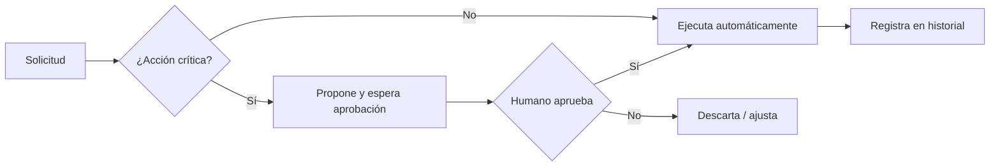

^^ Sesión 02 / Propósito
## Lo que vas a poder hacer al terminar

> Pasar de "pedirle cosas a la IA y cruzar los dedos" a **formular instrucciones que producen resultados verificables**, y entender dónde termina un asistente y empieza un agente.

:::split-3
:::card [01] Conversar con intención
Entender qué ocurre dentro de un modelo y estructurar cada pedido.
:::
:::card [02] Verificar, no confiar
Reconocer alucinaciones y saber cuándo revisar la fuente.
:::
:::card [03] Pensar en agentes
Distinguir chatbot, asistente y agente; diseñar uno para BIM.
:::
:::

---

^^ Sesión 02 / Fundamento
## ¿Qué pasa cuando le "hablás" a un modelo?

:::split
:::card [Mecánica] No busca: predice
Un modelo de lenguaje no consulta una base de datos ni "entiende" como una persona. **Predice el siguiente fragmento de texto** (token) más probable, dado todo lo anterior.

- Trabaja con **probabilidades**, no con certezas.
- La misma pregunta puede dar respuestas distintas.
- No tiene acceso a tu proyecto salvo que se lo des en el contexto.
:::
:::card [Implicación para BIM] Por qué te conviene saberlo
Si el modelo genera lo más *plausible*, tu trabajo es **reducir la ambigüedad**: cuanto más claro y acotado el pedido, más se parece la respuesta probable a la respuesta correcta.
:::warn
Un resultado que "suena bien" no es evidencia técnica. Suena bien **por diseño**.
:::
:::
:::

---

^^ Sesión 02 / Fundamento
## Contexto y ventana de conversación

> Todo lo que el modelo "sabe" en un momento dado vive en su **ventana de contexto**: tu instrucción, los documentos que pegaste y el historial reciente.

:::split
:::card [Entra en el contexto] Lo que sí ve
- Tus instrucciones y el rol que le asignás.
- Ejemplos y datos que le pegás.
- Los últimos turnos de la conversación.
:::
:::card [!Fuera del contexto] Lo que no ve
- El modelo de Revit, salvo que exportes datos.
- Documentos internos que no adjuntaste.
- Conversaciones anteriores en otra ventana.
:::
:::

:::note
Regla práctica: **el modelo solo es tan bueno como el contexto que le das**. Antes de culpar al modelo, revisá qué información le faltaba.
:::

---

^^ Sesión 02 / Técnica
## Anatomía de un prompt estructurado

Un buen pedido casi siempre tiene los mismos cinco ingredientes. Nemotecnia: **R·O·I·R·F**.

:::split
:::card [Los 5 ingredientes] R · O · I · R · F
- **Rol** — quién debe ser ("Actúa como coordinador BIM").
- **Objetivo** — qué querés lograr, en una frase.
- **Información** — datos, contexto, documentos.
- **Restricciones** — qué evitar, normas, alcance.
- **Formato** — cómo querés la salida (tabla, JSON, lista).
:::
:::card [Extras que elevan la calidad] Precisión fina
- **Ejemplos** (few-shot): mostrale una muestra del resultado ideal.
- **Criterios de aceptación**: cómo sabrás si la respuesta sirve.
- **Iteración**: refinar en varios turnos, no exigir todo de una.
:::
:::

---

^^ Sesión 02 / Demostración
## Prompt simple vs. prompt estructurado

:::split
:::card [!Ambiguo] Lo que muchos escriben
"Hazme un cuadro de los muros del proyecto."

*Resultado:* una tabla genérica, inventada, sin relación con tu modelo.
:::
:::card [Estructurado] Lo que conviene escribir
```
Rol: Eres coordinador BIM.
Objetivo: Consolidar una tabla de tipos de muro.
Información: [pego el CSV exportado de Revit].
Restricciones: solo muros portantes; no inventes
  valores faltantes, márcalos como "N/D".
Formato: tabla Markdown con Tipo | Espesor |
  Material | Nº de instancias.
```
:::
:::

:::ok
Mismo modelo, mismo día: la diferencia de calidad la puso la **instrucción**, no la "inteligencia" del modelo.
:::

---

^^ Sesión 02 / Riesgo
## Alucinaciones: plausible ≠ correcto

> Una **alucinación** es una respuesta bien redactada, segura y... falsa. No es un error del modelo: es su forma normal de operar cuando no tiene el dato.

:::split
:::card [Cuándo desconfiar] Señales de alerta
- Cifras exactas, normas o códigos citados de memoria.
- Referencias a artículos o cláusulas que no aportaste.
- Respuestas sobre tu proyecto sin haberle dado datos.
:::
:::card [Cuándo verificar] Protocolo mínimo
- Si la decisión tiene consecuencia técnica o legal → **verificá siempre**.
- Pedí que **cite la fuente exacta** del contexto que le diste.
- Contrastá contra el modelo, el pliego o la norma real.
:::
:::

---

^^ Sesión 02 / Cultura
## Tres mitos que conviene soltar

:::split-3
:::card [Mito 1] "El prompt perfecto"
No existe una fórmula mágica. Existe **claridad** e **iteración**. Un prompt bueno es el que produce el resultado que necesitás, no el más largo.
:::
:::card [Mito 2] "Razona / entiende"
El modelo **simula** razonamiento produciendo texto coherente. Útil, pero no es comprensión ni conciencia. No le atribuyas intención.
:::
:::card [Mito 3] "Nunca se equivoca"
Se equivoca con total seguridad. La confianza del tono **no** mide la exactitud del contenido.
:::
:::

---

^^ Sesión 02 / Transición
## De conversar a actuar: 3 niveles

> Aquí empieza la segunda mitad de la sesión. La diferencia clave no es "qué tan listo" es el sistema, sino **qué puede hacer**.

| | Chatbot | Asistente | Agente |
|---|---|---|---|
| **Qué hace** | Responde texto | Responde con contexto y memoria | **Ejecuta acciones** con herramientas |
| **Estado** | Sin memoria | Recuerda la conversación | Planifica y persigue un objetivo |
| **Ejemplo** | FAQ web | ChatGPT / Claude / Gemini con tus archivos | Agente que consulta un CDE y genera un reporte |
| **Riesgo** | Bajo | Medio | **Alto: puede modificar sistemas** |

---

^^ Sesión 02 / Concepto
## Anatomía de un agente

> Un agente es un modelo de lenguaje al que se le dan **objetivo, memoria, herramientas y límites**, y la capacidad de decidir qué paso dar a continuación.

:::split
:::card [Los componentes] Qué lo define
- **Objetivo** — la meta que persigue.
- **Instrucciones** — cómo debe comportarse.
- **Memoria / contexto** — qué recuerda entre pasos.
- **Herramientas** — funciones que puede invocar (consultar, calcular, escribir).
- **Límites** — qué NO puede hacer sin permiso.
:::
:::card [Cómo opera] El ciclo básico
:::flow
Objetivo -> *Planifica -> Usa herramienta -> Observa -> *Decide -> Resultado
:::
Repite el ciclo hasta cumplir el objetivo o pedir ayuda.
:::
:::

---

^^ Sesión 02 / Control
## Autónomo vs. supervisado

Cuanta más autonomía, más valor **y más riesgo**. La clave en entornos profesionales: **confirmación humana antes de acciones críticas**.



:::note
Consultar información suele ser seguro. **Modificar** el modelo, borrar o publicar exige un punto de validación humano y trazabilidad de la acción.
:::

---

^^ Sesión 02 / Aplicación
## Agentes aplicados a BIM

:::split-3
:::card [Consulta] Agentes que leen
"¿Qué muros no tienen el parámetro de resistencia al fuego?" → el agente consulta el modelo y responde con la lista y su fuente.
:::
:::card [Acción] Agentes que modifican
"Asigná el código de clasificación a estos elementos" → propone el cambio, pide confirmación y lo aplica dejando historial.
:::
:::card [Orquestación] Multiagente
Un agente coordina: uno extrae requisitos del pliego, otro los valida contra el modelo, otro redacta el reporte.
:::
:::

:::chips
Revisión de parámetros, Extracción de pliegos, Reportes de coordinación, Asistente de gerencia, Control de calidad
:::

---

^^ Sesión 02 / Taller
## Actividad práctica (15 min)

:::split
:::card [Parte A] De ambiguo a estructurado
Tomá una solicitud real y vaga de tu trabajo ("necesito un resumen del proyecto") y reescribila con **R·O·I·R·F** + un criterio de aceptación.
:::
:::card [Parte B] Ficha de un agente BIM
Definí en una tarjeta:
- **Propósito** del agente
- **Conocimiento** que necesita
- **Herramientas** que usaría
- **Límites** (qué no hace sin permiso)
- **Usuario** que lo opera
:::
:::

---

^^ Sesión 02 / Cierre
## Para llevar

:::split
:::card [Resultado] Lo que sale de hoy
Una **plantilla de interacción** con modelos de IA y la **ficha inicial de un agente** especializado para tu proceso BIM.
:::
:::card [!Idea fuerza] Una sola frase
El valor no está en el modelo, está en **cómo lo dirigís y cómo verificás**. Un buen operador de IA es, ante todo, un buen redactor de instrucciones y un buen escéptico.
:::
:::

> Próxima sesión de Julián: **Extracción, transformación y gobierno de la información BIM** — 28/08.
