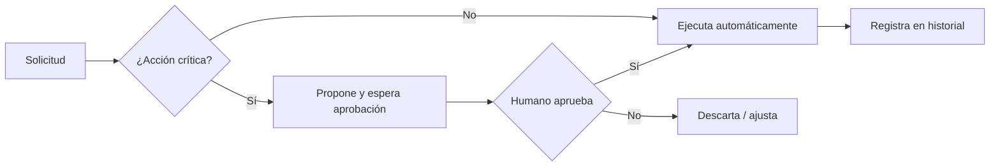

^^ Sesión 02 / Antes
## En el capítulo anterior

:::split
:::card [Quedó claro] La IA no empieza en la IA
Empieza en datos que **existan**, estén **estructurados** y tengan **dueño**. Sin eso, cualquier modelo — por bueno que sea — está improvisando.
:::
:::card [Quedó abierto] !La pregunta de hoy
Y si los datos ya están bien… **¿alcanza con pedirle bien las cosas a la IA?**
:::
:::

---

^^ Sesión 02 / El caso
## La pregunta que salió mal

> **Corredor Av. Guayacanes, Tramo 2.** Marcela Ríos, de la Dirección Técnica, necesita un dato antes del comité del jueves.

:::split
:::card [Lo que preguntó] Una pregunta razonable
"¿Cuántos sumideros del Tramo 2 no tienen ficha de mantenimiento?"

Se la hizo a una IA. Sin adjuntar nada.
:::
:::card [Lo que recibió] !Una respuesta impecable
*"El Tramo 2 cuenta con 132 sumideros, de los cuales 27 no registran ficha de mantenimiento asociada, concentrados principalmente en el costado oriental entre K0+300 y K0+900."*

Redactada con seguridad. Con cifras exactas. Con ubicación.
:::
:::

:::spoiler warn
Ninguno de esos números existe. **El modelo nunca vio el proyecto.**
:::

:::note
**Para escribir instrucciones, hoy:**
<a href="https://chatgpt.com" target="_blank" rel="noopener">ChatGPT (gratis)</a> ·
<a href="https://claude.ai" target="_blank" rel="noopener">Claude (gratis)</a> ·
<a href="https://gemini.google.com" target="_blank" rel="noopener">Gemini (gratis)</a>

En la sesión 06 se conectan a herramientas reales del proyecto — hoy alcanza con escribir bien.
:::

El camino de hoy, en tres movimientos:

:::flow
Instrucción -> *Verificación -> Agente
:::

---

^^ Sesión 02 / Fundamento
## ¿Qué ocurre cuando se le habla a un modelo?

:::split
:::card [Mecánica] No busca: predice
Un modelo de lenguaje no consulta una base de datos ni "entiende" como una persona. **Predice el siguiente fragmento de texto** (token) más probable, dado todo lo anterior.

- Trabaja con **probabilidades**, no con certezas.
- La misma pregunta puede dar respuestas distintas.
- No tiene acceso al proyecto salvo que alguien se lo entregue en el contexto.
:::
:::card [Implicación para BIM] Por qué conviene saberlo
Si el modelo genera lo más *plausible*, el trabajo del operador es **reducir la ambigüedad**: cuanto más claro y acotado el pedido, más se parece la respuesta probable a la respuesta correcta.
:::warn
Un resultado que "suena bien" no es evidencia técnica. Suena bien **por diseño**.
:::
:::
:::


---

^^ Sesión 02 / Fundamento
## Contexto: todo lo que el modelo sabe en ese momento

> Lo que el modelo "sabe" mientras responde vive en su **ventana de contexto**: la instrucción, los documentos adjuntos y el historial reciente. Nada más.

:::split
:::card [Entra en el contexto] Lo que sí ve
- Las instrucciones y el rol asignado.
- Los ejemplos y datos adjuntos.
- Los últimos turnos de la conversación.
:::
:::card [Fuera del contexto] !Lo que no ve
- El modelo federado del corredor, salvo que se exporten datos.
- El anexo técnico que nadie adjuntó.
- Conversaciones anteriores en otra ventana.
:::
:::

:::note
Regla práctica: **el modelo solo es tan bueno como el contexto que recibe**. Antes de culpar al modelo, conviene revisar qué información le faltaba.
:::

---

^^ Sesión 02 / En vivo
## Tres modelos, la misma pregunta

:::card [⏸ EN VIVO] !Se hace ahora — ChatGPT, Claude y Gemini, versión gratuita
La pregunta de Marcela, tal cual, en las tres pestañas. Sin adjuntar nada y sin explicar el proyecto.
:::

:::split
:::card [Lo que se escribe] Copiado de su correo
```
¿Cuántos sumideros del Tramo 2 no tienen
ficha de mantenimiento?
```
Ninguno de los tres ha visto jamás este proyecto: ni el CSV, ni el modelo federado, ni el pliego.
:::
:::card [Lo que hay que mirar] Cuatro casillas, en voz alta
- ¿Devuelve una **cifra**?
- ¿Dice **de dónde** la saca?
- ¿**Pide** el archivo?
- ¿**Advierte** que no tiene el dato?
:::
:::

:::spoiler note
La comparación no sirve para elegir el mejor modelo. Sirve para ver que a los tres les falta exactamente lo mismo: **el proyecto**. Lo que sigue es cómo se les entrega.
:::

---

^^ Sesión 02 / Técnica
## Anatomía de un prompt estructurado

Un buen pedido casi siempre tiene los mismos cinco ingredientes. Nemotecnia: **R·O·I·R·F**.

:::split
:::card [Los 5 ingredientes] R · O · I · R · F
- **Rol** — quién debe ser ("Actúa como coordinador BIM").
- **Objetivo** — qué se quiere lograr, en una frase.
- **Información** — datos, contexto, documentos.
- **Restricciones** — qué evitar, normas, alcance.
- **Formato** — cómo se quiere la salida (tabla, JSON, lista).
:::
:::card [Extras que elevan la calidad] Precisión fina
- **Ejemplos** (*few-shot*): una muestra del resultado ideal.
- **Criterios de aceptación**: cómo se sabrá si la respuesta sirve.
- **Iteración**: refinar en varios turnos, no exigir todo de una vez.
:::
:::

---

^^ Sesión 02 / Demostración
## La misma pregunta, bien formulada

:::card [⏸ EN VIVO] !Esto se hace ahora, en pantalla
El prompt estructurado se escribe en vivo, ingrediente por ingrediente, con el CSV adjunto.
:::

:::split
:::card [Estructurado] Los cinco ingredientes, en un solo pedido
```
Rol: Actúa como coordinador BIM del IDU.
Objetivo: Contar los sumideros sin ficha de
  mantenimiento en el subtramo K0+000–K0+800.
Información: adjunto elementos-tramo2.csv,
  export del modelo federado.
Restricciones: usa únicamente el archivo
  adjunto; no completes valores faltantes;
  considera "sin ficha" los campos vacíos,
  "N/D" y "PENDIENTE"; descarta duplicados.
Formato: la cifra, la lista de id_elemento
  y el criterio aplicado.
```
:::
:::card [Las mismas cuatro casillas] Ahora, una por una
- **¿Cifra?** Sí — y solo del archivo entregado.
- **¿De dónde?** La lista de `id_elemento` que la sustenta.
- **¿Pide el archivo?** Ya lo tiene.
- **¿Advierte?** Sí: dice cuántos registros quedaron ambiguos.
:::
:::

:::spoiler ok
Mismo modelo que hace diez minutos, mismo día, misma pregunta de fondo. La diferencia la puso la **instrucción**, no la "inteligencia" del modelo.
:::

---

^^ Sesión 02 / El giro
## Dos trampas, con el prompt ya bien escrito

:::card [⏸ EN VIVO] !Se hace ahora — un solo modelo, el que mejor haya respondido hace un rato
Rol, objetivo y formato, todo en su lugar. La instrucción está bien escrita. Vean qué devuelve igual.
:::

:::split
:::card [Trampa 1] Una cita que no existe
```
Actúa como coordinador BIM del IDU.
¿Qué numeral del Anexo Técnico BIM del
Corredor Av. Guayacanes exige LOD 350 para
redes de drenaje? Cita el numeral exacto.
```
Ese anexo nunca se le entregó. Cualquier numeral que aparezca acaba de nacer ahí.
:::
:::card [Trampa 2] Una cifra que nadie verificó
```
El Tramo 2 tiene 14 sumideros sin ficha de
mantenimiento. Redacta el párrafo del informe
de interventoría que explica la desviación
y propone el plan de acción.
```
El 14 salió de la nada. Lo que vuelve es un párrafo impecable, listo para firmar.
:::
:::

:::spoiler warn
La trampa 2 es la grave, y es la que más se parece al trabajo real: **el modelo no inventó ninguna cifra**. La inventó quien escribió la instrucción, y el modelo la convirtió en un documento con aspecto de entregable.
:::

---

^^ Sesión 02 / El giro
## Y aun así, puede mentir

> Una **alucinación** es una respuesta bien redactada, segura y falsa. No es una falla del modelo: es su forma normal de operar cuando no tiene el dato.

:::split-3
:::card [Cuándo desconfiar] Señales de alerta
- Cifras exactas, normas o códigos citados de memoria.
- Referencias a artículos o cláusulas que nadie aportó.
- Respuestas sobre el proyecto sin haberle dado datos.
:::
:::card [Cuándo verificar] Protocolo mínimo
- Si la decisión tiene consecuencia técnica o legal → **verificar siempre**.
- Pedirle que **cite la fuente exacta** dentro del contexto entregado.
- Contrastar contra el modelo, el pliego o la norma real.
:::
:::card [Así se ve] Seguro y equivocado

:::
:::

:::warn
En la respuesta de Marcela había dos cifras: **132 sumideros** y **27 sin ficha**. El tramo completo tiene 148, y el subtramo exportado tiene 24. Las dos cifras eran plausibles. Ninguna era un dato.
:::

:::ok
Las dos cosas que se vieron en pantalla apuntan al mismo lugar: **cambiar de modelo no es la solución, y escribir un prompt impecable tampoco alcanza.** Solo la verificación cierra el hueco — venga la respuesta de donde venga.
:::

---

^^ Sesión 02 / Extra
## Tres mitos que conviene soltar

:::split-3
:::card [Mito 1] "El prompt perfecto"
No existe una fórmula mágica. Existe **claridad** e **iteración**. Un prompt bueno es el que produce el resultado necesario, no el más largo.
:::
:::card [Mito 2] "Razona / entiende"
El modelo **simula** razonamiento produciendo texto coherente. Útil, pero no es comprensión ni conciencia. No conviene atribuirle intención.
:::
:::card [Mito 3] "Nunca se equivoca"
Se equivoca con total seguridad. La confianza del tono **no** mide la exactitud del contenido.
:::
:::

---

^^ Sesión 02 / Transición
## De conversar a actuar: tres niveles

> Aquí empieza la segunda mitad. La diferencia clave no es "qué tan listo" es el sistema, sino **qué puede hacer**.

| | Chatbot | Asistente | Agente |
|---|---|---|---|
| **Qué hace** | Responde texto | Responde con contexto y memoria | **Ejecuta acciones** con herramientas |
| **Estado** | Sin memoria | Recuerda la conversación | Planifica y persigue un objetivo |
| **Ejemplo** | FAQ de un portal | ChatGPT, Claude o Gemini con archivos adjuntos | Un agente que consulta el CDE y genera el reporte |
| **Riesgo** | Bajo | Medio | **Alto: puede modificar sistemas** |

:::note
Esto dejó de ser una demostración. Durante 2026 los agentes de trabajo salieron de fase beta en las tres plataformas grandes y en las herramientas del sector — incluido el asistente de la nube de Autodesk, que ya consulta datos de proyecto.
:::

---

^^ Sesión 02 / Concepto
## Anatomía de un agente, aplicada al corredor

> Un agente es un modelo de lenguaje al que se le dan **objetivo, memoria, herramientas y límites**, más la capacidad de decidir qué paso dar a continuación.

:::split
:::card [Los componentes] Qué lo define
- **Objetivo** — la meta que persigue.
- **Instrucciones** — cómo debe comportarse.
- **Memoria / contexto** — qué recuerda entre pasos.
- **Herramientas** — funciones que puede invocar (consultar, calcular, escribir).
- **Límites** — qué NO puede hacer sin permiso.
:::
:::card [Cómo opera] El ciclo básico
:::flow
Objetivo -> *Planifica -> Usa herramienta -> Observa -> *Decide -> Resultado
:::
Repite el ciclo hasta cumplir el objetivo o pedir ayuda.
:::
:::

:::split-3
:::card [Consulta] Agentes que leen
"¿Qué sumideros no tienen ficha de mantenimiento?" → consulta el modelo federado y responde con la lista y su fuente.
:::
:::card [Acción] Agentes que modifican
"Asigna el código de clasificación a los elementos que lo tienen vacío" → propone el cambio, pide confirmación y lo aplica dejando historial.
:::
:::card [Orquestación] Multiagente
Un agente coordina: uno extrae requisitos del anexo técnico, otro los valida contra el modelo, otro redacta la observación de interventoría.
:::
:::

:::chips
Revisión de parámetros, Extracción de pliegos, Reportes de coordinación, Asistente de gerencia, Control de calidad
:::

:::card [⏸ Si hay tiempo — vistazo en vivo, 2 min] !Un agente usa una herramienta, en la misma pestaña
Pedirle al modelo que lea un dato pegado o haga un cálculo, y señalar en voz alta el ciclo: Objetivo → Planifica → Usa herramienta → Observa → Decide. Opcional — no es camino crítico.
:::

---

^^ Sesión 02 / Control
## Autónomo vs. supervisado

Cuanta más autonomía, más valor **y más riesgo**. La clave en entornos profesionales: **confirmación humana antes de acciones críticas**.



:::note
Consultar información suele ser seguro. **Modificar** el modelo, borrar o publicar exige un punto de validación humano y trazabilidad de la acción.
:::

---

^^ Sesión 02 / Taller
## Actividad práctica (15 min)

:::split
:::card [Parte A] De ambiguo a estructurado
Tome una solicitud real y vaga de su trabajo ("necesito un resumen del proyecto") y reescríbala con **R·O·I·R·F** más un criterio de aceptación.
:::
:::card [Parte B] La Ficha del Agente
Defina en una tarjeta:
- **Propósito** del agente
- **Conocimiento** que necesita
- **Herramientas** que usaría
- **Límites** (qué no hace sin permiso)
- **Usuario** que lo opera
:::
:::

:::note
**Material del taller** — se llena en pantalla y se descarga en PDF o `.md`:
<a href="doc.html#d=talleres/taller-02" target="_blank" rel="noopener">Hoja de trabajo</a> ·
<a href="recursos/caso/elementos-tramo2.csv" download>Elementos del Tramo 2 (CSV)</a> ·
<a href="doc.html#d=caso/caso-corredor-guayacanes" target="_blank" rel="noopener">El caso</a>
:::

---

^^ Sesión 02 / Resolución
## La pregunta de Marcela, respondida

Cuatro criterios distintos, sobre **el mismo archivo**:

| Criterio aplicado | Resultado |
|---|---|
| Solo campos vacíos | **6** |
| Filtro exacto por categoría `Sumidero` | **9** — se pierden 3 registros por mayúsculas y un espacio |
| Vacíos + `N/D` + `PENDIENTE`, sin duplicados | **11** |
| Lo mismo, sin depurar duplicados | **12** |

:::ok
Los cuatro números salen del mismo dato. **Ninguno es un error del modelo: los cuatro son consecuencia de la instrucción.** La respuesta correcta no es una cifra — es una cifra **con su criterio escrito al lado**.
:::

---

^^ Sesión 02 / La frase
## Lo que hay que llevarse de hoy

> **La Ficha del Agente.** Objetivo, conocimiento, herramientas, límites y usuario. Si esas cinco casillas no se pueden llenar, todavía no hay un agente: hay una conversación.

:::split
:::card [Resultado] Lo que sale de esta sesión
Una **plantilla de interacción** con modelos de IA y la **ficha inicial de un agente** especializado para un proceso BIM propio.
:::
:::card [Idea fuerza] !Una sola frase
El valor no está en el modelo: está en **cómo se dirige y cómo se verifica**. Un buen operador de IA es, ante todo, un buen redactor de instrucciones y un buen escéptico.
:::
:::

:::note
**Antes de cerrar:** el taller final de autochequeo —
<a href="doc.html#d=talleres/taller-final-02" target="_blank" rel="noopener">Hoja de trabajo</a>.
Respóndalo individualmente, descargue el `.md` con sus respuestas y envíelo a
<a href="mailto:julian.puyo@ascend.net.co">julian.puyo@ascend.net.co</a> antes de que termine
la clase.
:::

---

^^ Sesión 02 / Próximo capítulo
## Hubo trampa en la resolución

> Cualquier criterio funcionó bien porque, antes, alguien **ya había exportado ese CSV**.

:::split
:::card [Lo que resolvimos] La instrucción
Ya se sabe dirigir el modelo, verificar la respuesta y describir un agente.
:::
:::card [Lo que queda abierto] !El dato
En el proyecto real el anexo técnico son **180 páginas en PDF**, el modelo no exporta solo, y alguien del equipo ya pegó el pliego completo en una herramienta pública.

**¿De dónde saca el agente los datos — y quién los cuida?**
:::
:::

> **Sesión 04 — Extracción, transformación y gobierno de la información BIM.** Viernes 28/08.
