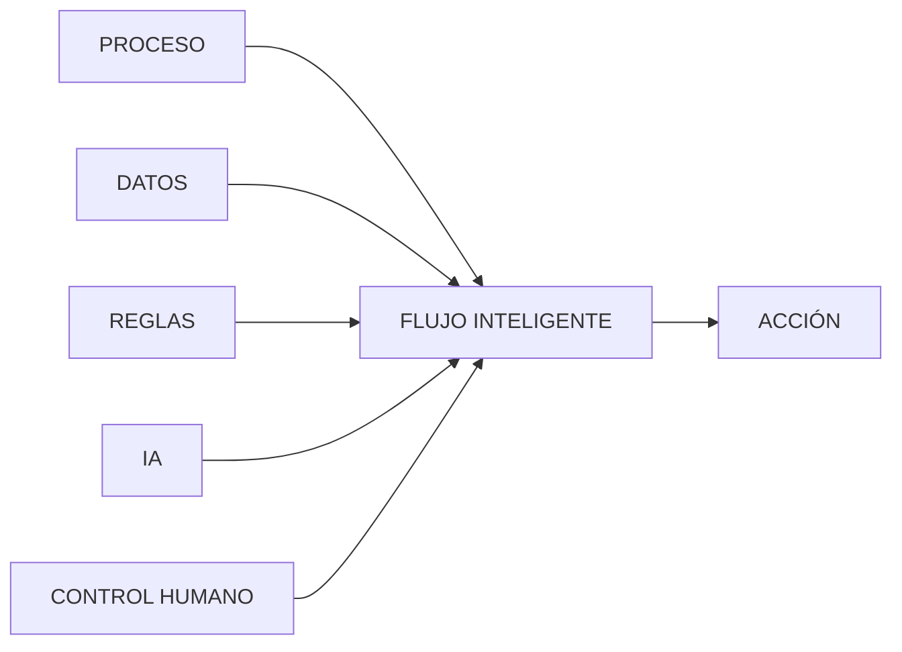

^^ Sesión 03 / Ejercicio de clasificación
## Clasifiquen, uno por uno

> Vamos por la lista. Cada incidencia la clasifica una persona distinta, en voz alta, hasta terminarla.

:::card [⏸ EN VIVO] !Se hace ahora, en pantalla
Se proyecta el Excel con las incidencias del Tramo 2 reportadas esta semana.
:::

Clasifique cada una en **drenaje, estructuras, redes, espacio público u otros**.

---

^^ Sesión 03 / Ejercicio de clasificación
## Ahora, la misma pregunta a una IA

:::card [⏸ EN VIVO] !Se hace ahora, en pantalla
El Excel con las mismas veinte incidencias se pega en un chat de IA, con este prompt:
:::

```text
Dime estas 20 incidencias cuáles son
drenaje, estructuras, redes, espacio
público u otros.
```

---

^^ Sesión 03 / El vaso y la botella
## ¿Cuál de los dos contiene agua?


:::split
:::card [Capacidad] ¿Puede hacer la tarea?
:::
:::card [Eficiencia] !¿Cuánto trabajo puede hacer correctamente por unidad de tiempo/costo?
:::
:::

:::ok
No siempre se necesita que la IA sea más inteligente que nosotros. Basta con que haga el mismo trabajo, suficientemente bien, a una escala, velocidad y costo que nosotros no podemos alcanzar.
:::

---

^^ Sesión 03 / El vaso y la botella
## Humano + IA: ya no siempre suma

*Vaccaro et al. (2024), <a href="https://www.nature.com/articles/s41562-024-02024-1" target="_blank" rel="noopener">Nature Human Behaviour</a>.*

> Hasta hace poco se asumía: Humano + IA > IA sola. La evidencia reciente lo matiza.

:::split
:::card [Si el humano es mejor] Combinar ayuda
Cuando la persona supera a la IA en la tarea, sumarla al proceso puede mejorar el resultado.
:::
:::card [Si la IA es mejor] !Combinar puede empeorar
Cuando la IA ya supera a la persona, meterla en el ciclo puede incluso **reducir** el rendimiento.
:::
:::

:::ok
No hay una regla general. Depende de la tarea, de cómo se diseña la interacción, y de quién tiene realmente la mejor capacidad — no de quién "se supone" que la tiene.
:::

---

^^ Sesión 03 / El rol humano
## El humano deja de ejecutar para diseñar el sistema

> El humano deja de ser necesariamente el ejecutor del trabajo y pasa a diseñar, delegar, supervisar y responsabilizarse por el sistema de trabajo.

:::split
:::card [Antes] El humano ejecuta
:::flow
Humano -> Ejecuta -> Revisa -> Decide -> Entrega
:::
:::
:::card [Ahora] !El humano diseña el sistema
:::flow
Humano -> Define objetivo -> *Diseña contexto -> Define criterios -> IA trabaja -> *Humano interviene donde aporta valor
:::
:::
:::

---

^^ Sesión 03 / El compañero de trabajo
## Deje de pensar en la IA como "el asistente"

> Un asistente espera instrucciones pequeñas. Un compañero recibe responsabilidad sobre trabajo.

:::split
:::card [Asistente] Instrucciones pequeñas
"Resume esto."

"Corrige esto."

"Clasifica esto."
:::
:::card [Compañero] !Responsabilidad sobre un trabajo
"Necesito preparar la revisión del entregable del contratista.

Identifica qué necesitas, analiza la información, señala riesgos, y entrégame una revisión lista para que yo tome la decisión."
:::
:::

:::ok
La diferencia no es antropomorfizar a la IA. Es el **nivel de delegación**.

No hay que decirle qué tecla presionar. Hay que explicarle qué resultado se necesita.
:::

---

^^ Sesión 03 / El compañero de trabajo
## ¿Cómo se trabaja con este compañero?

:::split-3
:::card [Prompt] Una tarea
:::
:::card [Proyecto] Varias tareas relacionadas
:::
:::card [Skill] !Una tarea que se repite
:::
:::

---

^^ Sesión 03 / El compañero de trabajo
## El prompt que realmente importa

:::split
:::card [Contexto] ¿Qué necesita saber?
:::
:::card [Tarea / Pregunta] ¿Qué necesito que haga?
:::
:::

:::split
:::card [Formato] ¿Cómo quiero recibirlo?
:::
:::card [Criterios de calidad] !¿Cómo sé que está bien?
:::
:::

---

^^ Sesión 03 / El compañero de trabajo
## ¿Y si el trabajo dura tres meses?

> Trabajar sobre el mismo contrato, semana tras semana.

No tiene sentido repetir, cada vez:

:::chips
Este es el proyecto, Este es el BEP, Estos son los participantes, Esta es la estructura, Estas son las reglas
:::

Entonces aparece el **proyecto** como unidad de trabajo:

```text
PROYECTO
│
├── contexto permanente
├── documentos
├── instrucciones
├── conversaciones
└── trabajo relacionado
```

:::ok
Un proyecto no reutiliza necesariamente la tarea. Reutiliza el **contexto**.
:::

---

^^ Sesión 03 / El compañero de trabajo
## ¿Y si no se repite el proyecto, sino el trabajo?

> Cada semana: revisar el informe semanal de interventoría.

:::split
:::card [Cambia] Cada vez
Proyecto

Documento

Fechas

Resultados
:::
:::card [Se mantiene] !Siempre
Proceso

Criterios

Formato

Validaciones
:::
:::

:::ok
**Skill** = forma reutilizable de hacer el trabajo.
:::

---

^^ Sesión 03 / El compañero de trabajo
## De la instrucción al procedimiento

> Un skill es lo que ocurre cuando un buen prompt deja de ser una instrucción improvisada y se convierte en un procedimiento reutilizable.

:::split-3
:::card [Prompt] "Haz esto así"
:::
:::card [Prompt bueno]
Contexto + pasos + formato + criterios
:::
:::card [Skill] !Prompt bueno + proceso
Ejemplos + recursos + comprobaciones + reutilización
:::
:::

:::note
*OpenAI define los Skills como flujos de trabajo reutilizables que pueden incluir instrucciones, ejemplos, recursos e incluso código. El archivo `SKILL.md` funciona como el playbook del proceso, y la propia IA puede ayudar a construirlo. — OpenAI Help Center*
:::

:::ok
**El Skill es un prompt que consiguió empleo fijo.**
:::

---

^^ Sesión 03 / El compañero de trabajo
## Cuatro formas de pedir trabajo

| Necesidad | Uso |
|---|---|
| Resolver algo ahora | Prompt |
| Mantener contexto sobre un trabajo | Proyecto |
| Repetir una forma de trabajar | Skill |
| Perseguir un objetivo y usar herramientas | Agente |

---

^^ Sesión 03 / Taller
## Actividad práctica (10 min)

Imagine un Skill: una tarea que hace una y otra vez, de la misma forma.

:::card [Individual] Responda por escrito
### ¿Qué tarea es?

### ¿Qué cambia cada vez?

### ¿Qué se mantiene siempre?

### ¿Ya podría escribirse como un procedimiento reutilizable?
:::

:::note
**Material del taller** — se llena en pantalla y se descarga en PDF o `.md`:
<a href="doc.html#d=talleres/taller-03" target="_blank" rel="noopener">Hoja de trabajo</a>

Responda individualmente. Después se elegirán al azar algunas personas para
compartir su Skill en voz alta.
:::

---

^^ Sesión 03 / Segunda mitad
## El dato no es el archivo

Un archivo es un contenedor o una representación. El dato es el contenido que necesitamos utilizar.

Por ejemplo:

```text
Modelo_Revit_Final_v23.rvt
```

es un archivo.

Pero dentro puede existir:

```text
Elemento:
    ID: SM-042
    Categoría: Sumidero
    Diámetro: 600 mm
    Estado: Ejecutado
    Tramo: T2
    FichaMantenimiento: pendiente
```

:::ok
Para trabajar con IA debemos comenzar a pensar menos en **archivos** y más en **información**.
:::

---

^^ Sesión 03 / Formatos
## El mismo dato puede viajar de muchas formas

Un elemento:

```text
SM-042
Sumidero
600 mm
Ejecutado
```

puede representarse como:

:::chips
CSV, XLSX, JSON, XML, HTML, Markdown, IFC
:::

:::ok
**El formato cambia. El significado debería conservarse.**
:::

---

^^ Sesión 03 / CSV
## CSV — simple y extremadamente útil

```csv
id,categoria,diametro_mm,estado
SM-042,Sumidero,600,Ejecutado
```

Ventajas:

:::chips
Simple, Ligero, Compatible, Fácil de procesar
:::

Limitaciones:

- representa principalmente información tabular;
- no expresa jerarquías complejas de forma natural;
- las relaciones suelen requerir identificadores;
- puede perder información sobre tipos, unidades o significado si no se documentan.

:::note
El CSV de la sesión anterior funcionaba porque alguien ya había convertido una parte del modelo en una **tabla entendible**.
:::

---

^^ Sesión 03 / Excel
## XLS / XLSX — dato + estructura de trabajo humana

Una hoja puede contener:

```text
Código    Descripción    Cantidad    Estado
SM-042    Sumidero       1           Ejecutado
```

Pero un libro de Excel también puede contener:

:::chips
Varias hojas, Fórmulas, Formatos, Celdas combinadas, Tablas, Gráficos, Comentarios
:::

:::warn
Lo que es cómodo para una persona no siempre es cómodo para una máquina.

Una tabla limpia es fácil de procesar.

Una hoja con títulos en cinco filas, celdas fusionadas y notas distribuidas por colores requiere interpretación adicional.
:::

---

^^ Sesión 03 / XML
## XML — estructura explícita mediante etiquetas

```xml
<elemento id="SM-042">
  <categoria>Sumidero</categoria>

  <propiedades>
    <diametro unidad="mm">600</diametro>
    <estado>Ejecutado</estado>
  </propiedades>

  <ubicacion>
    <tramo>T2</tramo>
  </ubicacion>
</elemento>
```

Tiene una estructura más verbosa, pero muy explícita.

:::note
XML sigue apareciendo en numerosos estándares, integraciones y ecosistemas empresariales.
:::

---

^^ Sesión 03 / JSON
## JSON — objetos dentro de objetos

El mismo elemento:

```json
{
  "id": "SM-042",
  "categoria": "Sumidero",
  "propiedades": {
    "diametro": {
      "valor": 600,
      "unidad": "mm"
    },
    "estado": "Ejecutado"
  },
  "ubicacion": {
    "tramo": "T2",
    "abscisa": "K0+620"
  }
}
```

JSON permite conservar naturalmente:

:::chips
Jerarquías, Objetos, Listas, Propiedades, Relaciones mediante IDs
:::

:::ok
Para conectar APIs, aplicaciones, agentes y herramientas modernas, **JSON aparece constantemente**.
:::

---

^^ Sesión 03 / Texto
## Markdown y HTML también contienen estructura

Markdown:

```markdown
# Sumidero SM-042

- Diámetro: 600 mm
- Estado: Ejecutado
- Tramo: T2

## Observación

Ficha de mantenimiento pendiente.
```

HTML:

```html
<article>
  <h1>Sumidero SM-042</h1>
  <ul>
    <li>Diámetro: 600 mm</li>
    <li>Estado: Ejecutado</li>
  </ul>
</article>
```

:::split
:::card [Markdown]
Excelente para representar contenido textual de manera simple y legible.

Muy útil como contexto para modelos de lenguaje.
:::
:::card [HTML]
Además del contenido, expresa estructura de documentos y aplicaciones web.

Puede incluir tablas, enlaces, atributos y metadatos.
:::
:::

---

^^ Sesión 03 / IFC
## IFC no es solamente "otro archivo 3D"

IFC representa información del entorno construido mediante una estructura estandarizada.

Conceptualmente:

```text
IfcProject
   ↓
IfcSite
   ↓
IfcFacility
   ↓
IfcElement
   ↓
Property Sets
```

Y relaciones:

```text
Elemento
   ├── pertenece a...
   ├── está contenido en...
   ├── tiene propiedades...
   ├── usa material...
   └── se relaciona con...
```

:::ok
La importancia de IFC para IA no está únicamente en poder abrir el modelo en otro visor.
Está en disponer de una estructura de información interpretable independientemente de la aplicación que la produjo.
:::

---

^^ Sesión 03 / Concepto
## Formato ≠ contenido

Esta distinción será fundamental durante todo el curso.

:::split
:::card [Formato]
Define cómo se representa o empaqueta información.

:::chips
CSV, JSON, XML, XLSX, IFC, PDF
:::
:::

:::card [Contenido]
Es lo que la información significa.

:::chips
Elemento, Código, Diámetro, Estado, Ubicación, Inspección, Responsable
:::
:::

:::card [Idea clave] !La IA necesita entender el contenido
Cambiar:

```text
RVT → IFC → CSV → JSON
```

no mejora automáticamente el dato.

Si el parámetro estaba vacío, sigue vacío.

Si la nomenclatura era inconsistente, sigue siendo inconsistente.
:::
:::

---

^^ Sesión 03 / Preparación
## Preparar información para IA

Antes de entregar datos a un modelo conviene pasar por un proceso:


---

^^ Sesión 03 / Preparación
## 1. Seleccionar

No necesitamos enviar:

> "todo el modelo".

Necesitamos responder:

> ¿Qué información necesita esta tarea?

Para revisar fichas de drenaje:

:::chips
ID, Categoría, Tramo, Estado, Código, Ficha, Inspección
:::

Probablemente no necesitamos:

:::chips
Texturas, Material gráfico, Familias completas, Geometría de otros sistemas
:::

---

^^ Sesión 03 / Preparación
## 2. Normalizar

Estos valores:

```text
Ejecutado
EJECUTADO
ejecutado
Ejecut.
100%
Terminado
```

pueden referirse al mismo concepto.

Podemos normalizarlos:

```text
estado = "EJECUTADO"
```

Lo mismo ocurre con:

:::chips
Fechas, Unidades, Códigos, Categorías, Estados, Nombres
:::

---

^^ Sesión 03 / Preparación
## 3. Validar

Antes de preguntarle a la IA:

> ¿cuáles elementos tienen problemas?

podemos verificar automáticamente:

- ID no vacío
- Categoría válida
- Unidad conocida
- Estado permitido
- Código único
- Referencia existente

:::ok
Primero usamos reglas determinísticas para garantizar lo que **sí podemos garantizar**.

Después utilizamos IA para interpretar lo que realmente requiere inferencia.
:::

---

^^ Sesión 03 / Preparación
## 4. Relacionar

Un registro aislado:

```json
{
  "id": "SM-042",
  "estado": "Ejecutado"
}
```

tiene poco contexto.

Relacionado:

```json
{
  "id": "SM-042",
  "estado": "Ejecutado",
  "tramo": "T2",
  "actividad": "DR-160",
  "inspeccion": "INS-882",
  "incidencias": ["INC-221"],
  "documentos": ["DOC-119"]
}
```

permite responder preguntas mucho más ricas.

---

^^ Sesión 03 / Preparación
## 5. Contextualizar

Finalmente podemos entregar a la IA:

```text
OBJETIVO
Determinar si debe generarse una observación.

ELEMENTO
SM-042

DATOS BIM
Categoría: Sumidero
Estado: Ejecutado
Tramo: T2

INSPECCIÓN
INS-882
Estado: Pendiente

REQUISITO
Todo elemento ejecutado debe tener
inspección aprobada antes del recibo.

REGLA
No inventar datos faltantes.

SALIDA
Propuesta de observación + evidencia.
```

:::ok
Aquí la IA ya no está "mirando un modelo".

Está **razonando sobre un contexto preparado a partir del modelo**.
:::

---

^^ Sesión 03 / Cierre
## Una ecuación para los flujos inteligentes



---

^^ Sesión 03 / Próximo capítulo
## Ahora aparece otro problema

Ya sabemos que el agente necesita datos como:

```json
{
  "id": "SM-042",
  "categoria": "SUMIDERO",
  "estado": "EJECUTADO",
  "inspeccion": "PENDIENTE"
}
```

Pero en el proyecto real esa información está distribuida entre:

:::chips
RVT, IFC, Excel, PDF, CDE, Formularios, Fotografías, Correos
:::

Y además:

- algunos datos están repetidos;
- algunos tienen nombres diferentes;
- algunos contienen información sensible;
- algunos no deberían salir de la institución;
- algunos necesitan transformarse antes de usarse.

:::card [!La siguiente pregunta]
**¿Cómo extraemos, transformamos y gobernamos toda esa información sin crear otro caos digital?**
:::
