^^ Sesión 03 / Antes
## En los capítulos anteriores

:::split
:::card [Sesión 01] BIM prepara el contexto
Entendimos que BIM no es solamente geometría.

Puede estructurar:

:::chips
Objetos, Propiedades, Relaciones, Documentos, Actividades, Incidencias, Evidencias, Trazabilidad
:::

Y que esa estructura puede convertirse en contexto para sistemas de IA.
:::

:::card [Sesión 02] La IA puede actuar
Aprendimos a pasar de una conversación a un agente:

:::flow
Objetivo -> Contexto -> Herramientas -> Acción
:::

Pero quedó una pregunta importante:

**¿qué ocurre entre la herramienta y los datos reales del proyecto?**
:::
:::

---

^^ Sesión 03 / El problema
## El agente de Marcela ya existe

> **Corredor Av. Guayacanes, Tramo 2.**

Marcela ya tiene un agente capaz de consultar información del proyecto.

Le pide:

> "Revisa las inspecciones de drenaje de esta semana, identifica elementos con información incompleta y genera las observaciones correspondientes."

El agente responde:

:::warn
**No sé cómo hacerlo.**

No porque le falte inteligencia.

Porque todavía no está definido:

- dónde empiezan los datos;
- qué información debe consultar;
- qué significa "incompleta";
- qué reglas debe aplicar;
- qué decisiones puede tomar;
- cuándo debe detenerse;
- qué puede modificar;
- quién debe aprobar;
- dónde debe registrar el resultado.
:::

---

^^ Sesión 03 / Idea central
## Un agente necesita un proceso

En la sesión anterior definimos:

:::flow
Objetivo -> *Planifica -> Usa herramienta -> Observa -> *Decide -> Resultado
:::

Pero una organización necesita algo más explícito:

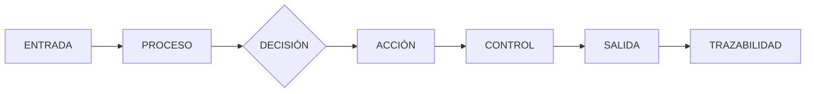

Cada caja de este flujo es una pregunta que hoy nadie ha respondido para el pedido de Marcela.

:::ok
Antes de preguntarnos **qué IA utilizar**, debemos entender **qué proceso queremos ejecutar**.
:::

---

^^ Sesión 03 / Evolución
## Cinco formas de ejecutar el mismo proceso

Tomemos una tarea habitual:

Revisar si las inspecciones de elementos de drenaje están completas.

:::split-3
:::card [01] Manual
Una persona:
abre el modelo;
busca elementos;
abre documentos;
compara información;
identifica faltantes;
redacta observaciones.
:::
:::card [02] Digital
Los mismos pasos ocurren en sistemas digitales.

:::chips
BIM, CDE, Excel, Formularios, Correo
:::
La información está digitalizada.
El proceso sigue siendo humano.
:::
:::card [03] Automatizado
Un software ejecuta reglas conocidas:

```text
SI ficha = vacía
Y estado = "Ejecutado"
ENTONCES generar alerta
```

No necesita IA.
:::
:::

:::split
:::card [04] Asistido por IA
El sistema ejecuta el proceso, pero utiliza IA donde existe ambigüedad.

Ejemplo:

> Interpretar el texto libre de una observación y determinar si corresponde a una falla de drenaje.

La persona conserva el control del proceso.
:::
:::card [05] Operado por agentes
Se entrega un objetivo.

El agente puede:

1. consultar sistemas;
2. seleccionar herramientas;
3. analizar resultados;
4. decidir el siguiente paso;
5. solicitar aprobación;
6. ejecutar acciones permitidas;
7. registrar lo realizado.
:::
:::

---

^^ Sesión 03 / Distinción
## Digitalizar no es automatizar

:::split
:::card [Digitalización]
Antes:

```text
Formulario en papel
```

Después:

```text
Formulario PDF
```

La persona sigue:

- descargándolo;
- leyéndolo;
- copiando información;
- verificándolo;
- enviándolo.
:::
:::card [Automatización]
El sistema recibe los datos directamente:

```text
Formulario
    ↓
Validación
    ↓
Base de datos
    ↓
Regla
    ↓
Notificación
```

La intervención humana se reserva para las excepciones.
:::
:::

:::warn
Mover una actividad manual desde papel hacia una pantalla no necesariamente transforma el proceso.
Puede ser exactamente el mismo proceso, pero digital.
:::

---

^^ Sesión 03 / Espectro
## De humano a agente

| Nivel | Quién ejecuta | Cómo decide | Ejemplo |
|---|---|---|---|
| Manual | Persona | Criterio humano | Revisar fichas una por una |
| Digital | Persona + software | Criterio humano | Revisarlas desde el CDE |
| Automatizado | Software | Reglas explícitas | Detectar campos vacíos |
| Asistido por IA | Persona + IA | Reglas + inferencia | Interpretar observaciones |
| Agéntico | IA + herramientas + persona | Planificación + reglas + inferencia | Revisar, consultar, proponer y registrar |

:::ok
No existe obligación de llegar siempre al último nivel.

**El mejor proceso puede ser una combinación de los cinco.**
:::

---

^^ Sesión 03 / Fundamento
## Dos mundos que deben convivir

:::split
:::card [Determinístico] Misma entrada → misma salida
Una regla define exactamente lo que ocurre.

```text
SI diámetro < 600 mm
ENTONCES marcar incumplimiento
```

Ideal para:

:::chips
Cálculos, Validaciones, Unidades, Estados, Permisos, Límites, Reglas contractuales
:::
:::

:::card [Probabilístico] La salida implica interpretación
No siempre existe una única respuesta matemática.

"Determine si esta observación
describe una posible falla de drenaje."

El sistema estima la respuesta más probable utilizando un modelo.
:::
:::

---

^^ Sesión 03 / Decisión
## No todo necesita Inteligencia Artificial

Supongamos que debemos verificar:

¿El parámetro CodigoActivo está vacío?

:::split
:::card [!Con IA]
Preguntarle a un LLM:
"¿Este campo está vacío?"
Más costo.
Más latencia.
Posibilidad de interpretación innecesaria.
:::
:::card [Con una regla]
```python
if codigo_activo is None:
    generar_alerta()
```

Predecible.

Auditable.

Repetible.
:::
:::

:::ok
Si una regla puede resolver correctamente el problema, utilizar IA puede agregar incertidumbre sin agregar valor.
:::

---

^^ Sesión 03 / Arquitectura
## El mejor flujo suele ser híbrido

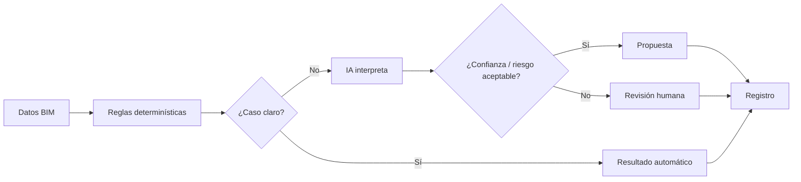

:::note
La IA no tiene que reemplazar las reglas.

Puede encargarse precisamente de los casos que **las reglas tradicionales no expresan bien**.
:::

---

^^ Sesión 03 / Anatomía
## Todo flujo puede descomponerse

Para automatizar un proceso debemos poder identificar:

:::split-3
:::card [Entrada]
¿Qué inicia el proceso?

:::chips
Archivo, Evento, Formulario, Solicitud, Cambio de estado, Fecha, Sensor
:::
:::

:::card [Actividad]
¿Qué trabajo se realiza?

:::chips
Consultar, Comparar, Calcular, Validar, Clasificar, Generar
:::
:::

:::card [Salida]
¿Qué produce?

:::chips
Dato, Documento, Decisión, Incidencia, Notificación, Cambio
:::
:::
:::

---

^^ Sesión 03 / Anatomía
## Y entre la entrada y la salida...

:::split-3
:::card [Reglas]
¿Qué debe cumplirse?

```text
estado = APROBADO
clasificación != NULL
```
:::

:::card [Decisiones]
¿Qué caminos existen?

```text
¿Cumple?
    Sí → continuar
    No → observar
```
:::

:::card [Excepciones]
¿Qué puede salir mal?

:::chips
Dato faltante, Archivo corrupto, Caso ambiguo, Permiso insuficiente
:::
:::
:::

:::split-3
:::card [Controles]
¿Dónde debemos detener el proceso para verificar algo?
:::
:::card [Responsables]
¿Qué hace el sistema y qué debe hacer una persona?
:::
:::card [Trazabilidad]
¿Qué debemos registrar para reconstruir posteriormente lo ocurrido?
:::
:::

---

^^ Sesión 03 / Trazabilidad
## Automatizar también significa poder explicar

Un buen flujo debería poder responder:

```text
¿Qué ocurrió?
¿Cuándo ocurrió?
¿Qué dato entró?
¿Qué reglas se ejecutaron?
¿Qué modelo de IA intervino?
¿Qué resultado produjo?
¿Qué acción se tomó?
¿Quién aprobó?
¿Qué información se modificó?
```

:::warn
Si un sistema genera automáticamente una observación contractual pero después nadie puede reconstruir por qué la generó, se automatizó la acción pero no el control.
:::

---

^^ Sesión 03 / Control humano
## El humano no desaparece: cambia de posición

En un flujo manual:

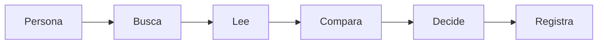

En un flujo inteligente:

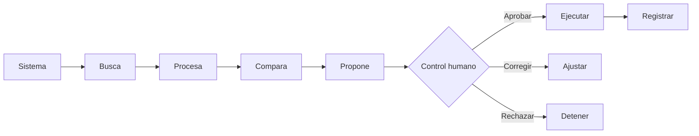

:::ok
La automatización elimina trabajo repetitivo.

No necesariamente elimina **responsabilidad profesional**.
:::

---

^^ Sesión 03 / Riesgo
## ¿Dónde colocamos puntos de control?

No todas las acciones requieren la misma supervisión.

:::split-3
:::card [Bajo riesgo] Automático
- consultar datos;
- ordenar información;
- convertir formatos;
- detectar campos vacíos;
- calcular cantidades.
:::
:::card [Riesgo medio] Revisar resultado
- clasificar incidencias;
- resumir informes;
- proponer observaciones;
- identificar inconsistencias.
:::
:::card [Alto riesgo] Aprobar antes de ejecutar
- modificar modelos;
- aprobar entregables;
- emitir comunicaciones oficiales;
- modificar información contractual;
- eliminar información.
:::
:::

---

^^ Sesión 03 / Comparación
## Tiempo, costo y riesgo

Tomemos 1.000 elementos que deben revisarse.

| Flujo | Trabajo humano | Escalabilidad | Variabilidad | Riesgo principal |
|---|---:|---|---|---|
| Manual | Muy alto | Baja | Humana | Omisiones |
| Digital | Alto | Baja | Humana | Fragmentación |
| Automatizado | Bajo | Muy alta | Baja | Regla incorrecta |
| IA asistida | Medio | Alta | Media | Interpretación |
| Agente | Bajo | Muy alta | Media/alta | Acción incorrecta |

:::note
La automatización no elimina el riesgo.
Cambia el tipo de riesgo.
En un proceso manual preocupa que una persona olvide revisar algo.
En uno automatizado preocupa que una regla equivocada revise incorrectamente miles de elementos de forma consistente.
:::

---

^^ Sesión 03 / Modelado
## Antes de diseñar el futuro: As Is

As Is significa representar cómo funciona realmente el proceso hoy.
No cómo debería funcionar.
No cómo está escrito en el procedimiento.
Cómo ocurre.

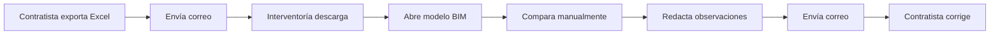

---

^^ Sesión 03 / Diagnóstico
## El As Is revela el desperdicio

Al diagramar aparecen actividades que antes parecían normales:

:::chips
Descargar, Copiar, Pegar, Renombrar, Buscar, Repetir, Transcribir, Volver a cargar, Preguntar, Esperar
:::

:::split
:::card [Trabajo que agrega valor]
- interpretar;
- decidir;
- diseñar;
- validar técnicamente;
- resolver excepciones.
:::
:::card [Trabajo candidato a automatización]
- mover información;
- transformar formatos;
- buscar registros;
- verificar reglas repetitivas;
- generar borradores;
- sincronizar sistemas.
:::
:::

---

^^ Sesión 03 / Modelado
## Después diseñamos el To Be

El **To Be** representa el proceso objetivo.

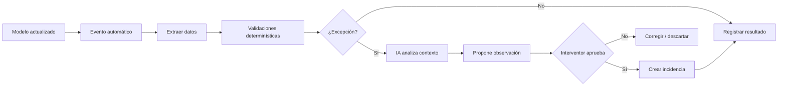

:::ok
El To Be no consiste en insertar un bloque llamado "IA" dentro del proceso existente.
Consiste en rediseñar qué actividades deben existir y quién debería ejecutarlas.
:::

---

^^ Sesión 03 / Regla de diseño
## No automatice todavía

Antes de automatizar una actividad pregunte:

:::split-3
:::card [01] ¿Debe existir?
Tal vez el paso es consecuencia de un proceso mal diseñado.
:::
:::card [02] ¿Puede simplificarse?
Tal vez podemos eliminar sistemas, duplicidades o transferencias.
:::
:::card [03] ¿Debe automatizarse?
Solo después elegimos:

**regla, código, integración, IA o agente.**
:::
:::

:::warn
Automatizar un proceso innecesariamente complejo puede producir simplemente:
un proceso malo que ahora ocurre más rápido.
:::

---

^^ Sesión 03 / El giro
## ¿Y qué circula por esos flujos?

Hasta ahora dibujamos cajas:

- Consultar modelo
- Extraer información
- Validar
- Comparar
- Generar incidencia

Pero una computadora necesita algo mucho más concreto.

:::card [Pregunta] !¿Qué significa "información del modelo"?
¿Un `.rvt`?

¿Un `.ifc`?

¿Una tabla?

¿Un JSON?

¿Geometría?

¿Propiedades?

¿Relaciones?

¿Todo?
:::

---

^^ Sesión 03 / Segunda mitad
## El dato no es el archivo

Un archivo es un contenedor o una representación. El dato es el contenido que necesitamos utilizar.

Por ejemplo:

```text
Modelo_Revit_Final_v23.rvt
```

es un archivo.

Pero dentro puede existir:

```text
Elemento:
    ID: SM-042
    Categoría: Sumidero
    Diámetro: 600 mm
    Estado: Ejecutado
    Tramo: T2
    FichaMantenimiento: pendiente
```

:::ok
Para trabajar con IA debemos comenzar a pensar menos en **archivos** y más en **información**.
:::

---

^^ Sesión 03 / BIM
## BIM = geometría + información + relaciones

Un elemento BIM puede representarse conceptualmente como:

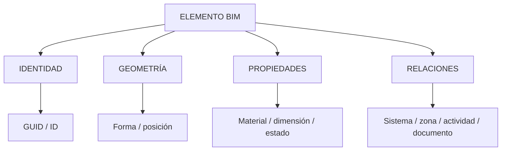

:::note
La geometría es importante.

Pero muchas tareas institucionales de IA pueden resolverse utilizando principalmente **identidad, propiedades y relaciones**.
:::

---

^^ Sesión 03 / Objetos
## BIM como colección de objetos

Supongamos un tramo de infraestructura:

```text
TRAMO 2
│
├── Sumidero SM-001
├── Sumidero SM-002
├── Pozo PZ-001
├── Tubería TB-001
├── Tubería TB-002
└── Cámara CM-001
```

Cada objeto puede tener:

:::split-3
:::card [Identidad]
- GUID
- código
- clasificación
- tipo
:::
:::card [Propiedades]
- diámetro
- material
- estado
- fecha
- longitud
:::
:::card [Relaciones]
- pertenece a tramo
- conecta con
- tiene inspección
- tiene documento
- tiene incidencia
:::
:::

---

^^ Sesión 03 / Parámetros
## Tipo vs. instancia

Para quienes trabajan en BIM es conocido.

Para preparar datos para IA, la diferencia se vuelve crítica.

:::split
:::card [Tipo] Información compartida
```text
Tipo:
Tubería PVC Ø600
```

Propiedades:

```text
Material = PVC
Diámetro = 600 mm
Norma = ...
```

Muchos elementos pueden utilizar el mismo tipo.
:::
:::card [Instancia] Información del objeto particular
```text
Elemento:
TB-0042
```

Propiedades:

```text
Tramo = T2
Longitud = 4.25 m
Estado = Ejecutado
Inspección = Pendiente
```

Son propias de ese elemento.
:::
:::

:::warn
Al exportar información debemos saber si una propiedad pertenece al tipo, a la instancia o resulta de una relación.
De lo contrario podemos duplicar, perder o interpretar incorrectamente los datos.
:::

---

^^ Sesión 03 / Datos
## Tres grandes formas de información

:::split-3
:::card [Estructurada]
Tiene una estructura explícita y predecible.

```text
id       tipo        diámetro
SM-01    Sumidero    600
SM-02    Sumidero    800
```

Ideal para:

:::chips
Filtrar, Ordenar, Calcular, Validar
:::
:::

:::card [Semiestructurada]
Tiene estructura, pero puede ser flexible o jerárquica.

```json
{
  "id": "SM-01",
  "propiedades": {
    "diametro": 600
  }
}
```

Ejemplos:

:::chips
JSON, XML, IFC
:::
:::

:::card [No estructurada]
La estructura no está explícita como filas y campos.

:::chips
PDF, Fotografías, Correos, Informes, Audio, Video
:::

Aquí la IA generativa resulta especialmente útil para extraer estructura.
:::
:::

---

^^ Sesión 03 / Bases de datos
## La tabla: una representación familiar

Una base de datos podría almacenar:

```text
id       categoría    tramo    diámetro_mm    estado
SM-001   Sumidero     T2       600            Ejecutado
SM-002   Sumidero     T2       600            Diseñado
PZ-001   Pozo         T2       1200           Ejecutado
```

Ahora podemos hacer preguntas determinísticas:

```sql
SELECT *
FROM elementos
WHERE categoria = 'Sumidero'
AND estado = 'Ejecutado';
```

:::ok
Una gran parte de lo que llamamos "consultar BIM" puede convertirse en operaciones sobre **datos estructurados**.
:::

---

^^ Sesión 03 / Relaciones
## Pero una sola tabla no representa todo BIM

Podemos tener:

:::chips
Elementos, Inspecciones, Incidencias, Documentos, Actividades, Personas
:::

Y relacionarlos:

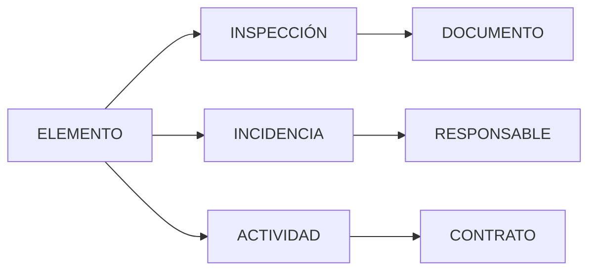

La capacidad de responder preguntas complejas aparece cuando conservamos esas relaciones.

---

^^ Sesión 03 / Formatos
## El mismo dato puede viajar de muchas formas

Un elemento:

```text
SM-042
Sumidero
600 mm
Ejecutado
```

puede representarse como:

:::chips
CSV, XLSX, JSON, XML, HTML, Markdown, IFC
:::

:::ok
**El formato cambia. El significado debería conservarse.**
:::

---

^^ Sesión 03 / CSV
## CSV — simple y extremadamente útil

```csv
id,categoria,diametro_mm,estado
SM-042,Sumidero,600,Ejecutado
```

Ventajas:

:::chips
Simple, Ligero, Compatible, Fácil de procesar
:::

Limitaciones:

- representa principalmente información tabular;
- no expresa jerarquías complejas de forma natural;
- las relaciones suelen requerir identificadores;
- puede perder información sobre tipos, unidades o significado si no se documentan.

:::note
El CSV de la sesión anterior funcionaba porque alguien ya había convertido una parte del modelo en una **tabla entendible**.
:::

---

^^ Sesión 03 / Excel
## XLS / XLSX — dato + estructura de trabajo humana

Una hoja puede contener:

```text
Código    Descripción    Cantidad    Estado
SM-042    Sumidero       1           Ejecutado
```

Pero un libro de Excel también puede contener:

:::chips
Varias hojas, Fórmulas, Formatos, Celdas combinadas, Tablas, Gráficos, Comentarios
:::

:::warn
Lo que es cómodo para una persona no siempre es cómodo para una máquina.

Una tabla limpia es fácil de procesar.

Una hoja con títulos en cinco filas, celdas fusionadas y notas distribuidas por colores requiere interpretación adicional.
:::

---

^^ Sesión 03 / JSON
## JSON — objetos dentro de objetos

El mismo elemento:

```json
{
  "id": "SM-042",
  "categoria": "Sumidero",
  "propiedades": {
    "diametro": {
      "valor": 600,
      "unidad": "mm"
    },
    "estado": "Ejecutado"
  },
  "ubicacion": {
    "tramo": "T2",
    "abscisa": "K0+620"
  }
}
```

JSON permite conservar naturalmente:

:::chips
Jerarquías, Objetos, Listas, Propiedades, Relaciones mediante IDs
:::

:::ok
Para conectar APIs, aplicaciones, agentes y herramientas modernas, **JSON aparece constantemente**.
:::

---

^^ Sesión 03 / XML
## XML — estructura explícita mediante etiquetas

```xml
<elemento id="SM-042">
  <categoria>Sumidero</categoria>

  <propiedades>
    <diametro unidad="mm">600</diametro>
    <estado>Ejecutado</estado>
  </propiedades>

  <ubicacion>
    <tramo>T2</tramo>
  </ubicacion>
</elemento>
```

Tiene una estructura más verbosa, pero muy explícita.

:::note
XML sigue apareciendo en numerosos estándares, integraciones y ecosistemas empresariales.
:::

---

^^ Sesión 03 / Texto
## Markdown y HTML también contienen estructura

Markdown:

```markdown
# Sumidero SM-042

- Diámetro: 600 mm
- Estado: Ejecutado
- Tramo: T2

## Observación

Ficha de mantenimiento pendiente.
```

HTML:

```html
<article>
  <h1>Sumidero SM-042</h1>
  <ul>
    <li>Diámetro: 600 mm</li>
    <li>Estado: Ejecutado</li>
  </ul>
</article>
```

:::split
:::card [Markdown]
Excelente para representar contenido textual de manera simple y legible.

Muy útil como contexto para modelos de lenguaje.
:::
:::card [HTML]
Además del contenido, expresa estructura de documentos y aplicaciones web.

Puede incluir tablas, enlaces, atributos y metadatos.
:::
:::

---

^^ Sesión 03 / IFC
## IFC no es solamente "otro archivo 3D"

IFC representa información del entorno construido mediante una estructura estandarizada.

Conceptualmente:

```text
IfcProject
   ↓
IfcSite
   ↓
IfcFacility
   ↓
IfcElement
   ↓
Property Sets
```

Y relaciones:

```text
Elemento
   ├── pertenece a...
   ├── está contenido en...
   ├── tiene propiedades...
   ├── usa material...
   └── se relaciona con...
```

:::ok
La importancia de IFC para IA no está únicamente en poder abrir el modelo en otro visor.
Está en disponer de una estructura de información interpretable independientemente de la aplicación que la produjo.
:::

---

^^ Sesión 03 / Concepto
## Formato ≠ contenido

Esta distinción será fundamental durante todo el curso.

:::split
:::card [Formato]
Define cómo se representa o empaqueta información.

:::chips
CSV, JSON, XML, XLSX, IFC, PDF
:::
:::

:::card [Contenido]
Es lo que la información significa.

:::chips
Elemento, Código, Diámetro, Estado, Ubicación, Inspección, Responsable
:::
:::

:::card [Idea clave] !La IA necesita entender el contenido
Cambiar:

```text
RVT → IFC → CSV → JSON
```

no mejora automáticamente el dato.

Si el parámetro estaba vacío, sigue vacío.

Si la nomenclatura era inconsistente, sigue siendo inconsistente.
:::
:::

---

^^ Sesión 03 / Exportación
## ¿Qué significa exportar BIM?

No es simplemente:

Guardar como...

Conceptualmente ocurre:

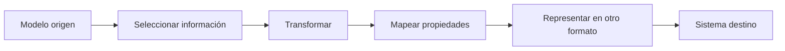

En cada paso puede cambiar algo.

---

^^ Sesión 03 / Riesgo
## En cada intercambio podemos perder contexto

Modelo original:

```text
SM-042
│
├── Tipo: Sumidero Prefabricado 600
├── Sistema: Drenaje Pluvial
├── Tramo: T2
├── Zona: Z-04
├── Actividad: DR-160
├── Inspección: INS-882
└── Incidencia: INC-221
```

Exportación rápida:

```csv
id,categoria,diametro
SM-042,Sumidero,600
```

¿Qué desapareció?

:::chips
Sistema, Tramo, Zona, Actividad, Inspección, Incidencia
:::

:::warn
El dato sigue siendo correcto.

Pero ya **no responde las mismas preguntas**.
:::

---

^^ Sesión 03 / Contexto
## Perder relaciones es perder inteligencia

Con:

```csv
id,categoria,diametro
SM-042,Sumidero,600
```

podemos preguntar:

> ¿Cuántos sumideros tienen diámetro 600?

Pero no:

> ¿Cuáles sumideros ejecutados durante junio tienen una inspección pendiente y una incidencia abierta relacionada con drenaje?

Para eso necesitamos conservar:

:::chips
Identidad, Relaciones, Estados, Fechas, Referencias
:::

---

^^ Sesión 03 / Ejemplo
## Un archivo correcto puede ser insuficiente

Supongamos:

```csv
elemento,valor
SM-042,600
```

¿Qué significa 600?

:::split-3
:::card
600 mm
:::
:::card
600 **cm**
:::
:::card
600 **unidades**
:::
:::

¿Y `SM-042`?

¿Es un sumidero?

¿Un código contractual?

¿Una familia?

¿Un identificador interno?

:::ok
Los datos necesitan semántica.
No basta con transportar valores.
:::

---

^^ Sesión 03 / Preparación
## Preparar información para IA

Antes de entregar datos a un modelo conviene pasar por un proceso:

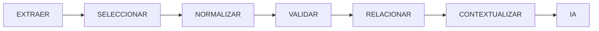

---

^^ Sesión 03 / Preparación
## 1. Seleccionar

No necesitamos enviar:

> "todo el modelo".

Necesitamos responder:

> ¿Qué información necesita esta tarea?

Para revisar fichas de drenaje:

:::chips
ID, Categoría, Tramo, Estado, Código, Ficha, Inspección
:::

Probablemente no necesitamos:

:::chips
Texturas, Material gráfico, Familias completas, Geometría de otros sistemas
:::

---

^^ Sesión 03 / Preparación
## 2. Normalizar

Estos valores:

```text
Ejecutado
EJECUTADO
ejecutado
Ejecut.
100%
Terminado
```

pueden referirse al mismo concepto.

Podemos normalizarlos:

```text
estado = "EJECUTADO"
```

Lo mismo ocurre con:

:::chips
Fechas, Unidades, Códigos, Categorías, Estados, Nombres
:::

---

^^ Sesión 03 / Preparación
## 3. Validar

Antes de preguntarle a la IA:

> ¿cuáles elementos tienen problemas?

podemos verificar automáticamente:

- ID no vacío
- Categoría válida
- Unidad conocida
- Estado permitido
- Código único
- Referencia existente

:::ok
Primero usamos reglas determinísticas para garantizar lo que **sí podemos garantizar**.

Después utilizamos IA para interpretar lo que realmente requiere inferencia.
:::

---

^^ Sesión 03 / Preparación
## 4. Relacionar

Un registro aislado:

```json
{
  "id": "SM-042",
  "estado": "Ejecutado"
}
```

tiene poco contexto.

Relacionado:

```json
{
  "id": "SM-042",
  "estado": "Ejecutado",
  "tramo": "T2",
  "actividad": "DR-160",
  "inspeccion": "INS-882",
  "incidencias": ["INC-221"],
  "documentos": ["DOC-119"]
}
```

permite responder preguntas mucho más ricas.

---

^^ Sesión 03 / Preparación
## 5. Contextualizar

Finalmente podemos entregar a la IA:

```text
OBJETIVO
Determinar si debe generarse una observación.

ELEMENTO
SM-042

DATOS BIM
Categoría: Sumidero
Estado: Ejecutado
Tramo: T2

INSPECCIÓN
INS-882
Estado: Pendiente

REQUISITO
Todo elemento ejecutado debe tener
inspección aprobada antes del recibo.

REGLA
No inventar datos faltantes.

SALIDA
Propuesta de observación + evidencia.
```

:::ok
Aquí la IA ya no está "mirando un modelo".

Está **razonando sobre un contexto preparado a partir del modelo**.
:::

---

^^ Sesión 03 / Estandarización
## Aquí vuelven las nomenclaturas

Proyecto A:

```text
Sumidero
SUMIDERO
sumideros
Sum.
SUMIDERO PLUVIAL
Drain inlet
```

Proyecto B:

Clasificación:

```text
DRENAJE.SUMIDERO
```

Código de tipo:

```text
SUM-PREF-600
```

:::warn
La IA puede intentar inferir que todos los nombres significan lo mismo.

Pero recuerde la sesión 01:

**inferir una relación no equivale a conocer una relación explícita.**
:::

---

^^ Sesión 03 / Escala
## Lo que funciona en un proyecto puede fallar en cien

Si cada proyecto utiliza:

```text
estado = terminado
```

otro:

```text
estado = ejecutado
```

otro:

```text
avance = 100
```

otro:

```text
status = complete
```

podemos hacer integraciones individuales.

Pero construir capacidad institucional se vuelve costoso.

:::ok
Las nomenclaturas, clasificaciones y esquemas comunes permiten ejecutar **la misma lógica** sobre múltiples proyectos.
:::

---

^^ Sesión 03 / Arquitectura
## Un flujo inteligente completo

Ahora podemos unir las dos mitades de la sesión.

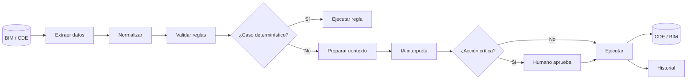

---

^^ Sesión 03 / Caso
## Volvamos al agente de Marcela

Solicitud:

> "Revisa las inspecciones de drenaje de esta semana, identifica elementos con información incompleta y genera las observaciones correspondientes."

Ahora podemos diseñarlo.

:::split
:::card [Datos]
**Entrada**

- elementos BIM;
- inspecciones;
- actividades;
- estados;
- requisitos.

**Formato operativo**

JSON / tablas consultadas mediante API.
:::
:::card [Proceso]
**Determinístico**

- seleccionar drenaje;
- filtrar semana;
- detectar campos obligatorios vacíos.

**IA**

- interpretar observaciones;
- redactar propuesta.

**Humano**

- aprobar observación contractual.
:::
:::

---

^^ Sesión 03 / Caso
## El agente ya tiene un camino

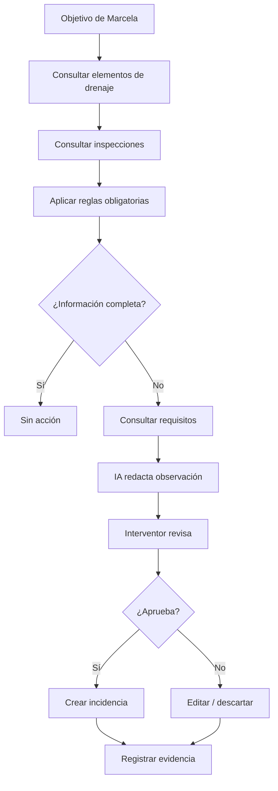

:::ok
El modelo de IA es solo una pieza.
El verdadero sistema está compuesto por:
datos + reglas + proceso + herramientas + IA + controles + trazabilidad.
:::

---

^^ Sesión 03 / Taller
## Actividad práctica — Parte A: As Is

Seleccione un proceso BIM real de su trabajo.

Ejemplos:

:::chips
Revisión de entregables, Inspección de obra, Validación de parámetros, Gestión de incidencias, Aprobación documental, Seguimiento de avance
:::

Dibuje el proceso actual.

Debe identificar:

```text
INICIO
↓
Entradas
↓
Actividades
↓
Decisiones
↓
Excepciones
↓
Controles
↓
Salidas
```

:::warn
No dibuje cómo debería funcionar.

Dibuje cómo funciona **realmente hoy**.
:::

---

^^ Sesión 03 / Taller
## Parte B: diseñar el To Be

Para cada actividad del As Is marque:

:::split-3
:::card [H] Humano
Requiere juicio profesional o responsabilidad.
:::
:::card [D] Determinístico
Puede resolverse mediante una regla conocida.
:::
:::card [IA] Probabilístico
Requiere interpretación, clasificación o generación.
:::
:::

Después elimine pasos innecesarios y diseñe:

> **el flujo futuro.**

---

^^ Sesión 03 / Taller
## Parte C: definir los datos

Seleccione una actividad del To Be que consuma información BIM.

Complete:

| Pregunta | Respuesta |
|---|---|
| ¿Qué objetos necesita? | |
| ¿Qué propiedades necesita? | |
| ¿Qué relaciones necesita? | |
| ¿Cuál es el identificador? | |
| ¿Qué unidades utiliza? | |
| ¿Qué valores son obligatorios? | |
| ¿En qué sistema viven? | |
| ¿Cómo pueden exportarse? | |
| ¿Qué contexto podría perderse? | |

---

^^ Sesión 03 / Taller
## Parte D: diseñar la interfaz con la IA

Finalmente represente la entrada ideal.

Ejemplo:

```json
{
  "objetivo": "evaluar inspeccion",
  "elemento": {
    "id": "SM-042",
    "categoria": "SUMIDERO",
    "estado": "EJECUTADO"
  },
  "inspeccion": {
    "id": "INS-882",
    "estado": "PENDIENTE"
  },
  "regla": {
    "codigo": "DR-04",
    "descripcion": "..."
  }
}
```

Y responda:

> **¿Qué parte debe resolver una regla y qué parte necesita realmente IA?**

---

^^ Sesión 03 / Resolución
## La transformación de Marcela

### As Is

```text
Correo
→ descargar Excel
→ abrir modelo
→ buscar elementos
→ comparar manualmente
→ leer fichas
→ redactar observaciones
→ enviar correo
```

### To Be

```text
Modelo actualizado
→ extracción automática
→ normalización
→ reglas de calidad
→ selección de excepciones
→ IA analiza únicamente excepciones
→ interventor aprueba
→ incidencia en CDE
→ trazabilidad
```

:::ok
La IA no reemplazó ocho pasos.
El proceso fue rediseñado para que varios pasos dejaran de ser necesarios.
:::

---

^^ Sesión 03 / La frase
## Lo que hay que llevarse de hoy

> Un agente no trabaja con "un modelo BIM". Trabaja con información seleccionada, estructurada y contextualizada que circula por un proceso explícito.

:::split
:::card [Flujos]
Antes de automatizar:

:::chips
Entradas, Reglas, Decisiones, Excepciones, Controles, Salidas
:::
:::

:::card [Datos]
Antes de usar IA:

:::chips
Identidad, Propiedades, Relaciones, Unidades, Formato, Contexto
:::
:::
:::

---

^^ Sesión 03 / Cierre
## Cinco ideas para llevar

:::split-3
:::card [01] Digital ≠ automatizado
Pasar de papel a software no necesariamente cambia el proceso.
:::
:::card [02] Determinístico ≠ probabilístico
Las reglas y la IA deben utilizarse para problemas diferentes.
:::
:::card [03] Automatizar ≠ eliminar humanos
El objetivo es colocar la intervención humana donde aporta criterio y control.
:::
:::

:::split
:::card [04] Archivo ≠ información
RVT, IFC, XLSX, CSV y JSON son representaciones.

Lo importante es qué contenido preservamos.
:::
:::card [05] Exportar puede eliminar contexto
Propiedades sin identidad, unidades o relaciones pueden seguir siendo datos correctos, pero convertirse en información insuficiente.
:::
:::

---

^^ Sesión 03 / Cierre
## Una ecuación para los flujos inteligentes

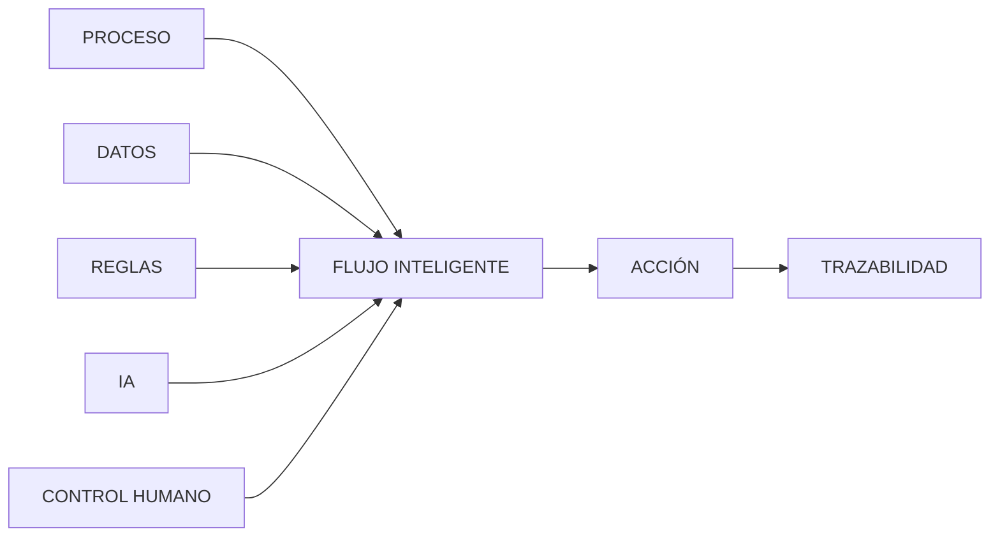

---

^^ Sesión 03 / Próximo capítulo
## Ahora aparece otro problema

Ya sabemos que el agente necesita datos como:

```json
{
  "id": "SM-042",
  "categoria": "SUMIDERO",
  "estado": "EJECUTADO",
  "inspeccion": "PENDIENTE"
}
```

Pero en el proyecto real esa información está distribuida entre:

:::chips
RVT, IFC, Excel, PDF, CDE, Formularios, Fotografías, Correos
:::

Y además:

- algunos datos están repetidos;
- algunos tienen nombres diferentes;
- algunos contienen información sensible;
- algunos no deberían salir de la institución;
- algunos necesitan transformarse antes de usarse.

:::card [!La siguiente pregunta]
**¿Cómo extraemos, transformamos y gobernamos toda esa información sin crear otro caos digital?**
:::
