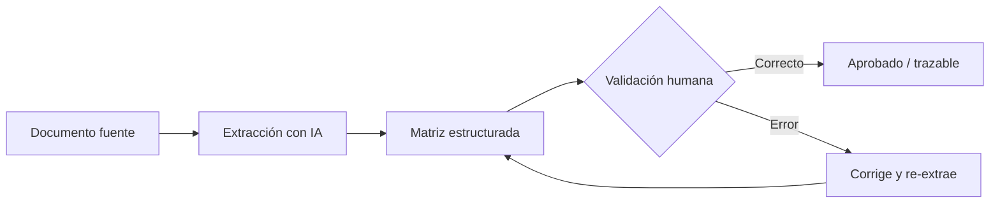

^^ Sesión 04 / Propósito
## De documentos dispersos a datos accionables

> El 80% del esfuerzo de un proceso BIM se va en **buscar, leer y reorganizar información** que ya existe. La IA acorta ese trabajo; el gobierno de datos evita que ese atajo se vuelva un problema.

:::split-3
:::card [01] Entender el dato
El modelo BIM como estructura de datos, no solo geometría.
:::
:::card [02] Extraer y estructurar
De pliegos, PEB y especificaciones a matrices de requisitos.
:::
:::card [03] Gobernar
Shadow AI, confidencialidad y controles mínimos.
:::
:::

---

^^ Sesión 04 / Fundamento
## Un modelo BIM es un modelo de datos

> Cada elemento no es un dibujo: es un **objeto** con propiedades, relaciones y clasificaciones. Eso es exactamente lo que una IA puede consultar y transformar.

:::split
:::card [Anatomía de un elemento] Qué contiene
- **Objeto**: un muro, una tubería, una puerta.
- **Propiedades**: parámetros de tipo y de instancia.
- **Relaciones**: pertenece a un nivel, aloja a otro.
- **Clasificación**: código Uniclass / OmniClass.
:::
:::card [El mismo muro, tres formas] Una idea central
- **Tabla** → filas y columnas, ideal para Excel.
- **JSON** → estructura anidada, ideal para sistemas.
- **Lenguaje natural** → "Muro portante de 20 cm en concreto, nivel 2".

La IA traduce entre estas tres representaciones.
:::
:::

---

^^ Sesión 04 / Formatos
## Estructurado, semiestructurado y no estructurado

| Tipo | Ejemplos | Qué tan "lista para IA" está |
|---|---|---|
| **Estructurado** | Tablas, CSV, XLSX, bases de datos | Directa: filas y columnas claras |
| **Semiestructurado** | JSON, XML, IFC, Markdown | Buena: hay etiquetas que dan contexto |
| **No estructurado** | PDF, correos, actas, fotos | Requiere extracción previa |

:::note
**IFC** es un formato de intercambio: preserva objetos e información entre plataformas. Distinto de un formato de *representación* (un PDF muestra, no estructura).
:::

---

^^ Sesión 04 / Riesgo silencioso
## La pérdida de contexto al exportar

> Cada vez que exportás, **perdés algo**. El arte está en exportar lo justo, con nomenclaturas consistentes, para que la IA no tenga que adivinar.

:::split
:::card [!Qué se pierde] Fugas típicas
- Relaciones entre elementos.
- Unidades y sistemas de coordenadas.
- Parámetros compartidos mal nombrados.
- Significado de abreviaturas internas.
:::
:::card [Cómo mitigarlo] Buenas prácticas
- Nomenclaturas **consistentes** y documentadas.
- Exportar solo los parámetros necesarios.
- Incluir un pequeño diccionario de campos.
- Verificar una muestra antes de procesar todo.
:::
:::

---

^^ Sesión 04 / Técnica
## Lectura asistida de documentos técnicos

La IA multimodal lee pliegos, contratos, PEB, manuales y matrices — y extrae lo que importa.

:::split
:::card [Qué se extrae] Objetivos de extracción
- Requisitos de información (EIR / PEB).
- Entregables, responsables y fechas.
- Especificaciones y criterios de aceptación.
- Restricciones normativas.
:::
:::card [Fuentes] De dónde
:::chips
PDF, XLSX, Word, Imágenes, Correos, Actas, Planos escaneados
:::
:::ok
Siempre pedí **trazabilidad**: que cada dato extraído indique de qué página o cláusula proviene.
:::
:::
:::

---

^^ Sesión 04 / Demostración
## De especificación a matriz de requisitos

:::split
:::card [Entrada] Texto plano del pliego
"El contratista entregará el modelo federado en formato IFC 4, nivel de información LOD 350, antes del hito de diseño de detalle. La nomenclatura seguirá el estándar del proyecto."
:::
:::card [Salida] Matriz estructurada
| Requisito | Valor | Responsable | Hito |
|---|---|---|---|
| Formato | IFC 4 | Contratista | Diseño detalle |
| Nivel info | LOD 350 | Contratista | Diseño detalle |
| Nomenclatura | Estándar proyecto | BIM Manager | Continuo |
:::
:::

:::ok
Resultado del taller de hoy: **una matriz de requisitos, responsables y entregables** lista para dar seguimiento.
:::

---

^^ Sesión 04 / Validación
## Extraer no es confiar

> La extracción automática es un **borrador de alta calidad**, no una verdad. El profesional valida.

:::note
Cada celda debe poder **volver a su fuente**. Sin trazabilidad, la matriz es una opinión bien formateada.
:::

---

^^ Sesión 04 / Gobierno
## Shadow IT y la llegada del Shadow AI

> **Shadow IT**: herramientas que los usuarios adoptan por su cuenta, sin pasar por TI. **Shadow AI**: lo mismo, pero cargando información del proyecto en herramientas públicas de IA.

:::split
:::card [!El riesgo] Qué puede salir mal
- Subir un pliego confidencial a un chat público.
- Datos del cliente usados para entrenar modelos ajenos.
- Sin control de acceso, permisos ni historial.
- Propiedad intelectual expuesta.
:::
:::card [La tensión] Gobernar sin frenar
El objetivo no es prohibir la IA — es **habilitarla con reglas**. Prohibir empuja a la gente al Shadow AI; gobernar la trae de vuelta.
:::
:::

---

^^ Sesión 04 / Clasificación
## No toda la información es igual

Antes de usar cualquier herramienta, preguntá: **¿de qué nivel es este dato?**

:::split
:::card [Clasificación] Cuatro niveles
- **Pública** — puede circular libremente.
- **Interna** — solo dentro de la organización.
- **Privada** — acceso restringido por rol.
- **Confidencial** — datos de cliente, contratos, IP.
:::
:::card [Regla de decisión] Qué herramienta usar
- Público / interno de bajo riesgo → herramientas de mercado con criterio.
- Privado / confidencial → **entornos corporativos** con procesamiento controlado (p. ej. Agent Workspace local).
:::
:::

---

^^ Sesión 04 / Práctica corporativa
## Herramienta pública vs. entorno corporativo

| | IA pública (ChatGPT, Gemini) | Entorno corporativo |
|---|---|---|
| **Ideal para** | Aprender, prototipar, datos no sensibles | Datos de proyecto y cliente |
| **Control de datos** | Limitado | Total (queda en la organización) |
| **Trazabilidad** | Baja | Historial y permisos |
| **Rol en el curso** | Explorar el concepto | Llevarlo a producción |

:::ok
Patrón sano: **prototipá** la idea con datos ficticios en una herramienta pública; **operá** con datos reales en un entorno gobernado.
:::

---

^^ Sesión 04 / Taller
## Actividad práctica (15 min)

:::split
:::card [Parte A] Matriz de requisitos
Tomá una especificación o pliego real y convertilo en una matriz **Requisito · Valor · Responsable · Entregable**, con la fuente de cada fila.
:::
:::card [Parte B] Evaluación de riesgo
Para ese mismo caso, clasificá la información y decidí: ¿qué se puede procesar en una herramienta pública y qué exige un entorno corporativo?
:::
:::

---

^^ Sesión 04 / Cierre
## Para llevar

:::split
:::card [Resultado] Lo que sale de hoy
Una **matriz estructurada de requisitos** y una **lista de controles mínimos** para usar IA de forma responsable sobre información BIM.
:::
:::card [!Idea fuerza] Una sola frase
La IA no reemplaza el gobierno de datos: lo hace **más urgente**. Velocidad sin control es riesgo; control sin velocidad es burocracia. El equilibrio es el trabajo.
:::
:::

> Próxima sesión de Julián: **Consulta conversacional, no-code, MCP y loops** — 04/09.
