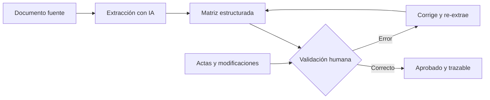

^^ Sesión 04 / Antes
## En el capítulo anterior

:::split
:::card [Quedó claro] La Ficha del Agente
Objetivo, conocimiento, herramientas, límites y usuario. Y una trampa: contar los mismos sumideros con cuatro criterios distintos dio **6, 9, 11 y 12**.
:::
:::card [Quedó abierto] !La pregunta de hoy
El agente ya sabe qué hacer. Pero **¿de dónde saca los datos — y quién los cuida?**
:::
:::

:::note
**Y el miércoles, con Hugo:** el modelo BIM como estructura de datos, los tres grados de estructura y el IFC como formato de intercambio. Hoy se parte de ahí — y el problema empieza justo donde esa clase termina: **el anexo técnico, las actas y los correos no están estructurados**. Antes de gobernar esa información hay que extraerla.
:::

---

^^ Sesión 04 / El caso
## Tres cosas pasaron esta semana

> **Corredor Av. Guayacanes.** Marcela necesita la matriz de seguimiento para el comité del jueves. Todo el expediente está en el entorno común de datos del proyecto — y aun así, en cinco días pasó todo esto.

:::split-3
:::card [01] El anexo son 180 páginas
El Anexo Técnico 7 define formatos, niveles de información, hitos, responsables y los procesos de coordinación. Nadie lo ha convertido nunca en una tabla de seguimiento.
:::
:::card [02] El export venía roto
El CSV del viernes tenía campos vacíos y categorías escritas de tres formas. El acta lo llama, textualmente, *"un error del proceso de exportación"*.
:::
:::card [03] !Y alguien tomó un atajo
Andrés, el coordinador BIM del Consorcio, pegó el anexo completo —y las actas, con los nombres y documentos de todos los que firman— en una herramienta pública para resumirlo rápido.
:::
:::

**La pregunta de hoy:** ¿cómo se convierten 180 páginas en una matriz confiable — **sin que el pliego salga de la entidad**?

---

^^ Sesión 04 / Extra
## Un modelo BIM es un modelo de datos

> Repaso, por si hace falta. Si la sesión 03 ya lo cubrió, esta lámina se salta.

Cada elemento no es un dibujo: es un **objeto** con propiedades, relaciones y clasificaciones. Eso es exactamente lo que una IA puede consultar y transformar.

:::split
:::card [Anatomía de un elemento] Qué contiene
- **Objeto**: un sumidero, un pozo, una luminaria.
- **Propiedades**: parámetros de tipo y de instancia.
- **Relaciones**: pertenece a un tramo, drena hacia un colector.
- **Clasificación**: el código que lo identifica en el estándar del proyecto.
:::
:::card [El mismo sumidero, tres formas] Una idea central
- **Tabla** → filas y columnas, ideal para hoja de cálculo.
- **JSON** → estructura anidada, ideal para sistemas.
- **Lenguaje natural** → "Sumidero lateral SL-100 en concreto, K0+012, con ficha FM-10441".

La IA traduce entre estas tres representaciones.
:::
:::

---

^^ Sesión 04 / Extra
## Estructurado, semiestructurado y no estructurado

> Repaso, por si hace falta. Si la sesión 03 ya lo cubrió, esta lámina se salta.

| Tipo | Ejemplos en el corredor | Qué tan "lista para IA" está |
|---|---|---|
| **Estructurado** | Export de elementos, presupuesto, cronograma | Directa: filas y columnas claras |
| **Semiestructurado** | IFC, JSON, XML, Markdown | Buena: hay etiquetas que dan contexto |
| **No estructurado** | Anexo técnico, actas, correos, fotos de obra | **Requiere extracción previa** |

:::note
**IFC** es un formato de intercambio: preserva objetos e información entre plataformas. Distinto de un formato de *representación* — un PDF muestra, no estructura. El anexo del contrato exige IFC 4.3, el esquema aplicable a infraestructura lineal.
:::

---

^^ Sesión 04 / Riesgo silencioso
## La pérdida de contexto al exportar

> Cada exportación **pierde algo**. El arte está en exportar lo justo, con nomenclaturas consistentes, para que la IA no tenga que adivinar.

:::split
:::card [Qué se pierde] !Fugas típicas
- Relaciones entre elementos.
- Unidades y sistemas de coordenadas.
- Parámetros compartidos mal nombrados.
- Significado de abreviaturas internas.
:::
:::card [Cómo mitigarlo] Buenas prácticas
- Nomenclaturas **consistentes** y documentadas.
- Exportar solo los parámetros necesarios.
- Incluir un pequeño **diccionario de campos**.
- Verificar una muestra antes de procesar todo.
:::
:::

:::warn
El CSV del viernes es exactamente esto. La información **sí estaba** en el modelo de autoría: se perdió al salir. Y nadie lo notó hasta que interventoría lo levantó como observación.
:::

---

^^ Sesión 04 / Técnica
## Lectura asistida de documentos técnicos

> El otro montón no tiene filas ni columnas: **180 páginas de texto**, sin un solo error de formato. La IA también las lee — y esta vez la materia prima *se ve bien*.

:::split
:::card [Qué se extrae] Objetivos de extracción
- Requisitos de información.
- Entregables, responsables y fechas.
- Especificaciones y criterios de aceptación.
- Restricciones normativas y contractuales.
:::
:::card [Fuentes] De dónde
:::chips
PDF, XLSX, Word, Imágenes, Correos, Actas, Planos escaneados
:::
:::ok
Regla no negociable: pedir **trazabilidad**. Cada dato extraído debe indicar de qué página o numeral proviene.
:::
:::
:::

---

^^ Sesión 04 / Extra
## Dónde entra la IA en lo que ya tienen

> No hay que cambiar de plataforma ni de proceso. La pregunta es **en qué punto** del flujo que ya existe entra una IA — y qué tan lejos se puede llegar hoy.

:::flow
Documentos en la nube -> *Leer y estructurar -> Consultar la fuente -> Proponer -> Anticipar
:::

:::split-3
:::card [Hoy · con lo que ya hay] !Leer y estructurar
Pliegos, actas y manuales que ya están en la nube del proyecto, convertidos en matrices trazables.

**Esto se puede hacer el lunes.** Basta un modelo de contexto largo y los documentos descargados.

Y por eso mismo: es el punto donde el Semáforo decide qué se descarga y qué no.
:::
:::card [Siguiente escalón] Consultar la fuente
Dejar de descargar copias y preguntarle al proyecto vivo, que no envejece.

Es posible hoy con conectores estándar. Antes hay que responder dos preguntas: **cómo se enchufa**, y **qué permisos hereda** lo que se enchufa.
:::
:::card [Escalón más alto] Proponer y anticipar
Cuando la IA deja de leer lo que ya está escrito: alternativas de diseño con restricciones en conflicto, o predicción de costo y plazo con su banda de incertidumbre.

Exige datos históricos ordenados y criterios de aceptación escritos. Es donde más se promete y menos se tiene listo.
:::
:::

:::note
Los cuatro pasos son **acumulativos**: cada uno necesita el anterior resuelto. Por eso el trabajo empieza por extraer y no por predecir — no se puede anticipar sobre datos que todavía nadie ordenó.
:::

---

^^ Sesión 04 / Demostración
## De 180 páginas a una matriz de requisitos

:::split
:::card [Entrada] Numeral 4.3 del Anexo Técnico 7
*"Los elementos de la red de drenaje se entregarán con nivel de información LOD 350 y ficha de mantenimiento asociada para el 100% de los elementos."*
:::
:::card [Salida] Matriz estructurada y trazable
| Requisito | Valor | Responsable | Fuente |
|---|---|---|---|
| Formato | IFC 4.3 | Contratista | 4.1.1 |
| Nivel info · drenaje | LOD 350 | Contratista | 4.3.1 |
| Ficha mantenimiento | 100% | Contratista | 4.3.1 |
| Clasificación | Sin campos vacíos | Contratista | 4.4.2 |
| Tolerancia · interferencia dura | 0 mm | Contratista | 5.2.1 |
| Informe de interferencias | Por hito, formato abierto | Contratista | 5.3.2 |
:::
:::

:::ok
Cada fila tiene su numeral al lado. Sin esa columna, la matriz es **una opinión bien formateada**.
:::

---

^^ Sesión 04 / El giro
## La matriz perfecta sobre el documento vencido

> La extracción salió impecable. Y la fila del nivel de información **está mal desde hace dos meses**.

:::split
:::card [Lo que dice el anexo] Numeral 4.3.1
Red de drenaje: **LOD 350** para el 100% de los elementos.
:::
:::card [Lo que decidió el comité] !Acta N.º 14 · 18 de junio
Tuberías y colectores **enterrados: LOD 300**.
Sumideros y pozos: se mantiene LOD 350.

Y el acta cierra con la frase que lo explica todo:

*"No se emitirá una nueva versión del documento; la modificación consta únicamente en la presente acta."*
:::
:::

:::warn
La IA leyó el anexo. **Nadie le dio el acta.** En un contrato, la verdad no vive en un documento: vive en un documento **más todas las actas que lo modificaron**.
:::

---

^^ Sesión 04 / Validación
## Extraer no es confiar

> La extracción automática es un **borrador de alta calidad**, no una verdad. El profesional valida.

:::note
La validación humana no consiste en releer lo que la IA escribió. Consiste en preguntar **qué documento faltó**.
:::

---

^^ Sesión 04 / Gobierno
## Shadow IT y la llegada del Shadow AI

> **Shadow IT**: herramientas que la gente adopta por su cuenta, sin pasar por TI. **Shadow AI**: lo mismo, pero cargando información del proyecto en herramientas públicas.

:::split
:::card [El riesgo] !Qué puede salir mal
- Subir un anexo reservado a un chat público.
- Datos del contrato procesados fuera del control de la entidad.
- Sin control de acceso, permisos ni historial.
- Información amparada por reserva, expuesta.
:::
:::card [La tensión] Gobernar sin frenar
El objetivo no es prohibir la IA: es **habilitarla con reglas**. Prohibir empuja a la gente al Shadow AI; gobernar la trae de vuelta.
:::
:::

:::warn
Lo que hizo Andrés ya estaba prohibido — y el contrato lo dice sin nombrar ninguna marca. Numeral 4.7.3: *"aplica a cualquier servicio de procesamiento automatizado o asistido, con independencia de su denominación comercial"*.

Y ya quedó consignado: **Acta N.º 15, numeral 4**. No hubo sanción — hubo un compromiso con plazo.
:::

---

^^ Sesión 04 / El objeto
## El Semáforo del Dato

Antes de pegar cualquier cosa en cualquier herramienta, una sola pregunta: **¿de qué color es este dato?**

:::split-3
:::card [Verde] Puede salir
Información pública o ya publicada: normas, especificaciones genéricas, **datos ficticios**, ejemplos anonimizados.

*Sirve para aprender y prototipar.*
:::
:::card [Ámbar] Solo en entorno gobernado
Información interna del proyecto sin identificadores contractuales: cantidades, geometría, parámetros técnicos.

*Sirve para trabajar, dentro de casa.*
:::
:::card [Rojo] !No sale
Anexos contractuales, precios unitarios, datos personales, correspondencia con el contratista, información bajo reserva.

*No hay atajo que valga.*
:::
:::

:::ok
**Ante la duda, es ámbar. Nunca verde.** La duda no es una excusa para arriesgar: es la señal de que hay que preguntar.
:::

---

^^ Sesión 04 / Extra
## El mismo párrafo, en tres colores

> El Anexo Técnico 7 **se clasifica solo**: el numeral 4.7.1 lo declara reservado y el 4.7.2 prohíbe incorporarlo a herramientas de terceros. Así se lo baja de color sin perderlo.

:::split-3
:::card [Rojo · como está] !No sale
*"Contrato **IDU-CO-2025-0418**. Objeto: Corredor **Av. Guayacanes — Tramo 2**. El hito H-2 se radicará a más tardar el **30 de septiembre de 2025**, con el desplazamiento respecto del origen registrado."*
:::
:::card [Ámbar · sin identificadores] Entorno gobernado
*"Corredor vial urbano de 2,4 km. El hito H-2 se radicará en la **semana 20**. Drenaje en **LOD 350** con ficha al 100%."*

Sirve para trabajar dentro de casa: conserva las cantidades reales.
:::
:::card [Verde · requisito genérico] Cualquier herramienta
*"Obra vial urbana. Entrega del modelo federado en la semana 20, en **IFC 4.3**, referida al datum nacional, con interferencia dura a **0 mm**."*

Podría ser de cualquier pliego del país.
:::
:::

:::warn
**Ojo con borrar de más.** El datum nacional se queda: es público y obligatorio para obra pública. Lo que se va es el **desplazamiento local** del numeral 4.2.3. Regla: el estándar público se queda, el valor propio del proyecto se va.

Y la prueba no es haber tachado campos, sino contestar: **¿alguien podría reconstruir de qué proyecto se trata?**
:::

---

^^ Sesión 04 / Práctica
## Herramienta pública vs. entorno corporativo

| | IA pública | Entorno corporativo |
|---|---|---|
| **Color del semáforo** | Solo verde | Verde y ámbar |
| **Ideal para** | Aprender, prototipar, datos ficticios | Datos reales de proyecto |
| **Control de datos** | Limitado | Queda en la organización |
| **Trazabilidad** | Baja | Historial y permisos |

:::ok
Patrón sano: **prototipar** la idea con datos ficticios en una herramienta pública; **operar** con datos reales en un entorno gobernado. Es el mismo archivo de ejemplo que se usa en este curso.
:::

:::note
Esto no es una exigencia nueva que trae la IA. La entidad ya tenía marco: el sector transporte adoptó BIM por resolución, la norma de gestión de información por BIM está adoptada en Colombia, y el país cuenta con una política nacional de IA. La IA no pide una excepción — pide aplicar lo que ya existe.
:::

---

^^ Sesión 04 / Taller
## Actividad práctica (15 min)

:::split
:::card [Parte A] La matriz trazable
Tome tres numerales del fragmento del anexo y conviértalos en una matriz **Requisito · Valor · Responsable · Fuente**. La columna *Fuente* es obligatoria.

Después, contraste contra las actas: **¿alguna fila cambió?**
:::
:::card [Parte B] Pinte el semáforo
Clasifique en verde, ámbar o rojo cinco documentos reales de su trabajo. Para cada rojo, escriba **qué versión sí podría salir** de la entidad.
:::
:::

:::note
**Material del taller** — se llena en pantalla y se descarga en PDF o `.md`:
<a href="doc.html#d=talleres/taller-04" target="_blank" rel="noopener">Hoja de trabajo</a> ·
<a href="doc.html#d=caso/pliego-anexo-tecnico-fragmento" target="_blank" rel="noopener">Anexo Técnico 7</a> ·
<a href="doc.html#d=caso/actas-comite-fragmento" target="_blank" rel="noopener">Actas 14 y 16</a>
:::

---

^^ Sesión 04 / Resolución
## Las tres cosas, resueltas

| Lo que pasó | Cómo se resuelve |
|---|---|
| **180 páginas sin matriz** | Extracción asistida **con columna de fuente** — y las actas como documento obligatorio, no opcional |
| **El export venía roto** | Diccionario de campos, exportar solo lo necesario, verificar una muestra antes de procesar todo |
| **Andrés pegó el anexo** | El anexo es **rojo**. Lo que sí podía hacer: prototipar con el fragmento anonimizado y operar en entorno gobernado |

:::ok
Y una consecuencia del viernes pasado: los **11 sumideros sin ficha** que encontramos contando ya no son un dato curioso. Son el incumplimiento del numeral 4.2 del Acta N.º 14, y el compromiso **16-1** que el Consorcio tiene que radicar en cinco días.
:::

---

^^ Sesión 04 / La frase
## Lo que hay que llevarse de hoy

> **El Semáforo del Dato.** Verde sale, ámbar solo en casa, rojo no sale. Ante la duda, es ámbar — nunca verde.

:::split
:::card [Resultado] Lo que sale de esta sesión
Una **matriz de requisitos trazable** y un **semáforo aplicado** a los documentos propios, con la versión que sí puede salir de cada rojo.
:::
:::card [Idea fuerza] !Una sola frase
La IA no reemplaza el gobierno de datos: lo hace **más urgente**. Velocidad sin control es riesgo; control sin velocidad es burocracia. El equilibrio es el trabajo.
:::
:::

---

^^ Sesión 04 / Próximo capítulo
## Todo esto sigue viviendo en carpetas

> La matriz quedó bien. El semáforo quedó puesto. Y mañana el Consorcio radica una versión nueva del modelo.

:::split
:::card [Lo que resolvimos] El dato
Ya se sabe extraer con trazabilidad, detectar el documento vencido y decidir qué puede salir de la entidad.
:::
:::card [Lo que queda abierto] !La fuente
Cada copia envejece el día que alguien actualiza el original. Volver a exportar todo cada lunes no es un método.

**¿Cómo se conecta la IA a la fuente viva?**
:::
:::
