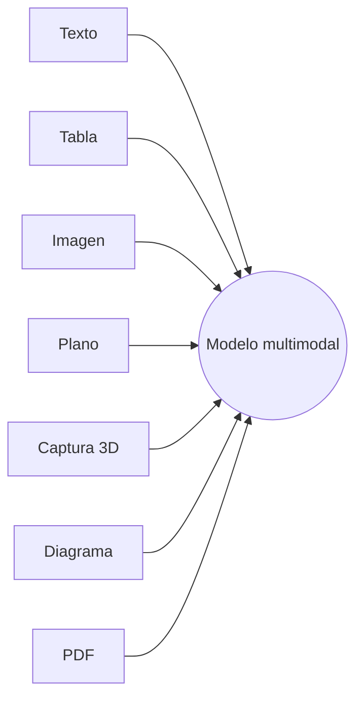
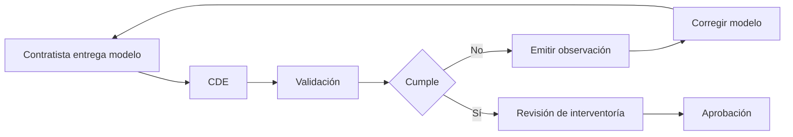

^^ Sesión 05 / Objetivo
## Objetivo de la sesión

> Utilizar IA multimodal para interpretar, transformar y comunicar información BIM mediante imágenes, diagramas y presentaciones, sin confundir una representación útil con una evidencia técnica.

:::split-3
:::card [Interpretar] ¿Qué muestra la información?
:::
:::card [Representar] ¿Cómo puede hacerse comprensible?
:::
:::card [Comunicar] !¿Qué necesita decidir la audiencia?
:::
:::

---

^^ Sesión 05 / El problema
## Una matriz correcta todavía puede comunicar mal

```
8 tuberías enterradas modeladas en LOD 300 — Conforme — Acta 14 · 4.2
3 sumideros sin ficha de mantenimiento — No conforme — Anexo 7 · 4.3.1
8 elementos sin clasificación completa — No conforme — Anexo 7 · 4.4.2
Informe de interferencias pendiente — En curso — Anexo 7 · 5.3.2
```

:::warn
Poner la matriz completa en una diapositiva no la convierte en una presentación. Solo la hace más pequeña.
:::

---

^^ Sesión 05 / La cadena
## Dato → representación → audiencia → decisión

:::flow
Dato confiable -> Representación adecuada -> Audiencia concreta -> *Decisión requerida
:::

:::split
:::card [La pregunta técnica] ¿Qué sabemos y de dónde sale?
:::
:::card [La pregunta de comunicación] !¿Qué necesita entender esta persona para actuar?
:::
:::

:::ok
Comunicar no es decorar ni resumir. Es diseñar una representación para que una audiencia pueda comprender y decidir.
:::

---

^^ Sesión 05 / Multimodalidad
## ¿Qué es un modelo multimodal?

> Un sistema capaz de trabajar con más de un tipo de información y de traducir entre representaciones.



:::chips
Describe, Compara, Clasifica, Extrae, Transforma, Genera
:::

---

^^ Sesión 05 / Representaciones
## Una misma información, múltiples representaciones

:::split-3
:::card [Dato] Preciso, trazable, verificable
`3 de 11 sumideros no tienen ficha de mantenimiento — Anexo 7 · 4.3.1`
:::
:::card [Diagrama] Explica relación y estado
:::flow
11 revisados -> *3 pendientes
:::
:::
:::card [Mensaje] !La audiencia entiende la consecuencia
:::warn
Entregable en riesgo
:::
:::
:::

:::note
La representación cambia. El significado no debería cambiar. Si la visualización altera cantidades, relaciones o incertidumbre, ya no está comunicando: está inventando.
:::

---

^^ Sesión 05 / Demostración
## ¿Qué puede saber la IA de una imagen?

:::card [⏸ EN VIVO] !Se hace ahora, en pantalla
Se carga una fotografía de obra, una captura del modelo o un fragmento de plano en un modelo multimodal disponible desde navegador.
:::

:::split


```text
Analiza esta imagen y separa tu respuesta en:

1. Lo observable directamente.
2. Inferencias razonables.
3. Información que no puede determinarse
   únicamente con esta imagen.

No presentes una inferencia como un hecho.
Para cada afirmación, indica qué elemento visual la sustenta.
```
:::

---

^^ Sesión 05 / Interpretación visual
## Ver ≠ interpretar ≠ conocer

:::split-3
:::card [Ver] Lo observable
Píxeles, formas, textos legibles, posiciones y relaciones visibles.
:::
:::card [Interpretar] Una hipótesis
Una lectura razonable construida con lo visible y el contexto disponible.
:::
:::card [Conocer] !Una afirmación verificable
Requiere una fuente suficiente, contexto y, muchas veces, información que no aparece en la imagen.
:::
:::

:::warn
Una imagen puede mostrar una tubería. No demuestra por sí sola su material, diámetro, pendiente, estado contractual ni fecha de instalación.
:::

---

^^ Sesión 05 / Generación
## De texto a imagen: generar una representación

:::flow
Intención -> Descripción -> Generación -> Revisión -> *Uso declarado
:::

:::split
:::card [Sirve para] Comunicar
Bocetos conceptuales, atmósferas, portadas, escenarios ilustrativos, diagramas de apoyo y tratamientos gráficos.
:::
:::card [No sustituye] !Documentar
Planos coordinados, detalles constructivos, cantidades, especificaciones, verificaciones normativas ni evidencia de obra.
:::
:::

---

^^ Sesión 05 / Transformación
## De imagen a imagen: transformar sin perder el contexto

> Una imagen de referencia reduce el espacio de invención, pero no garantiza fidelidad.

:::split
:::card [Entrada] Fotografía o captura existente
Contiene geometría, perspectiva, elementos, contexto y una condición inicial.
:::
:::card [Instrucción] Qué cambia y qué se conserva
"Elimina vehículos y personas. Conserva infraestructura, encuadre, perspectiva y proporciones."
:::
:::

:::warn
Revisar también lo que no se pidió cambiar. La IA puede alterar silenciosamente accesos, señalización, elementos urbanos o relaciones geométricas.
:::

---

^^ Sesión 05 / Referencias
## Composición ≠ estilo

:::split
:::card [Referencia de composición] Dónde está cada cosa
Controla aproximadamente encuadre, cámara, distribución, masas, profundidad y proporciones.
:::
:::card [Referencia de estilo] !Cómo se ve
Orienta color, textura, trazo, materialidad aparente, iluminación y lenguaje gráfico.
:::
:::

:::note
Una referencia puede cumplir ambos papeles, pero conviene declarar cuál se quiere preservar. "Usa esta imagen como referencia" deja demasiado por decidir.
:::

---

^^ Sesión 05 / Prompt visual
## Un buen prompt visual no es una lista de adjetivos

:::split
:::card [Objeto + contexto] Qué y dónde
Una intervención de drenaje urbano en un corredor vial existente, vista desde el nivel peatonal.
:::
:::card [Composición + restricciones] !Cómo y con qué límites
Perspectiva de la foto de referencia. Conservar geometría e infraestructura. No agregar obras no documentadas.
:::
:::

```text
OBJETO
CONTEXTO
PUNTO DE VISTA Y COMPOSICIÓN
LENGUAJE VISUAL
ELEMENTOS QUE DEBEN CONSERVARSE
ELEMENTOS QUE PUEDEN CAMBIAR
ELEMENTOS QUE NO DEBEN APARECER
FORMATO DE SALIDA
```

---

^^ Sesión 05 / Demostración
## Una imagen conceptual a partir del caso

:::card [⏸ EN VIVO] !Se hace ahora, en pantalla
Se carga una fotografía ficticia o autorizada del corredor y se produce una ilustración para explicar la intervención, no para simular una obra ejecutada.
:::

```text
Conserva la geometría, perspectiva e infraestructura
visible de la imagen de referencia.

Conviértela en una ilustración conceptual limpia para
explicar una intervención BIM de drenaje urbano.

Diferencia con color la superficie, la red enterrada y
los puntos de captación. No agregues componentes no
presentes en la información suministrada.

Incluye la etiqueta: "Representación conceptual · No construida".
```

---

^^ Sesión 05 / Para explorar
## De varias fotos a una escena navegable


:::chips
NeRF · Neural Radiance Fields
:::

> Es otra forma de multimodalidad: un conjunto de imágenes 2D se convierte en una representación 3D consultable desde cualquier ángulo. [Ver la explicación completa](https://www.youtube.com/watch?v=IKFmxP2HLXs).

---

^^ Sesión 05 / Verdad visual
## Una imagen convincente puede ser completamente falsa

| Representación | Uso principal | ¿Es evidencia? |
|---|---|---:|
| Fotografía original con contexto y metadatos | Documentación | Potencialmente sí |
| Fotografía editada con IA | Comunicación | ⚠️ |
| Render o imagen generada | Conceptualización | No |
| Diagrama explicativo | Comprensión | No |
| Plano aprobado según proceso | Documento técnico | Sí, según alcance |


:::warn
**La calidad visual no aumenta la calidad de la evidencia.** Una imagen fotorrealista puede ser más persuasiva y menos verdadera al mismo tiempo.
:::

---

^^ Sesión 05 / Clasificación
## Conceptual ≠ técnico ≠ evidencia

:::split-3
:::card [Conceptual] Explica una intención
Admite simplificación. Debe identificarse como conceptual y no construida.
:::
:::card [Técnica] Describe una solución
Requiere escala, convenciones, datos, responsabilidad profesional y control de versiones.
:::
:::card [Evidencia] !Demuestra una condición
Requiere origen, fecha, integridad, contexto, custodia y relación con el proceso contractual.
:::
:::

:::ok
La etiqueta correcta no es un pie de página. Es parte del contenido: **qué es, para qué sirve y qué no demuestra**.
:::

---

^^ Sesión 05 / Narrativa
## De información técnica a narrativa

> Tener todos los datos no significa saber qué contar.

:::flow
Información -> Selección -> Jerarquía -> Secuencia -> *Decisión
:::

:::ok
Una narrativa no cambia los hechos. Decide el orden en que una audiencia necesita encontrarlos.
:::

---

^^ Sesión 05 / Audiencia
## El mismo dato para tres audiencias

:::split-3
:::card [Coordinación BIM] Qué debe corregirse
3 sumideros sin ficha, identificadores afectados, responsable, requisito y fecha de cierre.
:::
:::card [Gerencia de proyecto] Por qué importa
11 incumplimientos abiertos, riesgo de rechazo del entregable y cinco días para corregir.
:::
:::card [Dirección] !Qué debe decidirse
Entregable en riesgo. Se requiere priorizar recursos y confirmar responsable hoy.
:::
:::

---

^^ Sesión 05 / Estructura
## La presentación ejecutiva de cinco diapositivas

:::split-3
:::card [01] ¿Qué está pasando?
:::
:::card [02] ¿Por qué importa?
:::
:::card [03] ¿Qué evidencia tenemos?
:::
:::

:::split
:::card [04] ¿Qué proponemos?
:::
:::card [05] !¿Qué decisión necesitamos?
:::
:::

:::note
La estructura no es una plantilla universal. Es un punto de partida para una conversación de decisión. Si una diapositiva no ayuda a responder una de estas preguntas, probablemente sobra.
:::

---

^^ Sesión 05 / Formatos
## PPTX o HTML

| Formato | Fortalezas | Límites |
|---|---|---|
| **PPTX / Slides** | Familiar, editable, presentable sin desarrollo | Diseño condicionado por diapositivas y versiones |
| **HTML** | Flexible, interactivo, navegable y reutilizable | Requiere más control técnico y pruebas |

:::ok
El contenido puede ser el mismo. El formato se elige por audiencia, canal, necesidad de edición, interactividad y permanencia.
:::

---

^^ Sesión 05 / Demostración
## El mismo contenido, otro contenedor

:::card [⏸ EN VIVO] !Se hace ahora, en pantalla
El guion validado se convierte en una presentación desde navegador. Luego se muestra cómo el mismo contenido podría verse como página HTML de una sola pantalla.
:::

:::warn
La herramienta puede proponer diseño e imágenes. No debe decidir por su cuenta el mensaje, la evidencia ni la conclusión.
:::

---

^^ Sesión 05 / Diagramas
## Mermaid: del proceso escrito al diagrama

> Mermaid convierte texto estructurado en diagramas reproducibles. La IA ayuda a traducir el proceso; Mermaid hace visible la estructura.

:::flow
Proceso en lenguaje natural -> Interpretación -> Código Mermaid -> Diagrama -> *Validación
:::

:::ok
El valor no está en "dibujar bonito". Está en volver explícitos actores, pasos, decisiones, dependencias y vacíos.
:::

---

^^ Sesión 05 / Tipos de diagrama
## Flowchart, Sequence y Timeline

:::split-3
:::card [Flowchart] ¿Cómo funciona?
Pasos, decisiones, bifurcaciones y rutas de retorno.
:::diagram

<svg viewBox="0 0 220 120" xmlns="http://www.w3.org/2000/svg">
  <circle cx="20" cy="60" r="6" fill="var(--accent-3)"/>
  <line x1="26" y1="60" x2="55" y2="60" stroke="var(--glass-line)" stroke-width="2"/>
  <rect x="55" y="45" width="30" height="30" transform="rotate(45 70 60)" fill="none" stroke="var(--glass-line)" stroke-width="2"/>
  <line x1="85" y1="60" x2="130" y2="30" stroke="var(--accent-1)" stroke-width="2.5"/>
  <line x1="85" y1="60" x2="130" y2="90" stroke="var(--glass-line)" stroke-width="2"/>
  <circle cx="140" cy="25" r="6" fill="var(--accent-1)"/>
  <circle cx="140" cy="90" r="6" fill="var(--text-dim)"/>
  <line x1="146" y1="25" x2="185" y2="25" stroke="var(--glass-line)" stroke-width="2"/>
  <circle cx="192" cy="25" r="6" fill="var(--accent-3)"/>
</svg>

:::
:::
:::card [Sequence] ¿Quién interactúa con quién?
Actores, mensajes y orden de intercambio.
:::diagram

<svg viewBox="0 0 220 120" xmlns="http://www.w3.org/2000/svg">
  <rect x="20" y="10" width="40" height="18" rx="3" fill="none" stroke="var(--glass-line)" stroke-width="1.5"/>
  <rect x="160" y="10" width="40" height="18" rx="3" fill="none" stroke="var(--glass-line)" stroke-width="1.5"/>
  <line x1="40" y1="28" x2="40" y2="110" stroke="var(--glass-line)" stroke-width="1.5" stroke-dasharray="4 4"/>
  <line x1="180" y1="28" x2="180" y2="110" stroke="var(--glass-line)" stroke-width="1.5" stroke-dasharray="4 4"/>
  <line x1="40" y1="50" x2="180" y2="50" stroke="var(--accent-1)" stroke-width="2"/>
  <polygon points="180,50 170,45 170,55" fill="var(--accent-1)"/>
  <line x1="180" y1="80" x2="40" y2="80" stroke="var(--accent-3)" stroke-width="2"/>
  <polygon points="40,80 50,75 50,85" fill="var(--accent-3)"/>
</svg>

:::
:::
:::card [Timeline / Gantt] !¿Cuándo sucede?
Hitos, duraciones, dependencias y secuencia temporal.
:::diagram

<svg viewBox="0 0 220 120" xmlns="http://www.w3.org/2000/svg">
  <line x1="15" y1="105" x2="205" y2="105" stroke="var(--glass-line)" stroke-width="1.5"/>
  <rect x="20" y="20" width="70" height="16" rx="3" fill="var(--accent-3)" opacity="0.85"/>
  <rect x="70" y="50" width="90" height="16" rx="3" fill="var(--glass-line)"/>
  <rect x="130" y="80" width="60" height="16" rx="3" fill="var(--accent-1)" opacity="0.85"/>
</svg>

:::
:::
:::

---

^^ Sesión 05 / Demostración
## Proceso BIM → Mermaid

:::card [Proceso] Entrega y revisión del modelo
El contratista entrega el modelo en el CDE. Se ejecuta una validación. Si incumple, se emite una observación y vuelve al contratista para corrección. Si cumple, pasa a interventoría para aprobación.
:::



> Sintaxis completa de flowchart: [documentación de Mermaid](https://mermaid.ai/open-source/syntax/flowchart.html).

---

^^ Sesión 05 / Prompt de diagrama
## Primero interpretar, después diagramar

:::split
:::card [Proceso] Revisión de una entrega
El contratista entrega el modelo BIM de drenaje. El coordinador BIM revisa los 20 elementos y comprueba si cada uno tiene ficha de mantenimiento y clasificación.

Si un elemento incumple, se registra una observación y el contratista lo corrige; el coordinador ejecuta una nueva validación.

Si todos cumplen, el modelo pasa a aprobación. Si todavía hay incumplimientos, regresa al contratista.
:::

```text
Convierte el proceso BIM descrito en un diagrama Mermaid.

Antes del código:
1. enumera actores, acciones y decisiones;
2. señala ambigüedades o pasos faltantes;
3. confirma el inicio, el final y los retornos.

Luego usa flowchart LR.
No inventes pasos que no estén descritos.
Representa las decisiones como nodos de decisión.
Devuelve finalmente el código Mermaid.
```
:::

:::ok
Pedir primero la interpretación permite corregir el proceso antes de convertir un error en una figura convincente.
:::

---

^^ Sesión 05 / Validación
## El diagrama también puede alucinar

:::split
:::card [Comparar] Contra el proceso original
¿Están todos los pasos? ¿El orden es correcto? ¿Cada decisión tiene salidas? ¿Los retornos llegan al punto correcto?
:::
:::card [Confirmar] !Con quien ejecuta el proceso
¿Los actores reconocen el flujo? ¿Falta una aprobación? ¿Hay una excepción que nunca fue escrita?
:::
:::

:::warn
Un diagrama legible no demuestra que el proceso sea correcto. Solo hace que sus supuestos sean más fáciles de ver.
:::

---

^^ Sesión 05 / Próximo capítulo
## Funcionó. Pero seguimos cargando archivos manualmente

:::flow
Matriz.xlsx -> Subir -> IA -> Diagrama / imagen / presentación
:::

:::split
:::card [Lo que resolvimos] La representación
Ya sabemos convertir información confiable en una comunicación comprensible, verificable y adecuada para una audiencia.
:::
:::card [Lo que queda abierto] !La conexión
Cada vez descargamos, copiamos y volvemos a subir. La respuesta envejece cuando cambia la fuente.

**¿Y si la IA pudiera consultar directamente la fuente viva?**
:::
:::
