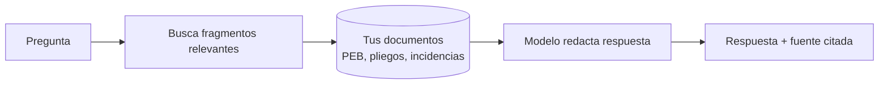
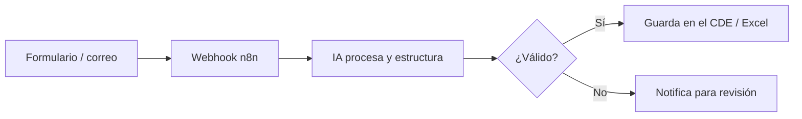

^^ Sesión 06 / Propósito
## Conectar la IA con tus herramientas reales

> Hasta ahora conversamos con la IA. Hoy la **conectamos**: que consulte tus documentos, dispare acciones en otras plataformas y opere sobre Revit — resolviendo con IA lo que normalmente exigiría código.

:::split
:::card [Ruta de la sesión] Cuatro paradas
- **RAG** — consulta conversacional de tus datos.
- **No-code** — automatización visual (n8n, Power Automate).
- **MCP** — el "puerto USB" entre IA y herramientas.
- **Loops** — ejecuciones periódicas y agentes que actúan.
:::
:::card [Enfoque] Conceptual y aplicado
No vamos a programar. Vamos a entender **cuándo** usar cada pieza y cómo formular la solución.
:::
:::

---

^^ Sesión 06 / Del buscador al significado
## Búsqueda por palabra vs. búsqueda por significado

:::split
:::card [!Buscador tradicional] Coincidencia exacta
Buscás "muro cortafuego" y solo encuentra documentos con **esas palabras**. Si el pliego dice "muro RF-120", no aparece.
:::
:::card [Buscador semántico] Coincidencia por sentido
Buscás "protección contra incendios" y encuentra "RF-120", "resistencia al fuego" y "cortafuego" — porque entiende que **significan lo mismo**.
:::
:::

:::note
La magia detrás son los **embeddings**: convertir texto en vectores donde lo que significa parecido queda cerca.
:::

---

^^ Sesión 06 / RAG
## RAG: preguntarle a tus propios documentos

> **RAG** (Generación Aumentada por Recuperación): en vez de confiar en la memoria del modelo, primero **recupera** los fragmentos relevantes de *tus* fuentes y luego **responde citándolos**.

:::ok
Esto resuelve el problema de las alucinaciones: la respuesta se ancla en **tus** documentos, no en lo que el modelo "recuerda".
:::

---

^^ Sesión 06 / RAG en BIM
## Qué podés consultar conversacionalmente

:::split-3
:::card [Modelo] Parámetros
"¿Qué elementos del nivel 3 no tienen código de clasificación?"
:::
:::card [Documentos] Requisitos
"¿Qué exige el PEB sobre entregables IFC?"
:::
:::card [Proyecto] Compromisos
"¿Qué incidencias de coordinación siguen abiertas y de quién dependen?"
:::
:::

:::warn
Límite clave: RAG responde bien sobre lo que está en sus fuentes. Distinguí siempre **conocimiento general** del modelo vs. **conocimiento corporativo** de tus documentos.
:::

---

^^ Sesión 06 / No-code
## Automatización sin escribir aplicaciones

> Plataformas **no-code / low-code** conectan servicios con bloques visuales: cuando pasa X, hacé Y. Sin desarrollar software desde cero.

:::split
:::card [La anatomía] Tres piezas
- **Disparador** (trigger): qué inicia el flujo — un correo, un formulario, un horario.
- **Acción**: qué se ejecuta — llamar a la IA, guardar, notificar.
- **Condición**: bifurcaciones y filtros.
:::
:::card [Plataformas] El panorama
:::chips
n8n, Power Automate, Make, Zapier
:::
Ideales para orquestar tareas entre correo, almacenamiento, formularios y modelos de IA.
:::
:::

---

^^ Sesión 06 / No-code
## Un flujo típico: entrada → IA → plataforma

:::note
Un **webhook** es simplemente una URL que dispara el flujo cuando algo la llama. Es el pegamento entre plataformas.
:::

---

^^ Sesión 06 / APIs
## APIs, en versión funcional

> No necesitás programar una API para entender qué hace: es la **puerta de entrada** por la que dos sistemas se piden cosas entre sí, con reglas claras.

:::split
:::card [Analogía] El mesero del restaurante
Vos (una app) pedís al mesero (la API), que va a la cocina (el sistema) y trae el plato (los datos). No entrás a la cocina; usás la puerta.
:::
:::card [Por qué importa] Para el profesional BIM
Saber que "existe una API" te permite **formular el requerimiento** correcto a un equipo técnico: qué datos necesitás, en qué formato, con qué frecuencia.
:::
:::

---

^^ Sesión 06 / MCP
## MCP: el puerto estándar entre IA y herramientas

> **Model Context Protocol** es un estándar para que un agente descubra y use herramientas y fuentes de datos — sin integración a medida para cada una. Pensalo como el **USB-C de la IA**.

:::split
:::card [Arquitectura] Cliente y servidor
- **Servidor MCP**: expone herramientas ("consultar modelo", "leer CDE").
- **Cliente MCP**: el agente que las descubre y las usa.
- **Herramientas**: las funciones disponibles, con permisos.
:::
:::card [MCP vs. lo anterior] Cuándo cada uno
- **No-code**: flujos fijos entre apps conocidas.
- **API**: integración a medida, requiere desarrollo.
- **MCP**: el agente **elige** qué herramienta usar según el objetivo.
:::
:::

---

^^ Sesión 06 / MCP
## MCP frente a API y no-code

| Criterio | No-code | API | MCP |
|---|---|---|---|
| **Quién decide el paso** | Vos (flujo fijo) | El programa | **El agente** |
| **Flexibilidad** | Media | Alta (con código) | Alta (con lenguaje natural) |
| **Esfuerzo técnico** | Bajo | Alto | Medio |
| **Ideal para** | Tareas repetibles | Integración robusta | Agentes que razonan sobre herramientas |

:::ok
MCP **simplifica drásticamente** conectar un agente a Revit, a un CDE o a una base de datos: se expone una vez y el agente la usa cuando la necesita.
:::

---

^^ Sesión 06 / Loops
## Loops: de responder a operar en el tiempo

> Un **loop** (pulso o ejecución periódica) hace que un agente no espere a que le preguntes: revisa, actúa y reporta **por su cuenta**, según un disparador de tiempo o evento.

:::split
:::card [Por evento] Reactivo
"Cuando se suba un modelo nuevo al CDE, valida los parámetros obligatorios y avisa qué falta."
:::
:::card [Por tiempo] Programado
"Cada lunes a las 7:00, genera el reporte de incidencias abiertas y envíalo al coordinador."
:::
:::

:::warn
Con autonomía viene responsabilidad: los loops que **modifican** algo necesitan confirmación humana y trazabilidad. Los que solo **consultan** son seguros.
:::

---

^^ Sesión 06 / Ejemplo integrador
## Revit como plataforma de ejemplo

> Muchas tareas que hoy exigen un plugin o un script pueden resolverse describiéndolas en lenguaje natural a un agente conectado.

:::split
:::card [!Antes] Con código
Escribir un script de Dynamo o un add-in en C# para: seleccionar muros, leer un parámetro, escribir otro y exportar un reporte.
:::
:::card [Ahora] Con un agente + herramientas
"Seleccioná los muros portantes sin resistencia al fuego, proponé el valor según el tipo y generá un reporte." El agente lo hace vía herramientas, **pide confirmación** y deja historial.
:::
:::

:::note
El profesional BIM no deja de existir: pasa de *escribir* la solución a **dirigir y validar** la solución.
:::

---

^^ Sesión 06 / Taller
## Actividad práctica (15 min)

:::split
:::card [Diseñá un flujo] Entrada → IA → plataforma
Elegí una tarea real de tu proceso y dibujá su flujo no-code:
- **Disparador**: ¿qué lo inicia?
- **Procesamiento IA**: ¿qué transforma?
- **Salida**: ¿a qué plataforma llega?
- **Validación**: ¿dónde interviene un humano?
:::
:::card [Bonus] ¿MCP o no-code?
Para tu caso, decidí: ¿basta un flujo fijo (no-code) o conviene un agente con herramientas (MCP)?
:::
:::

---

^^ Sesión 06 / Cierre
## Para llevar

:::split
:::card [Resultado] Lo que sale de hoy
El **diagrama de una automatización** conectada con IA, y criterio para elegir entre RAG, no-code, API y MCP según el problema.
:::
:::card [!Idea fuerza] Una sola frase
No se trata de programar más, sino de **conectar mejor**. La IA se vuelve útil cuando toca tus datos y tus herramientas — con permisos y validación.
:::
:::

> Próxima sesión de Julián: **Diseño generativo e integración de modelos BIM con IA** — 11/09.
