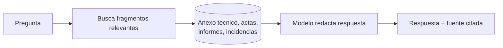
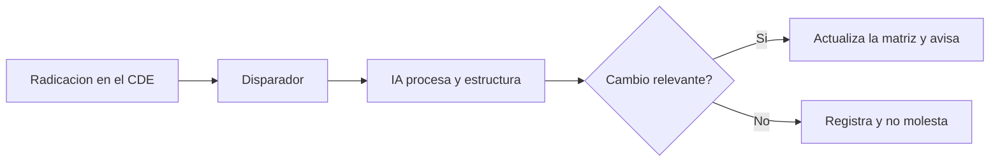

^^ Sesión 06 / Antes
## En el capítulo anterior

:::split
:::card [Quedó claro] El Semáforo del Dato
Verde sale, ámbar solo en casa, rojo no sale. Y la matriz de requisitos ya tiene columna de fuente, con las actas incluidas.
:::
:::card [!Quedó abierto] La pregunta de hoy
Todo eso sigue viviendo en carpetas. **¿Cómo se conecta la IA a la fuente viva?**
:::
:::

---

^^ Sesión 06 / El caso
## La matriz que envejeció en cuatro días

> **Corredor Av. Guayacanes.** El jueves Marcela llevó su matriz al comité. Salió impecable.

:::split
:::card [Lunes] El Consorcio radicó la corrección
Compromiso **16-2**: se corrigió el código de clasificación de los elementos que lo tenían vacío. Modelo nuevo en el CDE.
:::
:::card [!Martes] Nadie avisó
La matriz de Marcela sigue diciendo lo que decía el jueves. La copia que usó la IA es de la semana pasada. **Y nadie lo sabe.**
:::
:::

:::warn
Volver a exportar todo cada lunes no es un método: es una tarea que alguien va a olvidar. Y el día que la olvide, nadie se va a enterar.
:::

**La pregunta de hoy:** ¿cómo se conecta la IA a la fuente — de manera que la respuesta esté viva y no haya que acordarse de nada?

---

^^ Sesión 06 / Del buscador al significado
## Búsqueda por palabra vs. búsqueda por significado

:::split
:::card [!Buscador tradicional] Coincidencia exacta
Buscar "elementos de drenaje" encuentra solo los documentos con **esas palabras**. Si el anexo dice "estructura de captación", no aparece.
:::
:::card [Buscador semántico] Coincidencia por sentido
Buscar "elementos de drenaje" encuentra "sumidero", "colector", "pozo de inspección" y "estructura de captación" — porque **significan lo mismo**.
:::
:::

:::note
Lo que hay detrás son los **embeddings**: convertir texto en vectores donde lo que significa parecido queda cerca. No hace falta entender la matemática; sí hace falta saber que la búsqueda dejó de depender de acertar la palabra exacta.
:::

---

^^ Sesión 06 / RAG
## RAG: preguntarle a los documentos propios

> **RAG** (Generación Aumentada por Recuperación): en vez de confiar en la memoria del modelo, primero **recupera** los fragmentos relevantes de las fuentes propias y luego **responde citándolos**.

:::ok
Esto ataca de raíz el problema de la sesión 02: la respuesta se ancla en **documentos reales**, no en lo que el modelo "recuerda". Y trae la fuente, que es exactamente la columna que la matriz necesitaba.
:::

---

^^ Sesión 06 / RAG en el corredor
## Qué se puede consultar conversacionalmente

:::split-3
:::card [Modelo] Parámetros
"¿Qué elementos de drenaje siguen sin código de clasificación?"
:::
:::card [Documentos] Requisitos
"¿Qué nivel de información exige el anexo para los sumideros, contando las actas?"
:::
:::card [Proyecto] Compromisos
"¿Qué compromisos de comité siguen abiertos y de quién dependen?"
:::
:::

:::warn
Límite clave: RAG responde bien sobre lo que está en sus fuentes. Conviene distinguir siempre el **conocimiento general** del modelo del **conocimiento del proyecto** que vive en los documentos.
:::

---

^^ Sesión 06 / No-code
## Automatización sin escribir aplicaciones

> Plataformas **no-code / low-code** conectan servicios con bloques visuales: cuando pasa X, se hace Y. Tres piezas y nada más: **disparador**, **acción** y **condición**.

:::note
La elección de plataforma **no es de gusto: es de semáforo**. Si la información es ámbar, la plataforma tiene que poder autohospedarse dentro de la entidad. Herramientas como n8n permiten eso; las de catálogo cerrado, no.
:::

---

^^ Sesión 06 / Extra
## APIs, en versión funcional

> No hace falta programar una API para entender qué hace: es la **puerta de entrada** por la que dos sistemas se piden cosas entre sí, con reglas claras.

:::split
:::card [Analogía] El mesero del restaurante
Una aplicación le pide al mesero (la API), que va a la cocina (el sistema) y trae el plato (los datos). Nadie entra a la cocina; se usa la puerta.
:::
:::card [Por qué importa] Para el profesional BIM
Saber que "existe una API" permite **formular el requerimiento** correcto a un equipo técnico: qué datos, en qué formato, con qué frecuencia y con qué permisos.
:::
:::

---

^^ Sesión 06 / El objeto
## El Enchufe: un puerto estándar entre la IA y las herramientas

> **MCP** (Model Context Protocol) es un estándar para que un agente descubra y use herramientas y fuentes de datos, **sin una integración a medida para cada una**. El USB-C de la IA: se expone una vez, sirve para siempre.

:::split
:::card [Arquitectura] Tres piezas
- **Servidor**: expone herramientas — "consultar el modelo", "leer el CDE".
- **Cliente**: el agente que las descubre y las usa.
- **Herramientas**: las funciones disponibles, cada una con sus permisos.
:::
:::card [Ya no es una promesa] Dónde está hoy
Durante 2026 el protocolo pasó a tener soporte nativo en las plataformas grandes de IA, y existe un ecosistema —todavía joven— de servidores para el mundo BIM y openBIM:
:::chips
IfcOpenShell, Bonsai, web-ifc / Fragments, servidores propietarios en desarrollo
:::
:::
:::

---

^^ Sesión 06 / MCP
## MCP frente a API y no-code

| Criterio | No-code | API | MCP |
|---|---|---|---|
| **Quién decide el paso** | La persona (flujo fijo) | El programa | **El agente** |
| **Flexibilidad** | Media | Alta (con código) | Alta (con lenguaje natural) |
| **Esfuerzo técnico** | Bajo | Alto | Medio |
| **Ideal para** | Tareas repetibles | Integración robusta | Agentes que razonan sobre herramientas |

:::ok
No son competidores: son capas. Un flujo no-code puede llamar a un agente, y el agente puede usar herramientas por MCP. La pregunta no es cuál es mejor, sino **quién decide el siguiente paso** en cada caso.
:::

---

^^ Sesión 06 / Loops
## Loops: de responder a operar en el tiempo

> Un **loop** hace que un agente no espere a que le pregunten: revisa, actúa y reporta por su cuenta, según un disparador de tiempo o de evento.

:::split
:::card [Por evento] Reactivo
"Cuando se radique un modelo nuevo en el CDE, verifica qué filas de la matriz cambian y avisa a quién corresponde."
:::
:::card [Por tiempo] Programado
"Cada lunes a las 7:00, genera el reporte de compromisos de comité vencidos."
:::
:::

:::warn
Con autonomía viene responsabilidad. Los loops que solo **consultan** son seguros. Los que **modifican** algo necesitan confirmación humana y trazabilidad — y un límite de cuántas veces pueden actuar sin que alguien mire.
:::

---

^^ Sesión 06 / Ejemplo integrador
## De escribir la solución a dirigirla

> Muchas tareas que hoy exigen un plugin o un script pueden resolverse describiéndolas en lenguaje natural a un agente conectado.

:::split
:::card [!Antes] Con código
Escribir un script o un complemento para: seleccionar los sumideros, leer un parámetro, escribir otro y exportar un reporte. Cada variación, un desarrollo nuevo.
:::
:::card [Ahora] Con un agente y sus herramientas
*"Identifica los sumideros sin ficha de mantenimiento, contrasta contra el Acta 14 y prepara el listado del compromiso 16-1."* El agente lo hace con sus herramientas, **pide confirmación** y deja historial.
:::
:::

:::note
El profesional BIM no desaparece: pasa de **escribir** la solución a **dirigir y validar** la solución. Que es exactamente lo que se practicó en la sesión 02.
:::

---

^^ Sesión 06 / El giro
## Funcionó. Y ahí empezó el problema nuevo

> Marcela conectó el agente al CDE. Funciona perfecto. Lo conectó **con su usuario**.

:::split
:::card [!Lo que nadie preguntó] ¿Con qué permisos entra?
El agente ve **todo lo que ve Marcela**: contratos, correspondencia, información económica del proceso.

Y el agente le responde a cualquiera que le escriba.
:::
:::card [La regla] Permisos heredados
Un agente conectado **no tiene permisos propios: hereda los de quien lo conectó**. Si se conecta con una cuenta de coordinación, es una cuenta de coordinación la que queda expuesta a quien converse con él.
:::
:::

:::warn
El Semáforo de la sesión 04 no desaparece: **cambia de lugar**. Antes controlaba lo que salía de la entidad. Al conectar, ya no sale nada — la herramienta entra. El control pasa del dato al **permiso**.
:::

---

^^ Sesión 06 / Taller
## Actividad práctica (15 min)

:::split
:::card [Parte A] Diseñe un flujo
Elija una tarea real de su proceso y dibuje su flujo:
- **Disparador**: ¿qué lo inicia?
- **Procesamiento IA**: ¿qué transforma?
- **Salida**: ¿a qué plataforma llega?
- **Validación**: ¿dónde interviene una persona?
:::
:::card [Parte B] Las dos decisiones
1. ¿Basta un flujo fijo (no-code) o conviene un agente con herramientas (MCP)?
2. **¿Con qué usuario se conecta** — y qué es lo peor que podría hacer con esos permisos?
:::
:::

:::note
**Material del taller** — se llena en pantalla y se descarga en PDF o `.md`:
<a href="doc.html#d=talleres/taller-06" target="_blank" rel="noopener">Hoja de trabajo</a> ·
<a href="doc.html#d=caso/actas-comite-fragmento" target="_blank" rel="noopener">Actas 14 y 16</a>
:::

---

^^ Sesión 06 / Resolución
## La matriz que ya no envejece

| El problema del lunes | Cómo queda resuelto |
|---|---|
| La copia envejece y nadie avisa | El agente consulta **la fuente**, no una copia. No hay copia que envejezca. |
| Alguien tiene que acordarse de exportar | Un **loop por evento**: cuando se radica algo, se verifica qué filas cambian |
| Cada integración era un desarrollo | **Un enchufe** expuesto una vez, que el agente usa cuando lo necesita |
| El agente veía todo lo de Marcela | Entra con una **cuenta de servicio de solo lectura**, con alcance limitado al proyecto |

:::ok
Y la matriz del jueves ya se habría corregido sola el lunes a las 7:03 — avisando que la fila del código de clasificación cambió, y **por qué**.
:::

---

^^ Sesión 06 / La frase
## Lo que hay que llevarse de hoy

> **El Enchufe.** Conectar una vez y usar siempre — y entrar con el permiso correcto, no con el propio.

:::split
:::card [Resultado] Lo que sale de esta sesión
El **diagrama de una automatización** conectada con IA, con su decisión de plataforma según el semáforo y su cuenta de acceso definida.
:::
:::card [!Idea fuerza] Una sola frase
No se trata de programar más, sino de **conectar mejor**. La IA se vuelve útil cuando toca los datos y las herramientas reales — con permisos, límites y validación.
:::
:::

---

^^ Sesión 06 / Próximo capítulo
## Todo lo que hace, hasta ahora, es leer

> El agente consulta la fuente viva y responde con evidencia. Pero **no ha propuesto nada**: solo ordena lo que ya estaba escrito.

:::split
:::card [Lo que resolvimos] La conexión
La IA ya llega a la fuente, con el permiso correcto, y avisa cuando algo cambia.
:::
:::card [!Lo que queda abierto] La propuesta
Interventoría observó que **seis sumideros chocan** con el trazado de la ciclorruta. Reubicarlos toca la pendiente del pluvial, el arbolado y el ancho del andén. Cuatro restricciones que no se pueden cumplir todas.

**La respuesta no está escrita en ningún documento. ¿Puede la IA proponerla?**
:::
:::

> **Sesión 08 — Diseño generativo e integración de modelos BIM con IA.** Viernes 11/09.
