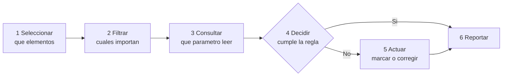

^^ Sesión 07 / Antes
## El miércoles, en cuatro líneas

> Toda la sesión 06 en una sola imagen. Es el punto de partida de hoy.

:::split
:::card [La imagen] Un ingeniero nuevo que llegó hoy
Sabe muchísimo de ingeniería en general. De **este** proyecto, nada.

Hay dos maneras de ponerlo al día: darle **fotocopias**, o darle la **llave del archivo**.
:::
:::card [Lo que cambia] !La fotocopia envejece
La fotocopia dice lo que decía el día que se sacó. La llave abre siempre lo que hay hoy.

Y la llave que uno presta es **la propia**: ese ingeniero ve todo lo que uno ve.
:::
:::

:::ok
**Fotocopia contra llave**, y **la llave es la mía**. Las siglas del miércoles —RAG, MCP, loops— son los nombres técnicos de esas dos frases.
:::

---

^^ Sesión 07 / Antes
## Las cuatro siglas del miércoles, en castellano

| Lo que se dijo | Qué es, sin siglas | Ejemplo de todos los días |
|---|---|---|
| **RAG** | Darle a leer mis documentos antes de que responda | Le paso la carpeta del proyecto y le pregunto |
| **No-code** | Una receta fija que corre sola, sin programar | *Cuando llegue el correo, guarda el adjunto en la carpeta* |
| **API** | La puerta de servicio entre dos programas | El mesero: uno pide, él va a la cocina y trae el plato |
| **MCP** | Un enchufe estándar para conectar esa puerta | El USB-C: un solo cable para todo |

:::ok
Y la única regla práctica: **quién decide el siguiente paso.** Si los pasos se pueden dibujar de antemano, es una receta. Si el paso siguiente depende de lo que se encuentre, hace falta un agente.
:::

:::note
El miércoles se vio **cómo se conecta** la IA a las herramientas. Hoy se ve **qué se le encarga** cuando ya está conectada: qué tareas de la semana valen la pena automatizar, y con cuál de estas cuatro se hace cada una.
:::

---

^^ Sesión 07 / El caso
## La semana de Marcela

> **Corredor Av. Guayacanes, Tramo 2.** Marcela coordina el modelo por parte de la entidad. Esta es su semana, sin adornos.

:::split
:::card [Lo que hace] Cinco días
- **Lunes.** El Consorcio radica el modelo. Ella lo abre y revisa **63 elementos**, uno por uno, contra el anexo.
- **Martes.** Exporta el informe de interferencias: **31 incidencias**. Las clasifica a mano.
- **Miércoles.** Arma la matriz de requisitos para el comité.
- **Jueves.** Comité. Toma nota de los compromisos.
- **Viernes.** Escribe el correo de observaciones al Consorcio.
:::
:::card [El problema] !Y vienen cuatro subtramos más
Ninguna de esas cinco cosas es diseñar. Casi ninguna necesita criterio de ingeniería: necesita **mirar, comparar y anotar**.

El Tramo 2 tiene **cinco subtramos**. Marcela alcanzó a revisar uno.
:::
:::

**La pregunta de hoy:** de esa semana, ¿qué puede hacer una máquina — y qué no debería hacer nunca?

---

^^ Sesión 07 / Bloque 1
## Qué hace de verdad un coordinador BIM

> Antes de automatizar nada hay que mirar de frente en qué se va el día. Casi todo cae en cinco familias.

:::split-3
:::card [1] Revisar
Abrir el modelo y verificar que cada elemento cumpla la regla: que tenga el parámetro, el código, la ficha, el nivel de detalle.
:::
:::card [2] Extraer
Sacar tablas del modelo y de los informes. Exportar, limpiar, renombrar columnas, volver a exportar.
:::
:::card [3] Cruzar
Poner dos listas lado a lado y buscar lo que coincide: inventario contra interferencias, modelo contra pliego.
:::
:::

:::split-3
:::card [4] Reportar
Convertir el hallazgo en una tabla, una vista, un PDF, una diapositiva de comité.
:::
:::card [5] Avisar
Escribirle a quien corresponde, con el asunto correcto, y hacer seguimiento hasta que responda.
:::
:::card [Lo que no aparece] !Decidir
Decidir, negociar con la Interventoría, sostener un criterio técnico. **Eso es lo que se hace cuando las otras cinco dejan tiempo.**
:::
:::

---

^^ Sesión 07 / Bloque 1
## La prueba de las cuatro preguntas

> Una tarea es candidata a automatizarse si responde **sí** a las cuatro. Con un solo no, todavía no se automatiza.

:::split
:::card [Las cuatro] Sirven para cualquier tarea
1. **¿Se repite?** Al menos una vez por semana, o una vez por radicación.
2. **¿Tiene una regla escrita?** Algo que quepa en una frase con *"si… entonces…"*.
3. **¿El resultado se puede verificar?** Alguien mira la salida y sabe si está bien.
4. **¿Los datos ya existen?** En una tabla, un modelo o un documento — no en la cabeza de alguien.
:::
:::card [La semana de Marcela] Aplicada
| Tarea | ¿Automatizable? |
|---|---|
| Revisar 63 elementos contra la regla | **Sí**, las cuatro |
| Clasificar 31 interferencias | **Casi** — la regla de prioridad no está escrita |
| Armar la matriz del comité | Sí, si la revisión ya corrió |
| Decidir qué se le exige al Consorcio | **No.** Es criterio, y tiene consecuencia contractual |
| Escribir el correo | Sí el borrador. **No** el envío |
:::
:::

:::note
La pregunta 2 es la que más veces falla, y casi nunca se nota: la regla existe, pero vive en la experiencia de una persona y nadie la ha escrito nunca. **Escribirla es la mitad del trabajo de automatizar** — y esa mitad no la puede hacer un programador.
:::

---

^^ Sesión 07 / Bloque 1
## Anatomía de una automatización BIM

> Todas las automatizaciones de modelo tienen las mismas seis piezas, en el mismo orden. Lo que cambia es lo que se pone adentro.

:::split
:::card [El encargo] Dicho en una frase
*"De todos los sumideros del Tramo 2, dime cuáles no tienen ficha de mantenimiento, márcalos como observados y hazme la tabla para el comité."*
:::
:::card [La misma frase] Desarmada en seis piezas
**Seleccionar** los sumideros · **Filtrar** los del Tramo 2 · **Consultar** la ficha de mantenimiento · **Decidir** si está vacía · **Actuar** marcando el estado · **Reportar** la tabla.
:::
:::

---

^^ Sesión 07 / Bloque 1
## Asistencia, automatización y autonomía

> Tres cosas distintas que se confunden todo el tiempo. La diferencia no es la tecnología: es **quién aprieta el botón**.

| Nivel | Qué hace la máquina | Qué hace la persona | En el corredor |
|---|---|---|---|
| **Asistencia** | Propone y explica | Ejecuta todo | *"Dime qué debería revisar en esta radicación"* |
| **Automatización** | Ejecuta la tarea completa | **Dispara y valida** | El reporte de los 63 elementos, cuando ella lo pide |
| **Autonomía** | Ejecuta sin que nadie pida | Audita después | Cada radicación, revisa sola y avisa |

:::ok
Las dos piezas que hacen aceptable la autonomía son las mismas del miércoles: **confirmación previa** antes de modificar cualquier cosa, e **historial** de todo lo que hizo. Sin esas dos no es autonomía: es un agente suelto.
:::

:::warn
Regla práctica: lo que **lee** puede ser autónomo. Lo que **escribe** en el modelo, no — hasta que una persona lo confirme. Por eso el servidor oficial de Revit 2027 es de **solo lectura**: el fabricante ya tomó esa decisión.
:::

---

^^ Sesión 07 / Bloque 2
## Ustedes ya programan. Solo que en Excel

> Toda la lógica que necesita una automatización cabe en cinco palabras. Las cinco se usan todos los días en una hoja de cálculo.

| Palabra | Qué es, de verdad | Dónde ya la usan |
|---|---|---|
| **Variable** | Una casilla con un nombre | `abscisa` vale `K0+294` |
| **Condición** | Un *"si… entonces…"* | `=SI(I2="";"FALTA";"OK")` |
| **Lista** | Una columna | Los 63 elementos del export |
| **Ciclo** | Arrastrar la fórmula hasta abajo | De la fila 2 a la 64 |
| **Función** | Una fórmula guardada con nombre, para volver a usarla | `BUSCARV`, `SUMAR.SI` |

:::ok
Un script que revisa los 63 elementos es **exactamente** esa hoja de cálculo, escrita en renglones en vez de celdas. No hay un salto conceptual: hay un cambio de notación.
:::

:::note
Por eso en esta sesión no se aprende a programar. Se aprende a **encargar** una automatización: describir la regla, el alcance y la validación con la misma precisión con que hoy se escribe una fórmula.
:::

---

^^ Sesión 07 / Bloque 2
## El filtro que miente

> En la hoja de elementos del Tramo 2, filtre la columna `categoria` por **Sumidero** y cuente lo que sale.

:::metrics
22 | Filas que devuelve el filtro
21 | Sumideros distintos, porque uno está repetido
24 | Sumideros que hay de verdad
:::

:::split
:::card [Por qué] Tres maneras de escribir la misma palabra
`SUM-005` y `SUM-018` quedaron como **`SUMIDERO`**. `SUM-015` quedó como **`sumidero `**, con un espacio al final que no se ve en pantalla.

Y `SUM-014` aparece **dos veces** en el export.
:::
:::card [Lo que importa] !Los tres que se pierden
`SUM-005`, `SUM-015` y `SUM-018` son tres de los doce elementos de drenaje **sin ficha de mantenimiento**.

El filtro no falló: hizo exactamente lo que se le pidió. **Lo que estaba mal era el dato.**
:::
:::

:::warn
Esto es la sesión 04 cobrando: **normalizar antes de contar** no es un tecnicismo, es la diferencia entre 21 y 24. Una automatización montada sobre este archivo sin limpiarlo primero repite el error 63 veces, más rápido y sin que nadie mire.
:::

---

^^ Sesión 07 / Bloque 2
## El mismo encargo, cuatro tecnologías

> *"Sumideros del Tramo 2 sin ficha de mantenimiento, marcados y tabulados."* Cuatro maneras de resolverlo — y las seis piezas son siempre las mismas.

| | Cómo se ve | Quién lo puede hacer | Se rompe cuando… |
|---|---|---|---|
| **No-code** | Cajas conectadas en un lienzo | Cualquiera, en una tarde | La tarea deja de ser siempre igual |
| **Dynamo** | Un grafo dentro de Revit: nodos y cables | Un perfil BIM que le dedique tiempo | El grafo crece y nadie más lo entiende |
| **Python** | Veinte renglones de texto | Alguien que programe — o la IA, y alguien que revise | Nadie lo documentó y su autor se fue |
| **Plugin / API** | Un botón nuevo en la barra de Revit | Un desarrollador, con contrato | Sale la versión siguiente de Revit |

:::ok
No son cuatro niveles de dificultad: son **cuatro respuestas a la misma pregunta**. Y la pregunta es cuántas veces va a correr esto, quién lo va a mantener y qué pasa el día que se caiga.
:::

---

^^ Sesión 07 / Extra
## Script, grafo, plugin y aplicación

> Cuatro palabras que se usan como sinónimos y no lo son. La diferencia práctica es **quién lo ejecuta y dónde vive**.

:::split
:::card [Se ejecutan a mano] Script y grafo
- **Script** — un archivo de texto con instrucciones. Corre cuando alguien lo corre.
- **Grafo** — lo mismo, pero dibujado. Vive dentro de Dynamo y necesita Revit abierto.
:::
:::card [Se instalan] Plugin y aplicación
- **Plugin** — se instala en Revit y aparece como un botón. Hay que mantenerlo versión por versión.
- **Aplicación** — un programa aparte, con su servidor. Es lo que se pide cuando el proceso es de la entidad y no de una persona.
:::
:::

:::note
El costo no está en escribirlo: está en **mantenerlo**. Un script de alguien que se va de la entidad es un script muerto. Por eso lo que se automatiza necesita quedar escrito y con dueño — que es la matriz de la sesión 04, otra vez.
:::

---

^^ Sesión 07 / Bloque 2
## La matriz de decisión

> El orden importa: la tecnología es la **tercera** decisión, no la primera. Elegirla antes de escribir la regla es lo que produce automatizaciones que nadie usa.

:::flow
La regla -> Los datos -> *La tecnologia -> Quien valida
:::

| Si la tarea… | Use | Porque |
|---|---|---|
| Mueve archivos, correos y avisos entre plataformas | **No-code** | No toca el modelo, y el flujo se dibuja entero de antemano |
| Lee o modifica elementos dentro de Revit | **Dynamo** | Vive adentro: no hay que instalar nada ni pedir permisos |
| Cruza tablas, calcula, limpia datos, arma reportes | **Python** | Trabaja fuera del modelo, y es lo que mejor escribe la IA |
| La va a usar todo el equipo, todos los días, durante años | **Plugin o aplicación** | Alguien tiene que mantenerla, y eso es un contrato |
| Los pasos dependen de lo que se encuentre | **Agente con herramientas** | Es lo del miércoles: el flujo no se puede dibujar antes |

:::ok
Y la respuesta correcta más veces —aunque sea la menos emocionante— es **no-code**. Encargar un desarrollo cuando bastaba una receta es la manera más cara de automatizar.
:::

---

^^ Sesión 07 / Bloque 3
## Pedirle el código a la IA

> Hoy cualquiera pide un script y lo recibe en treinta segundos. Eso cambió **quién puede automatizar**. No cambió **quién responde** por el resultado.

:::split
:::card [Lo que sí funciona] Tres usos honestos
- **Escribir** el primer borrador de un script o de un grafo.
- **Explicar** en español un script que dejó alguien más y que nadie entiende.
- **Depurar**: pegarle el mensaje de error y pedirle que diga qué significa.
:::
:::card [Antes de correr nada] !Las tres preguntas
1. *"Explícame esto línea por línea, como si yo no programara."*
2. *"¿Qué pasa si un dato viene vacío, repetido o mal escrito?"*
3. *"¿Qué modifica en el modelo, exactamente?"*

Si la respuesta a la tercera no se entiende, **no se corre**.
:::
:::

:::warn
**Nunca sobre el modelo bueno.** Se corre sobre una copia, se compara contra el original y recién ahí se aplica. Un script que modifica 63 elementos en cuatro segundos también los daña en cuatro segundos — y sin preguntar.
:::

---

^^ Sesión 07 / El giro
## El script funcionó perfecto. La regla estaba mal escrita.

> Marcela automatizó la revisión con una frase: *"marca todo elemento que no tenga ficha de mantenimiento."* Corrió en cuatro segundos y marcó **15 elementos**. El Consorcio contestó el mismo día. Tenía razón en dos de ellos.

:::split
:::card [Error de alcance] !La regla no es una: son cuatro
El numeral **4.3.1** exige ficha al 100% — pero **solo para la red de drenaje**. Los otros tres numerales dicen cosas distintas:

- **4.3.2** alumbrado: también al 100%. `LUM-004` quedó bien marcado.
- **4.3.3** señalización: exigible **únicamente** con estructura de soporte propia. `SEN-003` **no se puede decidir**: esa columna no existe en el export.
- **4.3.4** arbolado: lleva **ficha de manejo silvicultural**, que es otra cosa. `ARB-003` se marcó mirando la columna equivocada.
:::
:::card [Error de vigencia] Acta N.º 14, numeral 4.1
Y la misma regla 4.3.1 exige **LOD 350** para toda la red de drenaje. El comité lo bajó a **LOD 300** en tuberías y colectores enterrados, manteniendo 350 solo en sumideros y pozos.

El numeral 4.3 del acta aclara que **no se emitiría versión nueva del anexo**. Quien automatizó leyó el anexo — que está vigente y desactualizado al mismo tiempo.
:::
:::

:::warn
De los 15: **13 bien marcados**, uno **indecidible** con los datos que hay, uno **mal**. El código no tuvo ni un error — hizo exactamente lo que se le pidió, 63 veces, sin dudar y sin preguntar.

**Automatizar no vuelve correcta una regla: la aplica más rápido.** Y nadie del equipo podía detectarlo, porque nadie leyó el script: lo pidieron, lo corrieron y le creyeron.
:::

---

^^ Sesión 07 / Taller
## Actividad práctica (15 min)

:::split
:::card [Parte A] La ficha de una automatización
Tome **una tarea propia** de su semana —de las cinco familias— y complétela:
- **Disparador**: ¿qué la inicia, un evento o un horario?
- **Regla**: escríbala en una frase con *"si… entonces…"*.
- **Alcance**: ¿qué elementos toca, y cuáles no debe tocar?
- **Salida**: ¿un reporte, una marca en el modelo, un correo?
- **Validación**: ¿quién mira antes de que se aplique?
:::
:::card [Parte B] La matriz de decisión
1. ¿No-code, Dynamo, Python, plugin o agente? Y por qué.
2. ¿De dónde sale la regla — y **en qué documento está escrita**?
3. Si esa regla cambia el mes entrante, **¿quién actualiza la automatización?**
:::
:::

:::note
**Material del taller** — se llena en pantalla y se descarga en PDF o `.md`:
<a href="doc.html#d=talleres/taller-07" target="_blank" rel="noopener">Hoja de trabajo</a> ·
<a href="doc.html#d=caso/actas-comite-fragmento" target="_blank" rel="noopener">Actas 14, 15 y 16</a>
:::

---

^^ Sesión 07 / Resolución
## La semana de Marcela, después

| Lo que hacía | Cómo queda | Quién la hace |
|---|---|---|
| Revisar 63 elementos, uno por uno | Se revisan los **cinco subtramos** en el mismo tiempo | Una automatización, disparada por la radicación |
| Clasificar 31 interferencias a mano | Llegan clasificadas y priorizadas | La misma automatización — **el día que la regla quedó escrita** |
| Armar la matriz para el comité | Sale del reporte, ya cruzada | Se genera sola |
| Decidir qué se le exige al Consorcio | **Igual que antes** | **Marcela** |
| Escribir el correo de observaciones | Llega el borrador; ella lo corrige y lo firma | Ella decide qué se manda |

:::ok
No se automatizaron las cinco familias: se automatizaron **revisar, extraer, cruzar y reportar**. **Avisar quedó a medias a propósito** —el borrador es de la máquina, la firma es de ella— y **decidir** no se tocó.

El resultado no es que Marcela trabaje menos: es que el lunes le queda libre para lo único que no puede hacer nadie más.
:::

---

^^ Sesión 07 / La frase
## Lo que hay que llevarse de hoy

> **Primero la regla, después el robot.** Una automatización no hace las cosas mejor: las hace sesenta y tres veces exactamente iguales.

:::split
:::card [Resultado] Lo que sale de esta sesión
La **ficha de una automatización propia** —disparador, regla, alcance, salida y validación— y la tecnología elegida con su porqué escrito.
:::
:::card [Idea fuerza] !Una sola frase
Lo escaso no es quien sabe programar: es **quien sabe escribir la regla**. Y esa persona es la que conoce el proyecto, no la que conoce el lenguaje.
:::
:::

---

^^ Sesión 07 / Próximo capítulo
## Todo lo de hoy supone que la respuesta ya existe

> Revisar, extraer, cruzar y reportar son maneras de **encontrar lo que ya está escrito**. Incluso la regla que se automatiza estaba escrita — en un acta que nadie leyó.

:::split
:::card [Lo que resolvimos] La tarea repetitiva
Se identifica con cuatro preguntas, se le escribe la regla, se elige la tecnología y se le asigna una persona que valida.
:::
:::card [Lo que queda abierto] !La propuesta
Interventoría observó que **seis sumideros chocan** con el trazado de la ciclorruta, entre K0+400 y K0+700. Reubicarlos toca la pendiente del pluvial, el arbolado y el ancho del andén.

**Ningún documento tiene esa respuesta. ¿Puede la IA proponerla?**
:::
:::

> **Sesión 08 — Diseño generativo e integración de modelos BIM con IA.** Miércoles 16/09.
