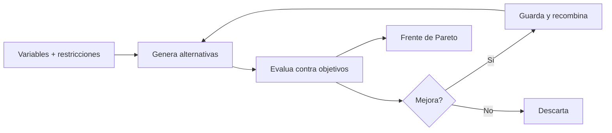
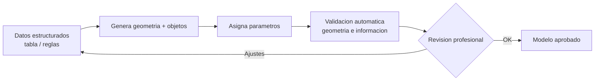

^^ Sesión 08 / Antes
## En el capítulo anterior

:::split
:::card [Quedó claro] El Enchufe
La IA ya llega a la fuente viva, con el permiso correcto, y avisa cuando algo cambia.
:::
:::card [Quedó abierto] !La pregunta de hoy
Pero todo lo que hace es **leer lo que ya está escrito**. ¿Puede proponer algo que nadie escribió?
:::
:::

---

^^ Sesión 08 / El caso
## Seis sumideros y cuatro restricciones que no caben

> **Corredor Av. Guayacanes, K0+400 – K0+700.** Interventoría observó que seis sumideros quedan dentro del trazado de la ciclorruta segregada. Hay que reubicarlos.

:::split
:::card [Lo que se toca al moverlos] !Cuatro restricciones
- El colector pluvial necesita **pendiente mínima**: mover un sumidero mueve la red.
- Tres **guayacanes** del separador tienen acta de manejo: no se talan.
- El andén no puede bajar del **ancho mínimo de accesibilidad**.
- Cada metro de colector reubicado **cuesta**.
:::
:::card [El problema real] No hay solución cómoda
Ninguna restricción se puede violar, y **no existe una alternativa que las cumpla todas holgadamente**. Cualquier salida cede algo.

Hasta hoy, esa decisión se tomaba en una reunión, con dos opciones dibujadas a mano y mucha experiencia.
:::
:::

**La pregunta de hoy:** ¿puede la IA proponer una solución que nadie escribió — y cómo se sabe si es buena?

---

^^ Sesión 08 / Conceptos
## Paramétrico, generativo y optimización

> Tres palabras que se confunden. La diferencia está en **quién propone** y **quién evalúa**.

| | Paramétrico | Generativo | Optimización |
|---|---|---|---|
| **Qué hace** | Se cambia un valor y el modelo se ajusta | El sistema **propone** muchas opciones | El sistema **busca la mejor** según un objetivo |
| **Quién decide** | El diseñador | El diseñador filtra | El algoritmo, guiado por objetivos |
| **En el corredor** | Mover el eje y que todo se actualice | 200 combinaciones de posición de sumideros | La combinación con menos metros de colector |

:::note
Generar no es optimizar. **Generar** produce variedad; **optimizar** persigue una meta. Casi siempre se usan juntos, y confundirlos lleva a pedirle a una herramienta lo que no hace.
:::

---

^^ Sesión 08 / El planteamiento
## Cómo se formula el problema del corredor

> Todo diseño generativo se define con tres piezas. Si no se pueden escribir, todavía no hay un problema resoluble — hay una intuición.

:::split-3
:::card [01] Variables
Lo que el sistema puede cambiar.

- Posición longitudinal de cada sumidero (± 15 m)
- Profundidad de tapa
- Trazado local de la ciclorruta (± 0,8 m)
- Ancho del andén, dentro del rango normativo
:::
:::card [02] Restricciones
Lo que no puede violar.

- Pendiente mínima del colector
- Los tres guayacanes, intocables
- Ancho mínimo de andén
- Distancia máxima entre punto bajo y captación
:::
:::card [03] Función objetivo
Lo que busca mejorar.

- Minimizar metros de colector reubicado
- Minimizar afectación de espacio público
:::
:::

:::ok
Escribir bien estas tres piezas es el **90% del trabajo**. El algoritmo es solo el motor — y arranca igual, esté bien o mal planteado el problema.
:::

---

^^ Sesión 08 / Motor
## Cómo se genera y se evalúa

:::card [Algoritmos genéticos] La idea intuitiva
Se inspira en la evolución: las mejores soluciones se **combinan y mutan** para producir la siguiente generación. Tras muchas iteraciones emergen opciones que nadie habría dibujado a mano.
:::

---

^^ Sesión 08 / El objeto
## El Abanico: cuando no hay una sola mejor solución

> En proyectos reales los objetivos **compiten**. Menos metros de colector puede significar más afectación de andén. No hay una ganadora: hay un **abanico de compromisos**.

:::split
:::card [Frente de Pareto] Qué es
El conjunto de soluciones donde **no se puede mejorar un objetivo sin empeorar otro**. Cada punto del abanico es un trueque legítimo, no un error.
:::
:::card [Rol del profesional] Qué aporta el humano
El algoritmo entrega el abanico; **la persona elige el punto**. Y al elegir, tiene que decir en voz alta qué está cediendo — que es exactamente lo que un comité necesita para decidir.
:::
:::

:::ok
El valor del abanico no es la alternativa ganadora. Es poder mostrar **qué se cede y cuánto cuesta cada opción**.
:::

---

^^ Sesión 08 / Aplicaciones
## Dónde se usa en infraestructura lineal

:::split
:::card [Trazado] Alineamiento y movimiento de tierras
Evaluar alineamiento horizontal y vertical **a la vez**, optimizando volúmenes de corte y lleno, seguridad, afectación predial y paso por zonas sensibles.
:::
:::card [Redes] Drenaje y servicios
Ubicación de captación, pendientes, cruces con otras redes, longitud total de colector.
:::
:::
:::split
:::card [Espacio público] Mobiliario y arborización
Distribución de mobiliario, sombra, superficie permeable, recorridos peatonales.
:::
:::card [Obra] Fases y manejo de tránsito
Secuencia constructiva que minimiza el impacto en el tráfico y la duración de los desvíos.
:::
:::

:::note
La diferencia con edificación importa: en un edificio se optimiza un volumen dentro de un lote; en un corredor se optimiza **una línea a lo largo de kilómetros**, con restricciones que cambian en cada abscisa.
:::

---

^^ Sesión 08 / Extra
## El panorama de herramientas

:::split
:::card [Infraestructura lineal] Lo más pertinente aquí
Han aparecido plataformas de diseño generativo específicas para infraestructura —viales, férreas, corredores— que exploran alternativas de trazado sobre datos geoespaciales, optimizando costo de construcción, longitud y afectación de suelo.
:::chips
Infraspace, optimización de alineamiento en plataformas de diseño vial
:::
:::
:::card [Edificación y sitio] El resto del ecosistema
Herramientas maduras para cabida, implantación y distribución en planta, más el paramétrico a medida de toda la vida.
:::chips
Autodesk Forma, TestFit, Grasshopper, Dynamo
:::
:::
:::

:::warn
Ninguna de estas herramientas resuelve un problema mal planteado. Cambian la velocidad de exploración, no la calidad de la formulación.
:::

---

^^ Sesión 08 / El giro
## El algoritmo no se equivocó

> Primera corrida sobre el caso del corredor, con un solo objetivo: **minimizar costo**.

:::split
:::card [El resultado óptimo] !Eliminar dos sumideros
Costo mínimo. **Todas las restricciones escritas, cumplidas.** El algoritmo hizo un trabajo impecable.
:::
:::card [Lo que pasa en obra] La primera lluvia fuerte
El subtramo se inunda. Porque la **capacidad de captación** nunca se escribió como restricción: era obvia, y por obvia nadie la puso.
:::
:::

:::warn
**Una restricción que no se escribe, no existe.** El optimizador va a encontrar todos los huecos de la formulación — no por malicia, sino porque encontrar huecos es literalmente su trabajo.
:::

:::ok
Es la misma lección de la sesión 02, con consecuencias de obra. Allá, cuatro criterios distintos sobre el mismo archivo daban cuatro números distintos. Aquí, el diseño depende de cómo se formuló el problema.
:::

---

^^ Sesión 08 / Segunda mitad
## ¿Qué significa "generar" un modelo BIM?

> "La IA hará el modelo sola" es la promesa más repetida del mercado. Conviene separar qué es real y qué es expectativa.

:::split
:::card [Qué implica generar] Las capas de un modelo
- **Geometría**: crear los elementos.
- **Objetos**: que sean sumideros, no cilindros.
- **Parámetros**: asignar la información correcta.
- **Relaciones**: coherencia entre elementos y con la red.
:::
:::card [Puntos de partida] Desde dónde se genera
- Desde **reglas** de diseño.
- Desde **tablas** o datos estructurados.
- Desde **instrucciones** en lenguaje natural.
- Desde **planos**, nubes de puntos o imágenes.
:::
:::

---

^^ Sesión 08 / Realidad
## Lo que hoy funciona y lo que todavía no

:::split
:::card [Funciona razonablemente] Con supervisión
- Crear elementos desde tablas y datos estructurados.
- Poblar parámetros según reglas.
- Generar variantes paramétricas.
- Modelado repetitivo basado en patrones.
:::
:::card [Todavía frágil] !Requiere revisión fuerte
- Interpretar planos complejos sin errores.
- Nubes de puntos a modelo listo para usar.
- Coherencia técnica en modelos grandes.
:::
:::

:::warn
El riesgo más peligroso no es el modelo que falla: es el que **parece correcto** y es técnicamente inválido. Geometría impecable, información equivocada. Y ya sabemos de la sesión 02 que lo que se ve bien, se ve bien por diseño.
:::

---

^^ Sesión 08 / Método
## Un flujo de generación asistida sensato

:::ok
La generación automática no elimina al modelador: **le cambia el rol**, de dibujar a definir reglas y validar resultados. Es el mismo movimiento de la sesión 06 — de escribir la solución a dirigirla.
:::

---

^^ Sesión 08 / Taller
## Actividad práctica (15 min)

:::split
:::card [Parte A] Formule un problema
Elija un problema de diseño de su contexto y escriba sus tres piezas: **variables**, **restricciones** y **función objetivo**.

Después, la pregunta que importa: **¿qué restricción es tan obvia que no la escribió?**
:::
:::card [Parte B] Arquitectura de generación
Esboce un flujo para generar o actualizar un modelo a partir de información estructurada, incluyendo el punto de **validación humana**.
:::
:::

:::note
**Material del taller** — se llena en pantalla y se descarga en PDF o `.md`:
<a href="doc.html#d=talleres/taller-08" target="_blank" rel="noopener">Hoja de trabajo</a>
:::

---

^^ Sesión 08 / Resolución
## Los seis sumideros, resueltos

> Se reformuló el problema con la **capacidad de captación como restricción dura**. Y se volvió a correr.

| | Qué entregó |
|---|---|
| **Alternativas en el frente** | 7 soluciones, ninguna dominada por otra |
| **Tres de ellas** | Priorizan costo: menos metros de colector, más afectación de andén |
| **Dos de ellas** | Conservan los tres guayacanes intactos, con mayor costo |
| **Dos de ellas** | Maximizan espacio público, con el plazo más largo |

:::ok
El comité eligió una — y por primera vez eligió **sabiendo exactamente qué estaba cediendo y cuánto costaba cada alternativa**. Ese, y no la geometría, fue el aporte de la máquina.
:::

---

^^ Sesión 08 / La frase
## Lo que hay que llevarse de hoy

> **El Abanico.** El diseño generativo no entrega una respuesta: entrega un abanico y obliga a elegir. Y al obligar a elegir, obliga a escribir lo que hasta ahora era criterio tácito.

:::split
:::card [Resultado] Lo que sale de esta sesión
El **planteamiento de un problema de diseño** con sus tres piezas, y la **arquitectura de generación** de un modelo con su punto de control.
:::
:::card [Idea fuerza] !Una sola frase
El computador genera opciones; el profesional **define el problema y juzga las respuestas**. La creatividad no se automatiza: se **amplifica**.
:::
:::

---

^^ Sesión 08 / Próximo capítulo
## Todas las cifras del abanico son estimaciones

> Cuánto cuesta reubicar un colector, cuánto se demora la fase. Números que salieron del presupuesto: **$86.400 millones y 22 meses**.

:::split
:::card [Lo que resolvimos] La propuesta
La IA ya propone alternativas que nadie dibujó, y obliga a explicitar el criterio con el que se elige.
:::
:::card [Lo que queda abierto] !La anticipación
El IDU ya ejecutó **40 corredores parecidos**. Todos tenían un presupuesto y un plazo. Casi ninguno terminó en el presupuesto y el plazo que decía el papel.

**¿Qué dicen esos 40 sobre lo que de verdad va a pasar con este?**
:::
:::

> **Sesión 09 — Machine learning para costos, planificación y decisiones.** Miércoles 16/09.
