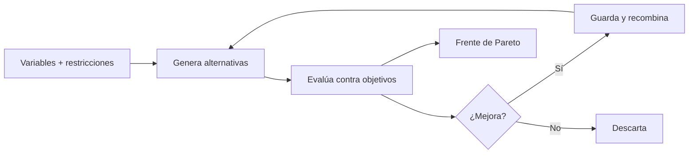
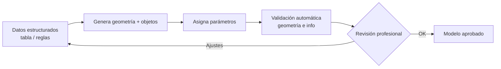

^^ Sesión 08 / Propósito
## Del diseño único al espacio de alternativas

> En vez de dibujar una solución, definimos el **problema** (variables, restricciones, objetivos) y dejamos que el sistema explore cientos de soluciones. El diseñador pasa de dibujar a **decidir**.

:::split
:::card [Primera mitad] Diseño generativo
Paramétrico, generativo y optimización. Cómo se generan y evalúan alternativas.
:::
:::card [Segunda mitad] Generación de modelos BIM
Qué significa "generar" un modelo, hasta dónde llega hoy y dónde el humano es imprescindible.
:::
:::

---

^^ Sesión 08 / Conceptos
## Paramétrico, generativo y optimización

> Tres palabras que se confunden. La diferencia está en **quién propone** y **quién evalúa**.

| | Paramétrico | Generativo | Optimización |
|---|---|---|---|
| **Qué hace** | Cambiás un valor, el modelo se ajusta | El sistema **propone** muchas opciones | El sistema **busca la mejor** según un objetivo |
| **Quién decide** | El diseñador | El diseñador filtra | El algoritmo, guiado por objetivos |
| **Ejemplo** | Mover un eje y todo se actualiza | 200 distribuciones de planta | La distribución con menor recorrido |

:::note
Generar ≠ optimizar. **Generar** produce variedad; **optimizar** persigue una meta. Casi siempre se usan juntos.
:::

---

^^ Sesión 08 / El planteamiento
## Cómo se formula un problema de diseño

> Todo diseño generativo se define con tres piezas. Si no podés escribirlas, todavía no tenés un problema resoluble.

:::split-3
:::card [01] Variables
Lo que el sistema puede cambiar: orientación, altura, número de módulos, posición de núcleos.
:::
:::card [02] Restricciones
Lo que no puede violar: normativa, linderos, presupuesto, área mínima.
:::
:::card [03] Función objetivo
Lo que busca mejorar: minimizar costo, maximizar área útil, reducir recorridos.
:::
:::

:::ok
Definir bien estas tres piezas es el **90% del trabajo**. El algoritmo es solo el motor.
:::

---

^^ Sesión 08 / Motor
## Cómo se genera y se evalúa

:::card [Algoritmos genéticos] La idea intuitiva
Se inspira en la evolución: las mejores soluciones se **combinan y mutan** para producir la siguiente generación. Tras muchas iteraciones, emergen opciones muy buenas.
:::

---

^^ Sesión 08 / Multiobjetivo
## Cuando no hay una sola "mejor" solución

> En proyectos reales, los objetivos **compiten**: más área útil suele costar más; menos recorrido puede reducir habitaciones. No hay una ganadora, hay un **abanico de compromisos**.

:::split
:::card [Frente de Pareto] Qué es
El conjunto de soluciones donde **no podés mejorar un objetivo sin empeorar otro**. Cada punto es un trueque legítimo.
:::
:::card [Rol del diseñador] Qué aporta el humano
El algoritmo entrega el frente; el **profesional elige** el punto que equilibra costo, valor y criterio — algo que el objetivo matemático no captura.
:::
:::

---

^^ Sesión 08 / Aplicaciones
## Dónde se usa en AECO

:::split-3
:::card [Cabida] Terrenos
Cuántos m² edificables, cuántas unidades, mejor implantación en el lote.
:::
:::card [Distribución] Planta
Ubicación de núcleos, recorridos, iluminación, eficiencia de circulaciones.
:::
:::card [Estructura] Materiales
Dimensionar elementos, reducir material, comparar sistemas estructurales.
:::
:::

:::chips
TestFit, Autodesk Forma (Spacemaker), Grasshopper, Dynamo, Galapagos
:::

---

^^ Sesión 08 / Segunda mitad
## ¿Qué significa "generar" un modelo BIM?

> "La IA hará el modelo sola" es la promesa más repetida del mercado. Veamos qué es real y qué es expectativa.

:::split
:::card [Qué implica generar] Capas de un modelo
- **Geometría**: crear los elementos.
- **Objetos**: que sean muros, no líneas.
- **Parámetros**: asignar información correcta.
- **Relaciones**: coherencia entre elementos.
:::
:::card [Puntos de partida] Desde dónde se genera
- Desde **reglas** de negocio.
- Desde **tablas** o datos estructurados.
- Desde **instrucciones** en lenguaje natural.
- Desde **planos** o imágenes (reconocimiento).
:::
:::

---

^^ Sesión 08 / Realidad
## Lo que hoy funciona vs. lo que no

:::split
:::card [Funciona razonablemente] Con supervisión
- Crear elementos desde tablas (p. ej. rejillas de columnas).
- Poblar parámetros según reglas.
- Generar variantes paramétricas.
- Modelado repetitivo basado en patrones.
:::
:::card [!Todavía frágil] Requiere revisión fuerte
- Interpretar planos complejos sin errores.
- Nubes de puntos a modelo "listo".
- Coherencia técnica en modelos grandes.
:::
:::

:::warn
El riesgo más peligroso: un modelo que **parece correcto** pero es técnicamente inválido. Geometría linda, información equivocada.
:::

---

^^ Sesión 08 / Método
## Un flujo de generación asistida sensato

:::ok
La generación automática no elimina al modelador: **cambia su rol** de dibujar a definir reglas y validar resultados.
:::

---

^^ Sesión 08 / Taller
## Actividad práctica (15 min)

:::split
:::card [Parte A] Formulá un problema
Elegí un problema de diseño de tu contexto y escribí sus tres piezas:
- **Variables** (qué puede cambiar)
- **Restricciones** (qué no se puede violar)
- **Función objetivo** (qué mejorar)
:::
:::card [Parte B] Arquitectura de generación
Esbozá un flujo para **generar o actualizar** un modelo a partir de información estructurada, incluyendo el punto de validación humana.
:::
:::

---

^^ Sesión 08 / Cierre
## Para llevar

:::split
:::card [Resultado] Lo que sale de hoy
El **modelo conceptual de un proceso de diseño generativo** y una **arquitectura de generación** de modelos con su punto de control.
:::
:::card [!Idea fuerza] Una sola frase
El computador genera opciones; el profesional **define el problema y juzga las respuestas**. La creatividad no se automatiza: se **amplifica**.
:::
:::

> Próxima sesión de Julián: **Machine learning para costos, planificación y decisiones** — 16/09.
