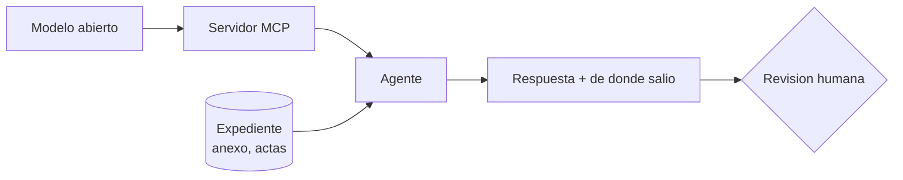
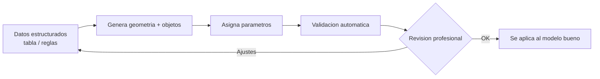

^^ Sesión 08 / Antes
## En el capítulo anterior

:::split
:::card [Quedó claro] Automatizar es adoptar una regla
Y toda regla adoptada necesita un dueño, porque las reglas cambian y los scripts no. El agente escribe el Python por debajo; lo que se audita es el plan y el resultado.
:::
:::card [Quedó abierto] !La pregunta de hoy
Pero todo lo automatizable supone que la respuesta ya está escrita en algún documento. **¿Y cuando la respuesta no está en ningún documento, sino en el modelo?**
:::
:::

---

^^ Sesión 08 / El caso
## Seis sumideros que ningún documento ubica

> **Corredor Av. Guayacanes, K0+400 – K0+700.** Interventoría observó que seis sumideros quedan dentro del trazado de la ciclorruta segregada. Pide el listado con abscisa y cota de tapa, para el comité del jueves.

:::split
:::card [Dónde está la respuesta] En el modelo, no en el expediente
El anexo no lo dice. Las actas no lo dicen. El informe de interferencias tampoco: esto no es un choque entre redes, es un elemento parado sobre un trazado.

**La respuesta está en la geometría**, y la geometría solo vive en el modelo.
:::
:::card [El problema] !La IA nunca ha visto el modelo
Desde la sesión 06 el agente lee el expediente: documentos, actas, informes. Todo lo que le conectaron son **archivos**.

El modelo federado son 2,4 GB abiertos en el equipo de Marcela, y para la IA no existe.
:::
:::

**La pregunta de hoy:** ¿cómo llega la IA hasta el modelo — y qué le puede preguntar de verdad?

---

^^ Sesión 08 / Bloque 1
## El modelo no es un documento

> Un PDF se lee de principio a fin. Un modelo no: es una base de datos con forma. Y esa diferencia decide qué se le puede preguntar.

:::split-3
:::card [01] Objetos
No hay "líneas": hay **sumideros**, pozos, tramos de colector. Cada uno sabe qué es.
:::
:::card [02] Parámetros
Los campos de la ficha: código, abscisa, cota de tapa, ficha de mantenimiento, estado.
:::
:::card [03] Geometría
Dónde está cada cosa, con qué forma y en relación con qué. Es lo más pesado y lo más difícil de consultar.
:::
:::

:::ok
De las tres capas, **la IA llega hoy muy bien a la segunda**. Los parámetros son tabla: se leen, se filtran y se cruzan igual que un CSV — que es exactamente lo que se practicó el viernes.
:::

---

^^ Sesión 08 / Bloque 1
## Tres caminos hasta el modelo

> Las tres funcionan. No son niveles de dificultad: son tres respuestas a *quién mantiene esto y qué pasa cuando el modelo cambie*.

| | Cómo se hace | Qué llega | Se rompe cuando… |
|---|---|---|---|
| **Exportar** | Se saca una tabla o un IFC y se le entrega a la IA | Una **copia**, con lo que había ese día | El modelo se actualiza y nadie vuelve a exportar |
| **API** | Un desarrollo consulta el modelo o la plataforma | Lo que se haya programado, cuando se programó | Sale la versión siguiente, o se va quien lo escribió |
| **MCP** | El modelo expone sus herramientas y el agente las descubre | La **fuente viva**, con los permisos de quien conectó | Se conecta con la cuenta equivocada |

:::note
Es la misma decisión de la sesión 06 —fotocopia contra llave— aplicada ahora al modelo y no al expediente. Y aparece una restricción nueva que los documentos no tenían: **el modelo pesa**. Exportar 2,4 GB para preguntar por seis sumideros no es una opción; filtrar antes de preguntar sí lo es.
:::

---

^^ Sesión 08 / Bloque 1
## Qué entrega el modelo y qué no

:::split
:::card [Contesta bien] Lo que está en un campo
- *"¿Qué sumideros del Tramo 2 no tienen ficha de mantenimiento?"*
- *"¿Cuántos elementos quedaron sin código de clasificación?"*
- *"Dame abscisa y cota de tapa de estos seis."*
:::
:::card [Contesta mal, o no contesta] !Lo que hay que mirar
- *"¿Este sumidero estorba la ciclorruta?"* — es geometría, y hay que calcularla.
- *"¿Por qué se dejó este pozo acá?"* — es **intención**, y no está escrita en ninguna parte.
- *"¿Está bien diseñado?"* — es criterio profesional.
:::
:::

:::warn
La regla corta: **el modelo entrega lo que alguien escribió en un campo.** Si el campo está mal, la respuesta sale mal — y con la misma seguridad. Es el Semáforo de la 04 y la alucinación de la 02, ahora sobre el modelo.
:::

---

^^ Sesión 08 / Práctica
## En vivo: conectar y preguntar

:::warn
**El corredor es ficticio y su modelo no existe.** Todo el expediente del curso está construido para el ejercicio. Así que lo que sigue no corre sobre el Tramo 2: corre sobre **un modelo real y simple**, abierto en la máquina de acá adelante.

No es un descuento. Es el punto: **las tres capas y los tres caminos son los mismos** en un modelo de cuatro elementos y en un corredor de 2,4 GB. Lo que cambia es el tamaño, no la mecánica.
:::

:::split
:::card [Lo que se va a ver] La misma pregunta, dos veces
Nada de tablas exportadas: todo sale del **modelo abierto**, en vivo. La misma pregunta antes y después de que algo cambie en Revit — y, arriba en la pantalla, la primera respuesta quedándose quieta.
:::
:::card [Lo que hay que mirar] !El plan, no la respuesta
Antes de ejecutar, el agente declara **qué va a consultar y cómo**. Ahí es donde se audita. Cuando la respuesta ya está en pantalla, es tarde.
:::
:::

---

^^ Sesión 08 / El objeto
## La Ventanilla

> Al modelo no se entra: **se le pide por una ventanilla**. Se hace la solicitud, alguien busca en la ficha y devuelve lo que ahí dice. Ni más, ni distinto.

:::split
:::card [Lo que llega por la ventanilla] La ficha, no el edificio
Llega lo que **está escrito en el campo**. No llega lo que el proyectista tenía en la cabeza, ni por qué tomó esa decisión, ni si el campo sigue siendo cierto.
:::
:::card [Y tiene tres puertas] !La que se abre la elige alguien
Autodesk publica **tres versiones** del servidor: una que **solo lee**; una que **lee y escribe**; y una de **acceso anticipado**, con más herramientas y menos rodaje.

No es un detalle técnico: **cuál se conecta es una decisión**, y tiene dueño. En un rato vamos a abrir la que escribe.
:::
:::

:::ok
La ventanilla no es un defecto. Es lo que hace que la conexión sea **auditable**: se sabe qué se pidió, qué se devolvió y de dónde salió. Un agente que entra a la bodega no deja ese rastro.
:::

---

^^ Sesión 08 / Bloque 2
## Del dato al modelo: generar y actualizar

> La ventanilla también funciona al revés, con una condición: que lo que entra venga **estructurado y con una regla**, no en lenguaje suelto.

:::split
:::card [Funciona razonablemente] Con supervisión
- Crear elementos desde una tabla de datos.
- Poblar parámetros según una regla escrita.
- Generar variantes de familias paramétricas.
- Modelado repetitivo por patrón.
:::
:::card [Todavía frágil] !Requiere revisión fuerte
- Interpretar planos complejos sin errores.
- Nube de puntos a modelo listo para usar.
- Coherencia técnica en modelos grandes.
:::
:::

:::note
Es la misma anatomía del viernes: **seleccionar, filtrar, consultar, decidir, actuar, reportar.** Lo único que cambia es que el paso "actuar" ahora escribe en el modelo — y por eso es el paso que se confirma a mano.
:::

---

^^ Sesión 08 / Extra
## Un flujo de generación sensato

:::ok
La generación automática no elimina al modelador: **le cambia el rol**, de dibujar a definir reglas y validar resultados. Y nunca se corre sobre el modelo bueno: copia primero, comparación después.
:::

---

^^ Sesión 08 / El giro
## Le dieron escritura

> Funcionó tan bien leyendo que se pidió el permiso completo. *"Completa la ficha de mantenimiento de todos los elementos de drenaje del Tramo 2."*

:::split
:::card [Lo que hizo] Las 16, en cuatro segundos
Los **10 campos en blanco**, los **4** que decían `N/D` y los **2** que decían `PENDIENTE`. Formato correcto, nomenclatura correcta, ni un error de sintaxis.

**La máquina hizo exactamente lo que se le pidió.**
:::
:::card [Lo que nadie previó] !Tres estaban vacíos a propósito
Tres de esos diez son los sumideros de **K0+400 – K0+700**: los que esperan la decisión de reubicación. El campo estaba en blanco porque no había nada que escribir todavía.

Ahora dice algo. Y dice algo que nadie decidió.
:::
:::

:::warn
**La máquina no distingue "falta el dato" de "todavía no se ha decidido".** Para ella las dos cosas se ven igual: una celda vacía.

Y hay algo peor en la misma jugada: en blanco, `N/D` y `PENDIENTE` eran **tres estados distintos** que alguien codificó a propósito. La máquina los aplanó en uno solo —"le falta"— y los llenó a los tres igual.
:::

:::ok
Por eso las ventanillas son tres y no una: el fabricante **no decidió por nadie**, dejó la decisión a la vista y con dueño. **Lo que lee puede ser autónomo; lo que escribe, no** — es la misma regla del viernes, ahora con el modelo de por medio.
:::

---

^^ Sesión 08 / Investigación
## Lo que viene: paramétrico, generativo y optimización

> Tres palabras que se confunden, y que van a aparecer en las ofertas de software del año que viene. La diferencia está en **quién propone**.

| | Qué hace | Quién decide |
|---|---|---|
| **Paramétrico** | Se cambia un valor y el modelo se ajusta | El diseñador |
| **Generativo** | El sistema **propone** muchas opciones | El diseñador filtra |
| **Optimización** | El sistema **busca la mejor** según un objetivo | El algoritmo, guiado por objetivos |

:::note
Generar no es optimizar: **generar produce variedad, optimizar persigue una meta.** Es la distinción que hay que tener clara para leer una ficha de producto sin comprar humo.
:::

---

^^ Sesión 08 / Investigación
## Y el abanico, que es a dónde lleva todo esto

> Cuando los objetivos compiten —menos metros de colector contra menos afectación de andén— no hay una ganadora. Hay un **abanico de compromisos**, y alguien tiene que elegir un punto.

:::split
:::card [Lo que cambia] De una respuesta a un rango
El sistema no entrega la solución: entrega las alternativas que **no son peores que ninguna otra en todo**. Cada una cede algo distinto.
:::
:::card [Lo que no cambia] !El criterio sigue siendo humano
Al elegir, hay que decir en voz alta qué se está cediendo. Que es exactamente lo que un comité necesita para poder decidir — y firmar.
:::
:::

:::warn
**Tema de investigación, no de compra.** Estas herramientas existen y son reales, pero hoy son más maduras en edificación que en infraestructura lineal. Lo que sirve desde ya es la pregunta: *¿cuáles son mis variables, mis restricciones y mi objetivo?* Esa se puede escribir sin comprar nada.
:::

---

^^ Sesión 08 / Taller
## La ronda: ¿a quién le sirve esto? (15 min)

> Hoy no hay hoja que llenar: **hablamos.** Piensen en **una tarea concreta** —suya o de alguien de su equipo— que hoy se resuelve abriendo el modelo a mano. ¿Qué cambiaría si se le pudiera preguntar por la ventanilla?

:::split-3
:::card [01] La tarea
Una frase, con nombre propio. Qué se resuelve hoy **abriendo el modelo**, y quién lo hace.
:::
:::card [02] Lo que cuesta
Cuánto toma, cada cuánto se repite — y qué pasa cuando quien la hace **no está**.
:::
:::card [03] !Por cuál puerta
¿Alcanza con que **lea**? ¿O hace falta que **escriba**? Y si escribe: ¿quién lo firma?
:::
:::

:::ok
La tercera es la que importa, y casi siempre la respuesta es **"con leer alcanza"**. Descubrirlo en voz alta y sobre un caso propio vale más que cualquier ejercicio de escritorio.
:::

---

^^ Sesión 08 / Resolución
## Los seis sumideros, ubicados

| Lo que se preguntó | Por dónde salió |
|---|---|
| Cuáles son y dónde están | **Parámetro** — abscisa y cota de tapa, por la ventanilla |
| Cuáles caen dentro del trazado | **Geometría** — el cálculo lo hace el modelo, no la IA |
| Qué exige el anexo para cada uno | **Expediente** — el agente ya lo tenía desde la 06 |
| Qué se hace con ellos | **Nadie automatizó esto.** Es la decisión del comité del jueves |

:::ok
La IA no reubicó ningún sumidero. Armó en cuatro minutos la tabla que Marcela armaba en media mañana —con abscisa, cota, requisito del anexo y estado— y la dejó **con la fuente de cada dato al lado**.

Y los tres campos que estaban vacíos a propósito **siguen vacíos** — porque para esta consulta se abrió la ventanilla de solo lectura. No lo impidió el software: lo decidió alguien, y esa decisión tiene nombre.
:::

---

^^ Sesión 08 / La frase
## Lo que hay que llevarse de hoy

> **La Ventanilla.** Al modelo se le pide y él devuelve lo que está escrito en la ficha. No lo que alguien pensó, no lo que debería decir: lo que dice. Y tiene tres puertas: **cuál se abre es una decisión con dueño**.

:::split
:::card [Resultado] Lo que sale de esta sesión
**Una tarea propia** que hoy se resuelve abriendo el modelo — con su tiempo, su dueño y la puerta por la que entraría. Y los casos de los demás, que casi nunca son los que uno esperaba.
:::
:::card [Idea fuerza] !Una sola frase
Conectar la IA al modelo no la vuelve inteligente sobre el proyecto: la vuelve **rápida leyendo lo que ya está escrito**. Lo que no está escrito sigue siendo trabajo de alguien.
:::
:::

---

^^ Sesión 08 / Próximo capítulo
## La ventanilla dice lo que hay hoy

> Cantidades, parámetros, estados, abscisas. Todo lo que el modelo sabe es **presente**: lo que está construido o lo que está dibujado.

:::split
:::card [Lo que resolvimos] El acceso al modelo
La IA ya llega al modelo por la ventanilla, sabe qué puede preguntarle y qué no, y no le toca nada.
:::
:::card [Lo que queda abierto] !El futuro
El presupuesto del Tramo 2 dice **$86.400 millones** y **22 meses**. Esas dos cifras no salieron del modelo: salieron de una estimación.

El IDU ya ejecutó **40 corredores parecidos**. Casi ninguno terminó en el presupuesto y el plazo que decía el papel.

**¿Qué dicen esos 40 sobre lo que de verdad va a pasar con este?**
:::
:::

> **Sesión 09 — Machine learning para costos, planificación y decisiones.** Viernes 18/09.
