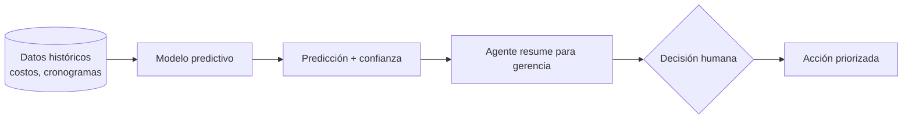

^^ Sesión 09 / Propósito
## De reaccionar a anticipar

> Los proyectos generan montañas de datos históricos: presupuestos, cronogramas, incidencias. El **machine learning** aprende de ese pasado para **predecir** el futuro — con humildad estadística.

:::split
:::card [Primera mitad] Cómo funciona
Formular un problema predictivo, tipos de aprendizaje y las trampas que invalidan un modelo.
:::
:::card [Segunda mitad] Dónde aplica
Costos (5D), planificación (4D), riesgo de retrasos y el agente como asistente de gerencia.
:::
:::

---

^^ Sesión 09 / Diferencia clave
## ML no es lo mismo que un LLM

> Un modelo de lenguaje **conversa**. Un modelo de machine learning **predice un número o una categoría** a partir de datos tabulares. Son herramientas distintas para problemas distintos.

:::split
:::card [Machine learning "clásico"] Datos → predicción
Aprende patrones de tus tablas históricas para estimar costo, duración o probabilidad de retraso.
:::
:::card [LLM / IA generativa] Texto → texto
Redacta, resume y explica. No es la herramienta para predecir un costo a partir de 500 proyectos pasados.
:::
:::

:::note
A veces **no necesitás IA**: si una regla o una fórmula resuelve el problema, usala. El ML brilla cuando los patrones son demasiado complejos para una regla.
:::

---

^^ Sesión 09 / Planteamiento
## Anatomía de un problema predictivo

:::split
:::card [Las piezas] Qué define el problema
- **Variables de entrada** (features): área, uso, ubicación, complejidad.
- **Variable objetivo** (target): lo que querés predecir — el costo.
- **Datos históricos**: proyectos pasados con entrada y resultado real.
:::
:::card [Los conjuntos] Cómo se entrena y prueba
- **Entrenamiento**: el modelo aprende aquí.
- **Validación**: se ajusta sin hacer trampa.
- **Prueba**: se mide contra datos que nunca vio.
:::
:::

:::warn
Si evaluás el modelo con los mismos datos con los que aprendió, el resultado será engañosamente bueno. **Nunca** midas sobre lo ya visto.
:::

---

^^ Sesión 09 / Tipos
## Tres tareas fundamentales

:::split-3
:::card [Clasificación] Categorías
Predecir una etiqueta. "¿Esta incidencia es estructural, MEP o arquitectónica?" "¿Riesgo alto o bajo?"
:::
:::card [Regresión] Números
Predecir un valor continuo. "¿Cuánto costará?" "¿Cuántos días durará esta actividad?"
:::
:::card [Anomalías] Lo atípico
Detectar lo que se sale del patrón. "¿Qué elementos o partidas se comportan de forma extraña?"
:::
:::

---

^^ Sesión 09 / Las trampas
## Por qué un modelo puede mentir

> Un modelo puede tener excelentes métricas y aun así ser **inútil o peligroso**. Estos son los cuatro venenos.

:::split
:::card [!Datos y sesgo] Basura entra, basura sale
- **Datos sesgados**: si el histórico está mal, el modelo hereda el error.
- **Cantidad y calidad**: pocos datos → patrones falsos.
:::
:::card [!Ajuste y causa] Errores de razonamiento
- **Sobreajuste**: memoriza el pasado, falla en lo nuevo.
- **Correlación ≠ causalidad**: dos cosas suben juntas sin que una cause la otra.
:::
:::

:::note
Generalización = qué tan bien funciona el modelo con datos **nuevos**. Es la única métrica que importa de verdad.
:::

---

^^ Sesión 09 / Aplicación 5D
## Predicción de costos

:::split
:::card [El caso] Estimación temprana
Con datos de proyectos pasados (área, uso, sistema estructural, ubicación), predecir un rango de costo en fases tempranas — cuando aún se puede decidir.
:::
:::card [Insumos] Qué necesitás
:::chips
Presupuestos históricos, Cantidades del modelo, Tipología, Ubicación, Fecha
:::
:::metrics
5D | BIM de costos
± % | Rango, no cifra exacta
:::
:::
:::

:::ok
La IA puede cruzar históricos de presupuestos (Excel / CSV) y **un agente puede resumirlos** para la gerencia, señalando desviaciones.
:::

---

^^ Sesión 09 / Aplicación 4D
## Planificación y riesgo de retrasos

| Caso de uso | Tipo de ML | Pregunta que responde |
|---|---|---|
| Predicción de duración | Regresión | ¿Cuánto durará esta fase? |
| Riesgo de retraso | Clasificación | ¿Qué actividades están en peligro? |
| Priorización | Clasificación | ¿Qué atender primero? |
| Mantenimiento predictivo | Regresión / anomalías | ¿Cuándo fallará este activo? |
| Reprocesos | Clasificación | ¿Qué tiene alta probabilidad de rehacerse? |

:::note
BIM **4D** conecta el modelo con el cronograma; el ML añade la capa de **predicción** sobre esa línea de tiempo.
:::

---

^^ Sesión 09 / Decisiones
## Del dato a la decisión

:::warn
El modelo **recomienda**, no decide. La decisión —y la responsabilidad— siguen siendo humanas. Las predicciones se **supervisan**, no se obedecen.
:::

---

^^ Sesión 09 / Interpretación
## Leer un resultado con criterio

:::split
:::card [Buenas preguntas] Antes de creerle al modelo
- ¿Con cuántos datos aprendió?
- ¿Se parecen esos proyectos al mío?
- ¿Qué tan seguro está de esta predicción?
- ¿Qué variables pesaron más?
:::
:::card [!Señal de alerta] Cuándo desconfiar
- El modelo es muy preciso "en el pasado" pero nadie lo probó con datos nuevos.
- Predice sobre un tipo de proyecto que casi no vio.
- Nadie puede explicar por qué dio ese número.
:::
:::

---

^^ Sesión 09 / Taller
## Actividad práctica (15 min)

:::split
:::card [Parte A] Ficha de un modelo
Formulá un caso predictivo de tu trabajo, definiendo:
- **Entradas** (variables disponibles)
- **Salida** (qué predice)
- **Datos** necesarios y de dónde salen
:::
:::card [Parte B] Escenario de gerencia
Con un escenario de proyecto, redactá las **recomendaciones** que un asistente de IA daría: riesgos, desviaciones y acciones propuestas.
:::
:::

---

^^ Sesión 09 / Cierre
## Para llevar

:::split
:::card [Resultado] Lo que sale de hoy
La **ficha de un modelo predictivo** (entradas, salida, datos) y un **informe ejecutivo** de riesgos y acciones para tu proceso.
:::
:::card [!Idea fuerza] Una sola frase
El ML no adivina el futuro: **cuantifica la incertidumbre** del pasado para decidir mejor hoy. Su valor no es tener razón siempre, sino equivocarse menos que la intuición.
:::
:::

> Última sesión de Julián en el diplomado: **Taller final y cierre académico** — 25/09 (junto a Daniel y Hugo).
