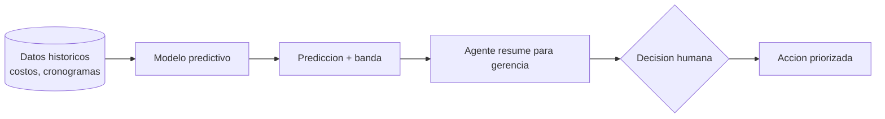

^^ Sesión 09 / Antes
## En el capítulo anterior

:::split
:::card [Quedó claro] El Abanico
El diseño generativo no entrega una respuesta: entrega alternativas y obliga a elegir. Y una restricción que no se escribe, no existe.
:::
:::card [!Quedó abierto] La pregunta de hoy
Pero todas las cifras del abanico son **estimaciones**. ¿Qué tan buenas son — y qué dice el pasado sobre lo que va a pasar?
:::
:::

---

^^ Sesión 09 / El caso
## Cuarenta corredores y una pregunta incómoda

> **Corredor Av. Guayacanes, Tramo 2.** El presupuesto dice **$86.400 millones** y **22 meses**. Marcela pide una sola cosa antes del comité.

:::split
:::card [La pregunta] Cuatro palabras
*"¿Ese número es realista?"*

Nadie en la sala la puede responder con evidencia. Se responde con experiencia, y la experiencia de cada quien es distinta.
:::
:::card [Lo que sí existe] Un archivo que nadie mira
El IDU ejecutó **40 corredores** parecidos en los últimos años. De cada uno se sabe el presupuesto, el plazo, lo que costó de verdad y cuánto se demoró de verdad.

Ese archivo ya está. Nunca se ha usado para responder nada.
:::
:::

**La pregunta de hoy:** ¿qué dicen esos 40 sobre este — y con cuánta confianza se puede decir?

---

^^ Sesión 09 / Diferencia clave
## ML no es lo mismo que un LLM

> Un modelo de lenguaje **conversa**. Un modelo de machine learning **predice un número o una categoría** a partir de datos tabulares. Herramientas distintas para problemas distintos.

:::split
:::card [Machine learning clásico] Datos → predicción
Aprende patrones de tablas históricas para estimar costo, duración o probabilidad de retraso. Es lo que sirve para los 40 corredores.
:::
:::card [LLM / IA generativa] Texto → texto
Redacta, resume y explica. **No** es la herramienta para predecir un costo a partir de 40 proyectos pasados — aunque responda si se le pregunta.
:::
:::

:::note
Y a veces no hace falta IA de ningún tipo: si una regla o una fórmula resuelve el problema, se usa la fórmula. El ML brilla cuando los patrones son demasiado complejos para una regla.
:::

---

^^ Sesión 09 / Planteamiento
## Anatomía de un problema predictivo

:::split
:::card [Las piezas] Qué define el problema
- **Variables de entrada**: longitud, tipo de intervención, redes húmedas, año, área.
- **Variable objetivo**: lo que se quiere predecir — el sobrecosto.
- **Datos históricos**: proyectos pasados con entrada **y resultado real**.
:::
:::card [Qué se puede predecir] Tres tareas
- **Regresión** → un número. *¿Cuánto costará?*
- **Clasificación** → una etiqueta. *¿Riesgo alto o bajo?*
- **Anomalías** → lo atípico. *¿Qué partida se comporta raro?*
:::
:::

:::warn
Si el modelo se evalúa con los mismos datos con los que aprendió, el resultado será engañosamente bueno. **Nunca** se mide sobre lo ya visto: se aparta un conjunto de prueba que el modelo no vio jamás.
:::

---

^^ Sesión 09 / El hallazgo
## Lo que dicen los 40

:::metrics
37 de 37 | Corredores terminados que superaron el presupuesto
20% | Sobrecosto mediano
5% | Se salieron de toda banda razonable
:::

:::split
:::card [Lo que sí predice] Las redes húmedas
Corredores **con** renovación de redes húmedas: **24%** de sobrecosto mediano.
**Sin** ellas: **12%**.

El doble. Y es la variable más fuerte del conjunto.
:::
:::card [!Lo que no predice] La longitud
La longitud del corredor —lo primero que todo el mundo mira— tiene una correlación de **0,15** con el sobrecosto.

Prácticamente nada. La intuición del gremio apuntaba al lugar equivocado.
:::
:::

:::note
Datos del expediente **ficticio** del curso, construidos para este ejercicio. Los patrones son verosímiles y las relaciones son reales dentro del archivo; las cifras **no** son del IDU.
:::

---

^^ Sesión 09 / Aplicación 5D
## Predicción de costos

:::split
:::card [El caso] Estimación temprana
Con datos de proyectos pasados —longitud, tipo, redes, área, año— predecir un **rango** de costo en fases tempranas, cuando todavía se puede decidir algo.
:::
:::card [Insumos] Qué se necesita
:::chips
Presupuestos históricos, Cantidades del modelo, Tipología, Ubicación, Fecha
:::
:::ok
La clave no es acertar la cifra: es **saber dónde está concentrado el riesgo**. En estos 40, el riesgo tiene nombre y apellido: redes húmedas.
:::
:::
:::

---

^^ Sesión 09 / El giro
## Correlación de 0,99. Y completamente inútil

> Se entrenó un modelo con **todas** las columnas disponibles del archivo. El resultado fue espectacular.

:::split
:::card [!La columna mágica] Número de otrosíes
`num_otrosi` predice el sobrecosto con una correlación de **0,99**. Ninguna otra variable se le acerca.

Un modelo con esa columna acierta casi siempre.
:::
:::card [La pregunta que lo derrumba] ¿Cuándo se sabe?
**¿Cuándo se sabe cuántos otrosíes tuvo un contrato?**

Cuando el contrato terminó.

Para el Tramo 2, que apenas empieza, esa columna está **vacía**.
:::
:::

:::warn
Se llama **fuga de información**: entrenar con datos que en el momento real de la predicción todavía no existen. Un modelo que usa información del futuro no predice — **recuerda**.
:::

:::ok
Quinta vez en el curso: la máquina hizo exactamente lo que se le pidió. El problema nunca estuvo en la máquina.
:::

---

^^ Sesión 09 / Las trampas
## Por qué un modelo puede mentir

> Un modelo puede tener excelentes métricas y aun así ser inútil o peligroso. Estos son los venenos.

:::split
:::card [!Datos] Basura entra, basura sale
- **Sesgo**: si el histórico está mal, el modelo hereda el error.
- **Cantidad**: pocos datos producen patrones falsos. Cuarenta proyectos es poco.
- **Fuga**: variables que no existen cuando hay que predecir.
:::
:::card [!Razonamiento] Errores de lectura
- **Sobreajuste**: memoriza el pasado, falla en lo nuevo.
- **Correlación no es causa**: dos cosas suben juntas sin que una cause la otra.
- **Atípicos**: dos hallazgos arqueológicos no se predicen con ningún modelo.
:::
:::

:::note
Generalización: qué tan bien funciona con datos **nuevos**. Es la única métrica que importa de verdad.
:::

---

^^ Sesión 09 / Aplicación 4D
## Planificación y riesgo de retrasos

| Caso de uso | Tipo de ML | Pregunta que responde |
|---|---|---|
| Predicción de duración | Regresión | ¿Cuánto durará esta fase? |
| Riesgo de retraso | Clasificación | ¿Qué actividades están en peligro? |
| Priorización | Clasificación | ¿Qué atender primero? |
| Mantenimiento predictivo | Regresión / anomalías | ¿Cuándo va a fallar este activo? |
| Reprocesos | Clasificación | ¿Qué tiene alta probabilidad de rehacerse? |

:::note
BIM **4D** conecta el modelo con el cronograma; el ML añade la capa de **predicción** sobre esa línea de tiempo. Y el mantenimiento predictivo cierra el ciclo: los datos de operación del corredor alimentan la estimación del siguiente.
:::

---

^^ Sesión 09 / El objeto
## La Banda

:::split
:::card [!Predicción puntual] Una opinión con decimales
> El Tramo 2 costará **$106.200 millones**.

Suena preciso. No dice nada sobre cuánto se puede equivocar, así que no se puede usar para decidir.
:::
:::card [Predicción con banda] Una herramienta de decisión
> Entre **$101.700 y $110.200 millones**, en 8 de cada 10 casos comparables.
>
> Y en 1 de cada 20, fuera de toda banda: hallazgos arqueológicos, redes no identificadas.

Ahora sí se puede provisionar, negociar y vigilar.
:::
:::

:::ok
**Una predicción sin banda es una opinión con decimales.** El ancho de la banda no es una debilidad del modelo: es la información más honesta que el modelo produce.
:::

---

^^ Sesión 09 / Decisiones
## Del dato a la decisión

:::warn
El modelo **recomienda**, no decide. La decisión — y la responsabilidad — siguen siendo humanas. Las predicciones se **supervisan**, no se obedecen.
:::

---

^^ Sesión 09 / Extra
## Leer un resultado con criterio

:::split
:::card [Buenas preguntas] Antes de creerle al modelo
- ¿Con cuántos datos aprendió?
- ¿Se parecen esos proyectos al mío?
- ¿Qué tan seguro está de esta predicción?
- ¿Qué variables pesaron más — y estaban disponibles el día de la predicción?
:::
:::card [!Señal de alerta] Cuándo desconfiar
- Muy preciso "en el pasado", pero nadie lo probó con datos nuevos.
- Predice sobre un tipo de proyecto que casi no vio.
- Nadie puede explicar por qué dio ese número.
:::
:::

---

^^ Sesión 09 / Taller
## Actividad práctica (15 min)

:::split
:::card [Parte A] Ficha de un modelo
Formule un caso predictivo de su trabajo:
- **Entradas** disponibles **el día de la predicción**
- **Salida**: qué predice y de qué tipo
- **Datos**: cuántos casos históricos hay y dónde están
:::
:::card [Parte B] Cace la fuga
Revise sus entradas una por una y pregunte: **¿esta variable existe el día en que necesito la predicción, o solo se conoce al final?**

Tache las que no existan todavía.
:::
:::

:::note
**Material del taller** — se llena en pantalla y se descarga en PDF o `.md`:
<a href="doc.html#d=talleres/taller-09" target="_blank" rel="noopener">Hoja de trabajo</a> ·
<a href="recursos/caso/historico-costos-corredores.csv" download>Histórico de 40 corredores (CSV)</a>
:::

---

^^ Sesión 09 / Resolución
## El Tramo 2, con banda

> Sin la columna fugada. Solo con lo que se sabe **hoy**: 2,4 km, construcción, con redes húmedas.

| | Presupuesto | Lo que dice el histórico |
|---|---|---|
| **Costo** | $86.400 millones | **$101.700 – $110.200 millones** |
| **Plazo** | 22 meses | **25 – 28 meses** |

:::ok
Y lo que se hace con eso **no** es cambiar el presupuesto. Es **provisionar, vigilar y actuar donde está el riesgo**: pedir estudios previos más profundos de redes húmedas, que es exactamente donde los 40 corredores anteriores se rompieron.

El valor no fue el número. Fue saber **dónde mirar**.
:::

---

^^ Sesión 09 / La frase
## Lo que hay que llevarse de hoy

> **La Banda.** Una predicción sin banda es una opinión con decimales. El ancho no es una debilidad del modelo: es la información más honesta que produce.

:::split
:::card [Resultado] Lo que sale de esta sesión
La **ficha de un modelo predictivo** con sus entradas verificadas contra la fuga, y una banda en vez de una cifra.
:::
:::card [!Idea fuerza] Una sola frase
El ML no adivina el futuro: **cuantifica la incertidumbre** del pasado para decidir mejor hoy. Su valor no es tener razón siempre, sino equivocarse menos que la intuición.
:::
:::

---

^^ Sesión 09 / Final de temporada
## La pregunta de la primera sesión

> La sesión 01 preguntó: **¿puede responderlo una IA?** Y respondió: *depende*. Estas cinco sesiones fueron las cinco cosas de las que depende.

:::split-3
:::card [02] La Ficha del Agente
De **cómo se le pide**.
:::
:::card [04] El Semáforo del Dato
De **de dónde salen los datos** y quién los cuida.
:::
:::card [06] El Enchufe
De **a qué esté conectada**.
:::
:::
:::split
:::card [08] El Abanico
De **qué pueda proponer**.
:::
:::card [09] La Banda
De **qué pueda anticipar**, y con cuánta incertidumbre.
:::
:::

:::ok
Las cinco veces, la máquina hizo exactamente lo que se le pidió: el número dependió de la instrucción, la matriz del documento que faltaba, el acceso del permiso heredado, el diseño de la restricción no escrita, y la predicción de una columna que no existía todavía.

**El trabajo nunca estuvo en la máquina. Estuvo en el planteamiento — y ese sigue siendo suyo.**
:::

> **Próximas sesiones:** coordinación y calidad en obra (18/09), CDE y gemelos digitales (23/09), y el taller final con los tres docentes el **25/09**.
