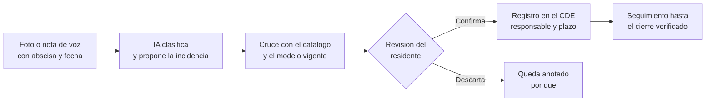

^^ Sesión 10 / Antes
## En el capítulo anterior

:::split
:::card [Quedó claro] La Banda
Una predicción sin banda es una opinión con decimales. Y con ella cerró la temporada: las cinco cosas de las que depende que una IA pueda responder.
:::
:::card [Quedó pendiente desde la 07] !La regla que nadie escribió
En la semana de Marcela, *clasificar 31 interferencias* salió **casi** automatizable: se repite, se verifica y los datos existen.

Faltaba una sola cosa: **la regla de prioridad no está escrita en ninguna parte.** Hoy se escribe.
:::
:::

---

^^ Sesión 10 / El caso
## Lo que bloquea el hito

> **Corredor Av. Guayacanes, Tramo 2.** La radicación del hito **H-2** quedó para el 24 de octubre. Y el numeral 5.5.3 del anexo es seco: una interferencia de severidad alta que siga abierta **impide aprobar el hito**.

:::split
:::card [Lo que dice el Consorcio] "Estamos casi al día"
El informe trae 31 interferencias. Todas tienen responsable asignado y varias ya figuran **cerradas**.

Andrés Peña pide que el hito se revise tal como está.
:::
:::card [Lo que necesita Marcela] !Una lista que se pueda firmar
Cuáles bloquean el hito, a quién le corresponde cada una y la observación redactada con su numeral. **Cada quincena**, no una sola vez.

Hoy esa lista se arma a mano, con un criterio que vive en la cabeza de quien la arma.
:::
:::

**La pregunta de hoy:** ¿qué bloquea de verdad el hito H-2 — y cómo se escribe la regla para que una máquina lo responda cada quincena?

---

^^ Sesión 10 / Bloque 1
## Una regla que una máquina puede aplicar

> Un requisito del pliego todavía no es una regla. Se vuelve regla cuando alguien le agrega **lo que el pliego da por sabido**.

| Casilla | La pregunta | Ejemplo: numeral 4.4.2 |
|---|---|---|
| **Fuente** | ¿De dónde sale? | Anexo Técnico 7, numeral 4.4.2 |
| **Condición** | ¿Si qué, entonces qué? | Si `codigo_clasificacion` está vacío → incumple |
| **Alcance** | ¿A qué elementos aplica? | A todos, sin excepción |
| **Severidad** | ¿Qué pasa si falla? | La entrega se devuelve |
| **Dueño** | ¿Quién la revisa cuando cambie? | El Gestor de Información (numeral 4.6.3) |

:::note
La sesión 07 dejó una pregunta como filtro: *¿la regla está escrita?* Estas cinco casillas son la manera de escribirla. **Y la última es la que casi siempre falta**: la sesión 07 lo vio con el Acta 14, que cambió una regla que nadie tenía a cargo.
:::

---

^^ Sesión 10 / Bloque 1
## El catálogo del Tramo 2

> Casi todo lo que revisa un coordinador cabe en seis familias de reglas. Y todas salen de documentos que ya están en el expediente.

| Familia | La regla | Fuente | Lo que encuentra en el Tramo 2 |
|---|---|---|---|
| **Parámetros obligatorios** | Ficha de mantenimiento en todo elemento de drenaje | 4.3.1 · Acta 14, 4.2 | Ausencias escritas de tres maneras: vacío, `N/D` y `PENDIENTE` |
| **Clasificación** | Ningún código de clasificación vacío | 4.4.2 | `SUM-011` |
| **Vocabulario** | Un mismo concepto, una sola denominación | 4.4.3 | `Alta`, `ALTA` y `Critica` en la misma columna |
| **Identidad** | Un identificador, un registro; toda referencia apunta a algo que existe | 4.4.1 · 5.3.2 | `INT-013` repetida; `SUM-099` no existe en el inventario |
| **Unidades** | Milímetros en los modelos de detalle | 4.2.2 | `SUM-013`, con la dimensión en centímetros |
| **Geometría** | Tolerancia de 0 mm en duras y 25 mm en blandas | 5.2 | La calcula el detector de interferencias, no la IA |

:::warn
*"Revisar que esté completo"* no es una regla. **"Completo" hay que definirlo**: ¿`N/D` cuenta como dato? ¿Y `PENDIENTE`? La sesión 07 lo descubrió con una fórmula; el catálogo lo deja escrito, y además dice qué hacer: **se reportan por separado, no se corrigen**.
:::

---

^^ Sesión 10 / Bloque 2
## Detectar no es priorizar

> El detector de interferencias encuentra choques. **No sabe cuál importa.**

:::split
:::card [Detección tradicional] Geometría contra tolerancia
Navisworks, Solibri o el software que use el proyecto cruzan las disciplinas del modelo federado y marcan cada intersección que viola la tolerancia del numeral 5.2.

Es exacto y es rápido. **Y no tiene criterio**: en un proyecto real devuelve cientos de registros, con repetidos y falsos positivos.
:::
:::card [Priorización asistida] !Criterio escrito, aplicado a la lista
Quitar lo repetido, normalizar la severidad, cruzar con el inventario, ordenar por lo que bloquea el hito, asignar y redactar la observación.

**Esto sí lo puede hacer la IA** — siempre que la regla de prioridad esté escrita.
:::
:::

:::note
La IA **no detecta** interferencias: la geometría la calcula el detector. La IA trabaja sobre el **informe** que el detector exporta. Y el numeral 5.3.2 pide ese informe en un formato abierto de intercambio de incidencias —en la práctica, BCF—; el export del caso es una tabla.
:::

---

^^ Sesión 10 / Bloque 2
## La regla de prioridad, escrita

> Es la regla que la sesión 07 encontró sin escribir. Cabe en cuatro líneas, y cada línea tiene su numeral.

1. Primero, lo que **impide aprobar el hito**: severidad alta o crítica, estado abierto — *numeral 5.5.3*.
2. Dentro de eso, lo que corre contra **plazo**: diez días hábiles desde la asignación — *numeral 5.5.4*.
3. Se marca **lo que se repite**: el elemento que además incumple otra regla del catálogo recibe una sola observación con todos sus problemas.
4. Todo registro que no se puede evaluar —sin holgura, con un estado que no se entiende, con una referencia que no existe— va a **una lista aparte**. No al final de la lista: aparte.

:::flow
Detección -> Asignación -> Propuesta de solución -> *Verificación -> Cierre
:::

:::note
El ciclo es el del numeral 5.5.1, y la IA puede acompañar casi todo: ordena, sugiere a quién asignar, redacta y hace seguimiento. **La verificación es de la Interventoría** (5.5.2). Y asignar tampoco es trivial: 30 de las 31 están asignadas a *Consorcio Via Norte*, cuando el numeral 5.4.1 pide un responsable **por disciplina**.
:::

---

^^ Sesión 10 / Práctica
## En vivo: el catálogo, aplicado

> **Antigravity**, el mismo de la sesión 07. Una carpeta nueva con el expediente del curso y un archivo más: **el catálogo**, escrito en español y con sus cinco casillas.

:::split-3
:::card [01] Aplicar el catálogo
*"Revisa los dos archivos contra el catálogo y dime qué incumple cada regla."*

**Lo que se mira:** el plan que declara antes de correr.
:::
:::card [02] Priorizar
*"Ordena las interferencias con la regla de prioridad."*

**Lo que se mira:** qué hizo con los repetidos, con `ALTA` y `Critica`, y con lo que no se podía evaluar.
:::
:::card [03] Redactar
*"Redacta la observación de Interventoría para las que bloquean el hito, citando el numeral."*

**Lo que se mira:** que cada numeral citado **exista** en el anexo.
:::
:::

:::warn
Carpeta nueva, expediente ficticio, nada de la entidad. Es el numeral 4.7.3 del anexo y es el Semáforo de la sesión 04: **sigue puesto**.
:::

:::note
El catálogo que se usa en pantalla está publicado: <a href="doc.html#d=caso/catalogo-reglas-calidad" target="_blank" rel="noopener">Catálogo de reglas del Tramo 2</a>.
:::

---

^^ Sesión 10 / Bloque 2
## De la lista a la observación

> Priorizar es la mitad del trabajo. La otra mitad es que cada interferencia le llegue a alguien, con plazo — y que alguien note cuando no se movió.

| Paso | Lo que hace la IA | Lo que no hace |
|---|---|---|
| **Asignar** | Sugiere el responsable a partir de la disciplina de cada elemento | Decidir quién responde contractualmente |
| **Redactar** | Escribe la observación en el tono de las actas, citando el numeral | Firmarla, ni decidir el tono con el Consorcio |
| **Agrupar lo recurrente** | Junta en una sola observación todos los problemas de un mismo elemento | Explicar la causa: ¿error de modelado o de exportación? |
| **Hacer seguimiento** | Compara el informe de esta quincena con el anterior: qué se cerró, qué cambió y qué sigue igual | Saber **por qué** no se movió |
| **Verificar** | — | **Es de la Interventoría** (numeral 5.5.2) |

:::note
El seguimiento es donde más rinde, y es lo que nadie hace: comparar dos informes quincenales, fila por fila, es tedioso. Pero es lo único que muestra **qué interferencia lleva tres comités abierta** — y el numeral 5.5.4 le pone plazo: diez días hábiles para las altas.
:::

:::ok
`SUM-011` es el ejemplo del Tramo 2: no tiene ficha de mantenimiento, no tiene código de clasificación y tiene una interferencia alta con el acueducto. Son **tres observaciones o una sola**, y esa decisión también se escribe en el catálogo.
:::

---

^^ Sesión 10 / Bloque 2
## El tablero de calidad

> El numeral 4.5.1 pide un **informe de calidad** con cada hito. Con el catálogo aplicado, sale solo. Este es el del Tramo 2, esta quincena.

:::metrics
13 | Interferencias altas o críticas abiertas
12 de 36 | Elementos de drenaje sin ficha de mantenimiento
6 | Interferencias cerradas
3 | Registros que no se pueden evaluar
:::

:::split
:::card [Lo que lo hace útil] Cada número apunta a una lista
Detrás de cada cifra hay identificadores: cuáles son, qué regla incumplen y de qué columna salió. Un indicador que no se puede abrir no se puede auditar.
:::
:::card [Lo que lo hace honesto] !Los que no se pueden evaluar, a la vista
Tres registros no entran en ninguna cuenta: les falta la holgura o apuntan a un elemento que no existe. **No se esconden al final**: tienen su propia cifra.
:::
:::

:::ok
El tablero está listo para el comité del jueves.
:::

---

^^ Sesión 10 / El giro
## Cerrada no es verificada

> El tablero salió limpio: **13 interferencias altas o críticas abiertas**, sin repetidos, con las severidades normalizadas. Otras seis figuran cerradas. Antes de mandarlo, alguien abre una de las seis.

:::split
:::card [INT-019] Estado: Cerrada
`SUM-020` contra la ciclorruta, en K0+558. Severidad alta.

La lista la dejó por fuera, como correspondía: el catálogo pide *abierta*, y esta dice *cerrada*.
:::
:::card [Lo que dice el resto del expediente] !Cerrada sobre un modelo que ya no existe
Se cerró sobre **MOD-FED-v3**; la versión vigente es la **v4**. El numeral 5.5.2 solo admite el cierre contra la versión vigente **y** con verificación de la Interventoría.

Y `SUM-020` es uno de los tres sumideros cuya reubicación **seguía sin decidirse** en la sesión 08.
:::
:::

:::warn
**"Cerrada" es una palabra en una celda.** La escribió alguien, y el export no dice quién. Tampoco trae ninguna columna que diga quién verificó el cierre ni contra qué: **ninguna de las seis cerradas se puede comprobar desde el informe.**
:::

:::ok
El catálogo revisa lo que el informe **dice**. Si nadie escribe la regla *"cerrada contra qué versión y verificada por quién"*, el indicador de calidad premia al que cierra primero, no al que resuelve. Y para saber si algo se resolvió de verdad, hay que **ir a mirar**.
:::

---

^^ Sesión 10 / Bloque 3
## Ir a mirar: la captura en obra

> El Tramo 2 todavía está en diseños; la obra es de un constructor que aún no se contrata. Pero lo que hoy se escriba en el catálogo es lo que ese constructor va a tener que **demostrar con evidencia de campo**.

| Captura | Responde bien | No responde |
|---|---|---|
| **Foto y video** desde el celular | ¿Qué elemento es? ¿Tiene un daño visible? Clasifica la foto y redacta la incidencia | ¿En qué abscisa está? ¿Cumple la cota? |
| **Cámara 360** en recorrido | ¿Cuánto avanzó este frente frente al cronograma? | Lo que está tapado o quedó fuera del recorrido |
| **Dron** con fotogrametría | Avance en superficie, movimiento de tierras, el corredor completo | Detalle fino y redes enterradas |
| **Escáner láser** · nube de puntos | ¿Lo construido coincide con el modelo, y por cuántos milímetros? | Nada, si no hay un modelo vigente contra el cual comparar |

:::note
Tres usos que funcionan hoy sin comprar nada: **clasificar fotografías**, **redactar la incidencia** a partir de una foto y una nota de voz, y **leer en campo** el documento que aplica. La comparación entre obra y modelo es la más valiosa y la que más exige: un modelo al día y una captura bien georreferenciada.
:::

---

^^ Sesión 10 / Bloque 3
## Inspección asistida en campo

> La captura no es solo la foto. En campo, la IA ayuda donde las manos están ocupadas y el documento está lejos.

:::split-3
:::card [La voz] Registrar hablando
Una nota de voz se convierte en una incidencia ordenada: elemento, abscisa dictada, descripción y severidad propuesta.

Reemplaza la libreta, no al inspector.
:::
:::card [El documento] Preguntarle al pliego desde la obra
*"¿Qué holgura exige el anexo para esta tapa?"* — y responde con el numeral.

Es la carpeta de la sesión 06, llevada en el celular. Si el anexo no está en la carpeta, no lo sabe.
:::
:::card [La seguridad] Ver lo que falta
Detectar en foto o video un casco, un chaleco o una señalización ausente en el frente de obra.

De todos los usos de campo, es de los más maduros.
:::
:::

:::warn
En seguridad es donde más cuesta que la máquina **no avise**: una alerta que no salta se lee como *"todo en orden"*. La IA acompaña la inspección de seguridad; no la reemplaza y no firma el permiso de trabajo. Y un video del frente de obra graba **personas**: en el Semáforo es ámbar como mínimo.
:::

---

^^ Sesión 10 / Bloque 3
## Lo que la foto no demuestra

:::split
:::card [Límites de la captura] !Lo que falla en campo
Luz, ángulo, lluvia, polvo, algo que tapa la vista. Sin georreferencia, una foto no dice en qué abscisa se tomó.

Y **lo enterrado no se ve**: las redes húmedas —donde la sesión 09 encontró el riesgo— se verifican antes de tapar, o no se verifican.
:::
:::card [El Semáforo en obra] !Una foto de obra casi nunca es verde
Rostros de trabajadores, placas de vehículos, fachadas de vecinos. Una foto de obra puede llevar **datos personales**.

Subirla a un servicio no aprobado es el mismo incumplimiento que registró el Acta 15.
:::
:::

:::warn
Reconocer un sumidero en una foto no es verificar que cumple. **La IA propone la incidencia; la firma quien estuvo ahí.** Una incidencia cerrada con una foto que nadie validó es `INT-019` con mejor resolución.
:::

---

^^ Sesión 10 / Extra
## Un flujo de captura, análisis y reporte

:::ok
Cada caja tiene un dueño, y la IA ocupa dos: clasificar y proponer. La pieza que más se olvida es la última — **qué evidencia cierra la incidencia**, y quién la firma.
:::

---

^^ Sesión 10 / Taller
## Actividad práctica (15 min)

> **Un agente de revisión de calidad, en papel.** Se trabaja sobre la tarea que cada quien dejó escrita en la parte B.2 del taller de la sesión 07 — o, si no la tiene, sobre el informe de interferencias del expediente.

:::split-3
:::card [01] Tres reglas
Cada una con sus cinco casillas: fuente, condición, alcance, severidad y **dueño**.

Si no aparece la fuente, la regla todavía no existe.
:::
:::card [02] La ficha del agente
Las cinco casillas de la sesión 02: propósito, conocimiento, herramientas, **límites** y usuario.

¿Solo lee, o también escribe?
:::
:::card [03] !La evidencia del cierre
¿Qué prueba que el problema quedó resuelto: una celda, un documento, una foto, una medición?

¿Y quién la firma?
:::
:::

:::note
**Hoja de trabajo** — se llena en pantalla y se descarga en PDF o `.md`:
<a href="doc.html#d=talleres/taller-10" target="_blank" rel="noopener">Hoja del taller</a> ·
<a href="doc.html#d=caso/catalogo-reglas-calidad" target="_blank" rel="noopener">Catálogo de reglas del Tramo 2</a> ·
<a href="doc.html#d=caso/pliego-anexo-tecnico-fragmento" target="_blank" rel="noopener">Anexo Técnico 7</a> ·
<a href="recursos/caso/interferencias-tramo2.csv" download>Informe de interferencias (CSV)</a> ·
<a href="doc.html#d=fichas/ficha-02-agente" target="_blank" rel="noopener">La Ficha del Agente</a>
:::

---

^^ Sesión 10 / Resolución
## Lo que bloquea el hito H-2

> El tablero decía 13. Con la regla de cierre escrita, son **14**.

| Lista | Cuántas | Qué se hace |
|---|---|---|
| Altas o críticas **abiertas**, sobre la versión vigente | **10** | Observación con el numeral 5.5.3 y plazo de diez días hábiles |
| Altas **abiertas**, sobre la versión anterior | **3** · `INT-014`, `INT-020`, `INT-031` | Correr de nuevo la detección sobre la v4 antes de discutirlas |
| **Cerrada** sin cierre válido | **1** · `INT-019` | Se reabre hasta que se verifique contra la v4 (numeral 5.5.2) |

:::note
De las diez primeras, **tres no se sostienen todavía**: `INT-021` e `INT-024` no traen holgura medida, e `INT-007` apunta a `SUM-099`, que no existe en el inventario. Van a la lista aparte, con una solicitud al Consorcio. Y cruzando los dos archivos aparece lo que ninguno muestra solo: **ocho sumideros** tienen a la vez una interferencia y la ficha de mantenimiento ausente.
:::

:::ok
Y la otra mitad de la pregunta: la regla quedó escrita — cuatro líneas, cada una con su numeral, y un dueño. La próxima quincena la lista sale sola. **Lo que no sale solo es la verificación del cierre**, y eso también quedó escrito.
:::

---

^^ Sesión 10 / La frase
## Lo que hay que llevarse de hoy

> **La IA no revisa el modelo: aplica el catálogo.** Y el catálogo es lo que alguien se tomó el trabajo de escribir — con fuente, con alcance y con dueño.

:::split
:::card [Resultado] Lo que sale de esta sesión
**Tres reglas** escritas con sus cinco casillas, la ficha de un agente que las aplica, y la respuesta a la pregunta que casi nadie hace: **qué evidencia cierra una incidencia**.
:::
:::card [Idea fuerza] !Una sola frase
**Cerrada es una palabra; verificada es una evidencia.** Un indicador de calidad mide lo que dice la celda. Lo que pasó en la obra hay que ir a mirarlo.
:::
:::

---

^^ Sesión 10 / Próximo capítulo
## Todo terminó en el mismo lugar

> La observación *se registra en el CDE*. La foto *se sube al CDE*. El cierre *queda en el CDE*. Hoy todas las piezas terminaron ahí, y nadie se detuvo a mirar ese lugar.

:::split
:::card [Lo que resolvimos] La regla y la evidencia
Qué revisa una automatización de calidad, en qué orden se atiende lo que encuentra y qué hace falta para declarar algo resuelto.
:::
:::card [Lo que queda abierto] !El lugar
El entorno común de datos apareció en la sesión 04 como escenario: estados, permisos, rastro de auditoría.

**¿Cómo funciona como sistema — y qué pasa cuando, además de guardar documentos, tiene que reflejar el corredor construido durante los próximos treinta años?**
:::
:::

> **Sesión 11 — BIM, CDE y gemelos digitales.** Viernes 25/09.
