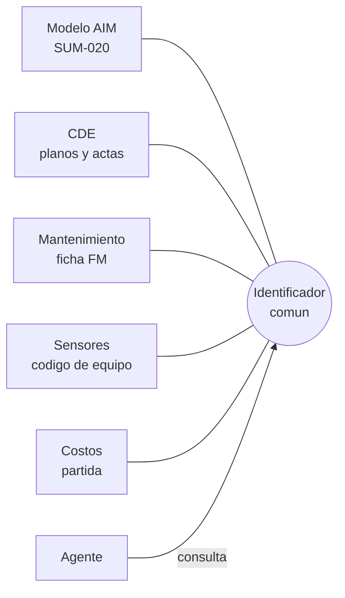

^^ Sesión 11 / Antes
## En el capítulo anterior

:::split
:::card [Quedó claro] Cerrada no es verificada
La IA no revisa el modelo: aplica el catálogo. Y un estado en una celda es una palabra, no una evidencia. Lo que pasó en la obra hay que ir a mirarlo.
:::
:::card [Quedó abierto] !El lugar
La observación *se registra en el CDE*. La foto *se sube al CDE*. El cierre *queda en el CDE*.

¿Cómo funciona ese lugar cuando una IA lo lee — y qué pasa cuando tiene que reflejar el corredor durante treinta años?
:::
:::

---

^^ Sesión 11 / El caso
## Octubre de 2028: se inunda la ciclorruta

> **Escenario.** El Corredor Av. Guayacanes lleva un año en operación. Primera temporada fuerte de lluvias: en **K0+558** el agua cubre la ciclorruta durante tres horas.

:::split
:::card [La pregunta] Tres datos, una mañana
El área de mantenimiento pide lo mínimo: **qué sumidero es**, **quién lo mantiene** y **cuándo se revisó por última vez**.

Tres datos. Ninguno debería tomar más de una hora.
:::
:::card [Dónde está la respuesta] !En cuatro lugares
La ubicación está en el **modelo**. La decisión de reubicarlo, en un **acta del CDE**. La rutina de mantenimiento, en el **sistema de mantenimiento**. Y lo que pasó esta mañana, en un **sensor**.

Cada sistema sabe una parte. Ninguno sabe que los otros tres existen.
:::
:::

**La pregunta de hoy:** ¿dónde está la respuesta — y qué hace falta para que alguien, o algo, la pueda juntar?

---

^^ Sesión 11 / Extra
## Ustedes ya viven en un CDE

> Esto no es una clase de entorno común de datos: lo usan todos los días. Es una pregunta. **¿A quién le ha pasado alguna de estas tres?**

:::split-3
:::card [Caso 1] La versión que viajó por fuera
*"Te mando la última versión por WhatsApp."* El plano corregido existe, pero no en el CDE: nadie sabe quién lo aprobó ni cuál es.
:::
:::card [Caso 2] El archivo que nadie encuentra
*"Plano final v3 (2).dwg"*, en la carpeta de otra especialidad o en el estado equivocado. Para auditarlo hay que abrirlo.
:::
:::card [Caso 3] !La aprobación de pasillo
*"Ya quedamos de acuerdo en la reunión, sigan con eso."* El estado cambió, pero no hay quién lo firme — es `INT-019` de la sesión 10, con otro nombre.
:::
:::

:::note
Los tres son molestos para una persona. **Para un agente son peores**: una persona duda antes de usar el archivo raro; el agente lo lee con la misma confianza que todo lo demás.
:::

---

^^ Sesión 11 / Bloque 1
## De los requisitos al activo

> El CDE no es un repositorio: es donde se encadena lo que la entidad **pidió** con lo que se va a **quedar** cuando el contrato termine. El expediente del Tramo 2 ya tiene las cinco piezas.

:::flow
EIR -> BEP -> MIDP -> PIM -> *AIM
:::

| Pieza | Qué es | En el Tramo 2 |
|---|---|---|
| **EIR** · Requisitos de intercambio de información | Lo que la entidad necesita recibir | El Anexo Técnico 7 |
| **BEP** · Plan de ejecución BIM | Cómo el contratista va a responder | El Plan de Ejecución BIM — en el anexo, **PEB** (numeral 4.4.1) |
| **MIDP** · Plan maestro de entrega de información | Qué se entrega y cuándo | Los hitos H-1 a H-4 (numeral 4.5) |
| **PIM** · Modelo de información del proyecto | La información que se produce mientras se diseña y se construye | El modelo federado, las actas, los informes |
| **AIM** · Modelo de información del activo | **Lo que queda para operar el activo** | El modelo de entrega y operación — hito **H-4** |

:::note
Las siglas vienen del inglés y de la norma ISO 19650: *Exchange Information Requirements*, *BIM Execution Plan*, *Master Information Delivery Plan*, *Project Information Model* y *Asset Information Model*.
:::

:::ok
Todo lo que el curso trabajó hasta la sesión 10 vive en el **PIM**. Lo que el IDU va a consultar durante treinta años es el **AIM**. Y el gemelo digital, que es el final de esta sesión, empieza exactamente ahí.
:::

---

^^ Sesión 11 / Bloque 1
## El cuarto actor

> El CDE del Tramo 2 tiene tres actores, cada uno con su nivel de acceso. Desde que alguien conecta un agente, tiene cuatro.

| Actor | Qué hace en el CDE | Con qué acceso |
|---|---|---|
| **Consorcio Vía Norte** | Produce, verifica y comparte | Sus carpetas, en todos los estados |
| **Interventoría Andes** | Revisa y emite concepto | Lee lo compartido; conceptúa |
| **IDU** — Gestora de Información | Recibe, publica y custodia | Todo; asigna los permisos (numeral 5.1.4) |
| **El agente** | Lee, cruza, resume — ¿y escribe? | **Nadie lo ha decidido todavía** |

:::warn
El Acta 15 dejó el compromiso **15-1**: *"documentar el criterio de asignación de permisos para las cuentas de integración y servicios automatizados, por no corresponder a personas naturales"*. Venció el 16 de julio de 2025. **Sigue abierto.**

Y la sesión 06 ya lo dijo: un agente conectado **hereda los permisos de quien lo conectó**. Si lo conectó la Gestora de Información, ve todo.
:::

---

^^ Sesión 11 / Bloque 1
## ¿De qué estado lee un agente?

> Los cuatro estados ya los conocen. Lo nuevo es la pregunta que el CDE nunca se tuvo que hacer: **cuando un agente responde, ¿de cuál de los cuatro sacó la respuesta?**

| Estado | Quién lo ve hoy | Lo que un agente puede hacer con él |
|---|---|---|
| **Trabajo en curso** | El equipo que lo produce | **Nada.** Responder desde aquí es responder con lo que nadie verificó |
| **Compartido** | Las partes, para coordinar | Leerlo para coordinar, **declarando** que no está publicado |
| **Publicado** | Todos, como información autorizada | Responder. Es la única fuente de una respuesta oficial |
| **Archivado** | Todos, como historia | Contar la historia, **nunca** responder el presente |

:::ok
Es la regla más barata del curso y la que más protege: **un agente dice siempre de qué estado sacó lo que dice.** Si no lo puede decir, la respuesta no sirve.
:::

:::note
Un ejemplo con los cuatro estados, para consultar después de clase: <a href="recursos/caso/cde-listado-tramo2.csv" download>listado del CDE del Tramo 2 (CSV)</a>. La versión vigente del modelo —la que en la sesión 10 escribimos en una regla— está ahí.
:::

---

^^ Sesión 11 / El mercado
## La IA que ya viene dentro del CDE

> Los fabricantes grandes ya ofrecen IA en cuatro familias. Lo que cambia entre uno y otro no es qué prometen, sino **en qué estado lo tienen**.

| Familia | Qué hace | Ejemplos en el mercado | Madurez hoy |
|---|---|---|---|
| **Extraer y clasificar** | Separa láminas y lee el cajetín, etiqueta fotos, arma el registro de *submittals* desde el pliego, puntúa el riesgo de las incidencias | Autodesk Forma, Trimble, Bentley | **Disponible** — la más madura |
| **Preguntarle a los documentos, con cita** | Responde sobre RFI, incidencias y actas, y dice de qué documento lo sacó | Autodesk (*Project Data Agent*, fuera de beta desde marzo de 2026), Procore, Dalux; ProjectWise en acceso anticipado | **Disponible** en varios |
| **Comparar y revisar** | Diferencias entre revisiones de un plano; revisión contra normativa o pliego | Bluebeam Max (disponible desde mayo de 2026); la revisión de cumplimiento de Autodesk está planificada para 2027 | **Mixta** |
| **Agentes de flujo** | Diario de obra dictado, borradores de RFI, revisión de *submittals* — con aprobación humana | Autodesk, Procore, Trimble | **Beta y pilotos** |

:::note
**Autodesk Construction Cloud se llama Autodesk Forma desde marzo de 2026**: Docs pasó a ser *Forma Data Management* y Build, *Forma Build*. Los proyectos, los permisos y las direcciones no cambiaron: solo la marca.
:::

:::ok
Para leer cualquier ficha de producto hacen falta cuatro palabras, y no son sinónimos: **anunciado**, **vista previa**, **beta** y **disponible**.
:::

---

^^ Sesión 11 / El mercado
## Fabricante por fabricante

| Plataforma | Disponible hoy | Anunciado o en prueba |
|---|---|---|
| **Autodesk Forma** | Riesgo de incidencias (*Construction IQ*), extracción de láminas, etiquetado de fotos, asistente con consulta de datos del proyecto | Asistente agéntico entre productos: vista previa, despliegue en **2027**. Revisión de planos contra normativa: **2027** |
| **Bentley** — ProjectWise, Infrastructure Cloud | Agente de anotación de planos en OpenRoads; servidores MCP de sus aplicaciones de cálculo | Búsqueda con IA en ProjectWise: acceso anticipado desde diciembre de 2025 |
| **Trimble Connect** | Lectura del cajetín y *submittals* automáticos, en Norteamérica y regiones seleccionadas | Asistente en Connect y plataforma de agentes: pilotos. Compró Document Crunch, revisión de riesgo contractual (abril de 2026) |
| **Procore** | *Procore Assist*, en español desde octubre de 2025 | Agentes de revisión de *submittals*, RFI y contratos: beta privada |
| **Oracle Aconex** | Asesor predictivo de seguridad (marzo de 2026) | Búsqueda con IA dentro de Aconex: **no verificada** |
| **Bluebeam** | *Bluebeam Max*: revisión y superposición inteligente de planos; conexión con asistentes externos | — |
| **Otros** | Dalux, Revizto, Newforma, Speckle | Thinkproject, Asite |

:::warn
**Para una entidad pública, la columna que falta es la de los datos.** Solo Autodesk —con fichas de transparencia por función— y Bentley —el cliente decide si sus datos entrenan modelos— publican políticas concretas. **Ninguno confirma dónde procesa la IA ni si está disponible en español para Colombia.** Eso se pregunta antes de activar nada, y se deja en el contrato.
:::

---

^^ Sesión 11 / El mercado
## El enchufe: oficial, de terceros y abierto

> La sesión 06 explicó qué es un servidor MCP. Esto es lo que existe hoy para conectar un asistente general al CDE y al modelo.

:::split-3
:::card [Oficial] Lo publica el fabricante
- **Revit**: vista previa técnica desde abril de 2026, en las tres versiones de la sesión 08.
- **Bentley**: STAAD.Pro disponible; MicroStation e iTwin IoT en acceso anticipado.
- **Bluebeam**, **Revizto** y **SketchUp**.

**Para Forma, Procore y Trimble Connect no hay un MCP oficial confirmado.**
:::
:::card [De terceros] !Lo publica alguien más
Servidores para Forma, Procore, Dalux, Speckle, y para Revit con más de cien herramientas. Código de GitHub o de npm, que dice *"no afiliado"* al fabricante.

Entra **con la cuenta de quien lo instala** — y ve todo lo que esa cuenta ve.
:::
:::card [Abierto] Se conecta a un estándar
**IfcOpenShell** trae su propio servidor MCP para archivos IFC. **buildingSMART** publica las API de OpenCDE y de BCF para intercambiar documentos e incidencias entre plataformas.

La IA se conecta a un formato, no a un producto.
:::
:::

:::note
**Y la ruta más usada no es ninguna de las tres**: el asistente general sobre el repositorio de documentos — Microsoft 365 Copilot sobre SharePoint, ChatGPT o Claude con sus conectores, Gemini y NotebookLM sobre Drive. Todos **respetan los permisos del repositorio**, lo que quiere decir que si una carpeta está mal compartida, el asistente la encuentra. Y **ninguno sabe qué es *Publicado***.
:::

---

^^ Sesión 11 / El mercado
## Cuando el agente lee lo que no debía

> El riesgo principal no está en el modelo de IA. Está en **lo que el agente lee** y en **quién lo instaló**. Tres casos reales, todos de 2025:

| Caso | Qué pasó |
|---|---|
| **Un servidor falso** | Un paquete en npm imitaba a un servidor MCP legítimo de correo y copiaba en secreto cada mensaje al atacante. Se descargó más de 1.600 veces antes de retirarse |
| **La fuga entre clientes** | El servidor MCP de una plataforma de gestión de proyectos expuso datos de cerca de mil organizaciones a otras. La empresa lo apagó doce días |
| **La instrucción escondida** | Un texto preparado dentro de una incidencia pública hizo que un agente con acceso a repositorios privados los filtrara |

:::warn
En un CDE, la incidencia, el RFI y el PDF del contratista son exactamente eso: **texto que el agente lee y que escribió otra persona**. Por eso las reglas son las mismas del curso: lectura separada de escritura, aprobación humana antes de escribir, bitácora, y solo servidores autorizados — el compromiso 15-1, otra vez.
:::

:::note
**El marco en Colombia:** CONPES 4144 de 2025 (política nacional de IA) · Guía ética para IA en entidades públicas (enero de 2026) · Lineamientos de seguridad y privacidad para sistemas de IA de MinTIC (abril de 2026) · Ley 1581 de 2012 y Circular 002 de 2024 de la SIC. **No hay ley de IA vigente**: el proyecto se volvió a radicar en julio de 2026.
:::

---

^^ Sesión 11 / El mercado
## Qué preguntar sobre su propio CDE

> Sin entrar a la herramienta, cinco preguntas le dicen a cualquiera qué IA tiene ya su CDE — y cuál podría estar funcionando sin que nadie la haya decidido.

| Pregunta | A quién | Por qué importa |
|---|---|---|
| **¿Qué funciones de IA trae el plan que tenemos contratado, y cuáles están activas?** | Al administrador del CDE | Varias funciones exigen un plan superior; otras llegan con las actualizaciones del producto, sin que nadie las pida |
| **¿Están disponibles en español y para nuestra región?** | Al administrador, o al fabricante | Muchas salen primero en inglés y en Norteamérica |
| **¿Dónde se procesan los datos, y se usan para entrenar?** | Al fabricante: la ficha de transparencia y el contrato | Solo dos fabricantes lo publican con detalle |
| **¿Hay cuentas de servicio o conectores de terceros conectados hoy?** | Al administrador y a TI | El cuarto actor puede estar ya adentro: es el compromiso 15-1 |
| **¿Quién decide activar una función nueva cuando llega?** | A la entidad | Las plataformas en la nube publican novedades casi cada mes, sin contrato nuevo |

:::ok
Ninguna de las cinco necesita saber de IA. Todas necesitan que **alguien en la entidad las haga** — y que la respuesta quede escrita.
:::

---

^^ Sesión 11 / Bloque 2
## Un sumidero, cuatro sistemas

> El sumidero de K0+558 no existe una vez: existe **cuatro veces**, en cuatro sistemas, con cuatro nombres. Integrar es lograr que esas cuatro copias sepan que son la misma.

| Sistema | Cómo lo llama | Qué sabe de él |
|---|---|---|
| **Modelo** (AIM) | `SUM-020` | Tipo, abscisa, dimensión, material |
| **CDE** | `GUA-T2-DRE-PLN-0012` y las actas | Por qué está ahí, quién aprobó moverlo |
| **Mantenimiento** | La ficha `FM-…` | Rutina, última revisión, responsable |
| **Sensor** | Un código del fabricante | El nivel de agua, cada cinco minutos |

:::warn
La llave entre el modelo y el mantenimiento es **la ficha de mantenimiento**. Por eso el curso volvió a ella una y otra vez desde la sesión 02. Y `SUM-020` es uno de los sumideros que **la tienen vacía**: para el sistema de mantenimiento, ese sumidero no existe.
:::

---

^^ Sesión 11 / Bloque 2
## Integrar es acordar un identificador

:::split-3
:::card [01] Un identificador que dure
Que no cambie cuando el modelo pasa de la v4 a la v5, ni cuando cambia el contratista. **Treinta años.**
:::
:::card [02] Un mapeo escrito
Qué campo de un sistema corresponde a qué campo del otro. Si nadie lo escribió, cada integración lo inventa distinto.
:::
:::card [03] !Validar antes de sincronizar
Lo que entra mal se copia a todos los sistemas en segundos. Un duplicado en el modelo es un duplicado en cuatro lugares.
:::
:::

:::note
Por archivo o por API da lo mismo: **la sesión 06 ya lo resolvió**. Y si el identificador viaja en un formato abierto —IFC 4.3 para el modelo, BCF para las incidencias—, sobrevive al cambio de plataforma. Lo que decide si la integración sirve es la columna del medio. Y el agente no reemplaza el identificador: **lo necesita más que nadie**, porque no pregunta cuando dos nombres se parecen.
:::

---

^^ Sesión 11 / Bloque 3
## Un modelo BIM no es un gemelo digital

> El modelo describe el corredor **como se decidió**. El gemelo describe el corredor **como está ahora** — y cambia solo, sin que nadie lo modele.

| | Modelo BIM | Gemelo digital |
|---|---|---|
| **Cambia cuando…** | Alguien lo edita | El activo cambia |
| **Tiempo** | Una foto por versión | Una serie continua |
| **Fuente** | El diseño y la obra | El modelo **más** sensores, mantenimiento y operación |
| **Pregunta que responde** | ¿Qué se construyó? | ¿Qué está pasando — y qué va a pasar? |
| **Dónde entra la IA** | Leer y cruzar lo escrito | Interpretar series, alertar y **anticipar** — la Banda de la sesión 09 |

:::note
Un gemelo no es un modelo bonito ni un visor 3D en tiempo real. Si nada entra solo desde el activo, es un modelo BIM con otra etiqueta.
:::

---

^^ Sesión 11 / El mercado
## Gemelos: qué se vende hoy

> La madurez depende del tipo de activo, y la diferencia es grande.

| Tipo de activo | Plataformas | Qué hace la IA | Madurez |
|---|---|---|---|
| **Edificios** | Autodesk Tandem, Siemens Building X, Willow | Fallas predictivas en climatización, consumo de energía, confort | **La más madura**: productos en operación |
| **Infraestructura** | Bentley iTwin e Infrastructure Cloud, con Cesium | Federa modelos, captura de realidad, SIG y sensores | La plataforma existe; el gemelo con sensores es **raro y hecho a la medida** |
| **Ciudad** | Esri ArcGIS, NVIDIA Omniverse, Virtual Singapore | Modelos 3D para planear; simulación | Sobre todo **planeación**. El tiempo real son proyectos a la medida |
| **Nubes públicas** | Azure Digital Twins, AWS IoT TwinMaker | La infraestructura para construir uno propio | Disponibles; Microsoft Fabric sigue en vista previa |

:::warn
**El mercado se mueve rápido.** El servicio de evaluación de pavimentos de Michelin cerró a finales de 2025; una plataforma de gemelo urbano conocida, Cityzenith, figura como cerrada; la división de ciudad de Hexagon se escindió como Octave en mayo de 2026. Lo que protege a la entidad no es escoger bien el proveedor: es exigir **formatos abiertos** —IFC 4.3, que desde 2024 es ISO y ya cubre vías y puentes; CityGML— y **la propiedad de los datos**.
:::

---

^^ Sesión 11 / El mercado
## Para vías y puentes, la IA mira imágenes

> Para un corredor, lo más maduro hoy no es el gemelo con sensores: es la visión por computador que produce **inventario y condición sin instalar nada**.

| Qué | Cómo | En el mercado |
|---|---|---|
| **Pavimento** | Video de celular o de cámara de vehículo | Vaisala RoadAI: coincide con la calificación de un ingeniero en 96 de cada 100 tramos, con un punto de tolerancia *(cifra del proveedor)* |
| **Señales, defensas, baches** | Imágenes de flotas comerciales que ya circulan | Blyncsy, de Bentley: más de 40 condiciones, en uso en departamentos de transporte de EE. UU. |
| **Postes y equipos** | Imágenes de Street View consultadas con IA | Google Street View Insights, disponible desde marzo de 2026 |
| **Puentes** | Dron + detección de fisuras sobre el modelo 3D | Bentley iTwin Capture: en un puente de Minnesota, 20 % menos tiempo de inspección en sitio *(cifra del proveedor)* |
| **Drenaje** | Sensores y compuertas en tiempo real | Xylem en South Bend (EE. UU.): los reboses del alcantarillado combinado bajaron más del 70 % |

:::note
**No se verificó la cobertura en Colombia** de ninguno de estos servicios: los de imágenes dependen de que haya flotas o recorridos en la zona. Y las cifras marcadas son del propio proveedor.
:::

---

^^ Sesión 11 / El mercado
## Lo que ya pasa cerca

| Iniciativa | Qué hay | Estado |
|---|---|---|
| **Gemelo Digital de Bogotá** — Secretaría de Planeación, IDECA | Mesas técnicas con más de 25 entidades desde noviembre de 2024 | La meta de 2025 era un piloto en un polígono; **no hay evidencia pública de que esté operando** |
| **Metro de Bogotá, Línea 1** | Diseñada en BIM; gemelo de operación con sensores e IA | En desarrollo, para la operación comercial de 2028 |
| **Semáforos de Bogotá** | 1.694 intersecciones inteligentes; un modelo con el BID que anticipa congestión con 30 a 60 minutos | En operación, supervisada por operadores |
| **Alumbrado — UAESP** | Telegestión: las fallas se detectan a distancia | Piloto en cuatro localidades; plan de 100.000 luminarias LED |
| **Medellín** | Gemelo 3D en ArcGIS, 17.500 hectáreas, para riesgo y ocupación | Geoespacial; sin sensores en tiempo real comprobados |
| **IDU** | BIM desde 2020: tres pilotos y 25 proyectos en 2023 | No se encontró información pública de un gemelo operativo |

:::ok
**Lo más cercano a un gemelo operativo en Bogotá está en los semáforos y el alumbrado, no en las vías.** Y todas las iniciativas dependen de la misma pieza, que es la que una entidad sí controla hoy: **un inventario confiable de lo construido**, entregado en formato abierto.
:::

---

^^ Sesión 11 / Bloque 3
## El gemelo del corredor

> **Nada de esto existe todavía:** el Tramo 2 está en diseño. Es justamente el momento de decidir qué va a tener, porque lo que no se pida en el AIM no se va a poder conectar después.

:::split-3
:::card [Drenaje] Sumideros y pozos
Nivel de agua y colmatación. **Pregunta:** ¿qué sumidero se va a tapar antes de la próxima lluvia?
:::
:::card [Alumbrado] 96 luminarias
Consumo y fallas, por telegestión. **Pregunta:** ¿qué tramo está a oscuras esta noche?
:::
:::card [Movilidad] Semáforos y ciclorruta
Tiempos de las cuatro intersecciones y aforo de bicicletas. **Pregunta:** ¿dónde se represa y a qué hora?
:::
:::

:::flow
Activo físico -> Sensores -> Datos en el tiempo -> Reglas y alertas -> *IA que interpreta -> Decisión humana
:::

:::warn
Sensores en sumideros, telegestión de luminarias y aforos de ciclorruta existen y se usan. **Para este corredor no hay un solo dato**: todo lo de esta lámina es diseño, no demostración.
:::

---

^^ Sesión 11 / El giro
## Un gemelo del plano

> El gemelo se armó bien: se cargó el modelo del corredor, se conectaron los sensores, las alertas funcionan. Esta mañana, en la lluvia, **la alerta saltó**.

:::split
:::card [Lo que dice el gemelo] Sumidero SUM-020, en K0+558
Nivel crítico. El gemelo lo ubica **dentro de la ciclorruta**, justo donde lo dibujó el modelo de diseño.

La cuadrilla sale con la abscisa en la mano.
:::
:::card [Lo que encuentra la cuadrilla] !Ahí no hay ningún sumidero
En la sesión 08, `SUM-020` era uno de los tres sumideros que esperaban la decisión de reubicación. **En obra se reubicó.** El modelo que se cargó al gemelo fue el **de diseño**, no el de obra construida.

El sensor está en el sumidero real. El gemelo lo pinta en el sumidero dibujado.
:::
:::

:::warn
**Un gemelo alimentado con el modelo de diseño es un retrato del plano, no del corredor.** Todo funciona —los sensores, las alertas, el tablero— y aun así manda a la cuadrilla al lugar equivocado.
:::

:::ok
Por eso el hito que importa es el **H-3**, el modelo de obra construida, y no el H-2. Y por eso lo que alimenta al gemelo tiene que salir del estado **Publicado** del AIM, con quien lo firmó al lado. Es la regla del estado, aplicada al activo.
:::

---

^^ Sesión 11 / Ronda
## Piloto, esperar o descartar

> Tres herramientas reales del panorama de hoy. Para cada una, **un voto a mano alzada** y dos argumentos — con las preguntas de esta sesión, no con el folleto.

:::split-3
:::card [01] El asistente del CDE
Preguntarle a los documentos del proyecto y recibir la respuesta con la cita. **Oficial**, **disponible**, dentro de la plataforma que ya usan.

¿Qué falta saber?
:::
:::card [02] Un servidor MCP de GitHub
Gratuito, lo instala cualquiera, conecta un asistente general al CDE. Dice *"no afiliado"* al fabricante.

¿Con la cuenta de quién entra?
:::
:::card [03] Pavimento evaluado con video
Una cámara en un vehículo y la IA califica el estado de la vía, **sin instalar sensores**. Disponible en el mercado; la cifra de precisión es del proveedor.

¿Funciona en Bogotá?
:::
:::

:::ok
No hay una respuesta única. Lo que se evalúa es **con qué preguntas se llega al veredicto**: en qué estado está, quién la publica, de qué estado del CDE lee, con qué cuenta entra, dónde procesa los datos y qué formatos entrega.
:::

---

^^ Sesión 11 / El mercado
## Cómo seguirle el rastro al mercado

> Este panorama tiene fecha: **24 de septiembre de 2026**. En seis meses va a ser otro. Así se mantiene al día sin probar nada.

:::split
:::card [Cuándo mirar] El calendario del mercado
Casi todo se anuncia en cuatro eventos al año:

- **Autodesk University** — septiembre
- **Year in Infrastructure**, de Bentley — octubre
- **Groundbreak**, de Procore — octubre
- **Dimensions**, de Trimble — noviembre

Y entre uno y otro, las **notas de versión** mensuales de cada plataforma.
:::
:::card [Cómo leerlo] !Cinco filtros
1. ¿**Anunciado**, **vista previa**, **beta** o **disponible**?
2. ¿**Oficial** o **de terceros**?
3. ¿La cifra es **del proveedor**?
4. ¿**Dónde procesa** los datos, y **en qué idioma** funciona?
5. ¿Entrega **formatos abiertos** o propios?
:::
:::

:::note
La fuente más confiable no es la prensa ni la presentación comercial: es **la nota de versión o la ficha de transparencia del propio fabricante, con fecha**. Si una función no aparece ahí, todavía no existe para su proyecto.
:::

---

^^ Sesión 11 / Resolución
## Octubre de 2028, respondido

| La pregunta | Dónde estaba la respuesta | Qué pasó |
|---|---|---|
| **¿Qué sumidero es?** | En el modelo — pero en el **de diseño** | `SUM-020`, dibujado donde ya no está |
| **¿Quién lo mantiene?** | En el sistema de mantenimiento | **Nadie**: nunca tuvo ficha `FM`, así que para ese sistema no existe |
| **¿Cuándo se revisó?** | En el mismo sistema | **Nunca quedó registrado**, por la misma razón |
| **¿Por qué está donde está?** | En un acta del CDE | Estaba — y nadie la cruzó con el modelo que se cargó al gemelo |

:::ok
La respuesta existía, **repartida en cuatro sistemas**. No faltó tecnología: faltó un identificador común, un modelo de obra construida en estado *Publicado*, y una ficha que se pidió en 2025 —compromiso 16-1— y se quedó en *Trabajo en curso*.

Un agente la habría juntado en minutos. **Si los cuatro sistemas hubieran compartido una llave.**
:::

---

^^ Sesión 11 / La frase
## Lo que hay que llevarse de hoy

> **Integrar no es conectar sistemas: es acordar un identificador que dure treinta años.** Y un gemelo es tan fiel como el modelo con el que se alimenta.

:::split
:::card [Resultado] Lo que sale de esta sesión
**Un mapa del mercado** —qué está disponible, qué está en prueba y qué solo está anunciado— y **las preguntas que ningún folleto responde**: de qué estado lee, con qué cuenta entra, dónde procesa los datos y qué formatos entrega.
:::
:::card [Idea fuerza] !Una sola frase
**El gemelo empieza donde termina el CDE: en el AIM.** Lo que no quedó bien escrito ahí no lo arregla ningún sensor.
:::
:::

---

^^ Sesión 11 / Próximo capítulo
## Once sesiones de piezas

> La ficha del agente, el semáforo, el enchufe, la ventanilla, la banda. El catálogo, la evidencia, el identificador. **Cada sesión dejó una pieza, y ninguna sirve sola.**

:::split
:::card [Lo que resolvimos] Dónde vive la información
Qué lee un agente dentro del CDE, cómo se habla un activo entre sistemas y qué hace falta para que un gemelo diga la verdad.
:::
:::card [Lo que queda] !Armarlo
Un caso propio, un proceso real, con sus datos, sus reglas, sus controles y su dueño. **Lo que cada equipo va a presentar.**
:::
:::

> **Sesión 12 — Taller final y cierre académico.** Miércoles 30/09, con los tres docentes.
